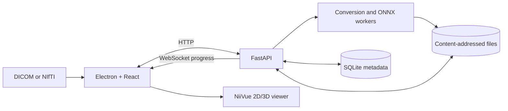

# ToothViz — Dental CBCT Visualisation and Tooth Segmentation

ToothViz is a local-first desktop application for analysis of dental cone-beam
computed tomography (CBCT) scans, segmenting individual teeth, and exploring the
result in an interactive 2D and 3D viewer.

The application accepts NIfTI data, runs the processing pipeline on the
user's machine, and overlays the resulting segmentation mask on the original
volume. Scans and derived files are not uploaded to an external service.

ToothViz is being developed as an engineering thesis by Paweł Fornagiel,
Katarzyna Bęben, Łukasz Dragon, and Emil Żychowicz.

[Features](#features) · [Quick start](#quick-start) ·
[Development](#development) · [Architecture](#architecture)

> [!CAUTION]
> ToothViz is research software, not a certified medical device. It must not be
> used as the sole basis for diagnosis or treatment decisions.

## Screenshots

<!--
Add the application screenshots as:
docs/screenshots/start.png
docs/screenshots/pipeline.png
docs/screenshots/visualization.png
-->


*Choose a temporary viewing session, create a study, or reopen a saved scan.*


*Follow upload, DICOM conversion, and segmentation progress step by step.*


*Inspect the source volume and segmentation overlay in 2D or 3D.*

## Features

- **DICOM and NIfTI input** — open `.nii` and `.nii.gz` volumes, a DICOM
  `.dcm` file, or a ZIP archive containing a DICOM series.
- **Three study modes** — review the source volume only, add an existing NIfTI
  mask, or run automatic tooth segmentation.
- **Interactive volume visualisation** — switch between axial, coronal,
  sagittal, multiplanar, and 3D views using
  [NiiVue](https://github.com/niivue/niivue).
- **Viewer controls** — adjust colormaps, intensity calibration, opacity,
  crosshairs, zoom, orientation, and 3D clipping planes.
- **Observable processing** — conversion and inference run in background worker
  processes while progress and errors are streamed to the interface over a
  WebSocket.
- **Persistent studies** — save imported scans and generated artefacts in a
  local study library, then reopen or retry them later.
- **Local processing** — the desktop-managed API, database, model, and files all
  remain on the same computer.

## How it works

1. **Choose a workflow.** Open a NIfTI volume for a temporary viewing session,
   create a persistent study, or select an existing study.
2. **Provide the scan.** Select NIfTI directly or import DICOM data. DICOM input
   is converted to NIfTI before further processing.
3. **Choose segmentation.** View the raw volume, upload a precomputed NIfTI
   mask, or run the ONNX model.
4. **Track processing.** The pipeline reports the state of each upload,
   conversion, and segmentation step.
5. **Explore the result.** The source volume and optional mask are loaded into
   the viewer as separate, configurable layers.

## Quick start

### Prerequisites

- Python 3.11 or newer
- [uv](https://docs.astral.sh/uv/)
- Node.js 20 or newer with npm
- GNU Make
- [Git LFS](https://git-lfs.com/) for the ONNX model files

Clone the repository, retrieve the model assets, and install the dependencies:

```bash
git clone https://github.com/pFornagiel/tooth.git
cd tooth

git lfs install
git lfs pull

cd packages/application
make install
make desktop-dev
```

`make desktop-dev` installs the frontend and Electron dependencies when needed,
starts the local FastAPI backend, and opens the Electron window.

The automatic mode requires the Git LFS object at
`packages/models/tooth_seg_semantic.onnx`. If the model is unavailable, raw
volume viewing and precomputed masks can still be used.

### Run without the model

Dummy mode generates a disposable test mask instead of running inference. It is
useful when developing the upload, pipeline, or viewer workflow:

```bash
cd packages/application
SEGMENTATION_MODE=dummy make desktop-dev
```

The generated mask is random and has no clinical or analytical meaning.

## Development

### Browser-based frontend development

After completing the dependency installation above, run the backend and frontend
in separate terminals.

Terminal 1 — API:

```bash
cd packages/application
uv run uvicorn backend.app:app \
  --reload \
  --host 127.0.0.1 \
  --port 8000
```

Terminal 2 — frontend:

```bash
cd packages/application/frontend
npm run dev
```

Open <http://127.0.0.1:5173>. The API is available at
<http://127.0.0.1:8000>, with interactive OpenAPI documentation at
<http://127.0.0.1:8000/docs>.

To use the dummy segmentation worker in this setup, prefix the API command with
`SEGMENTATION_MODE=dummy`.

### Build a desktop installer

```bash
cd packages/application
make desktop-dist
```

Build artefacts are written to `packages/application/desktop/release/`.
Packaging is still under development: the generated application does not yet
bundle Python and uv, so those tools must be available on the target system.

### Tests and static checks

Run these commands from the repository root:

```bash
uv run pytest
npm --prefix packages/application/frontend run test
npm --prefix packages/application/frontend run typecheck
npm --prefix packages/application/frontend run lint
```

## Architecture



The Electron main process allocates a free loopback port and launches FastAPI as
a child process. The React interface communicates with that API over HTTP and
receives job updates over a WebSocket. FastAPI coordinates uploads, study
metadata, content-addressed file storage, DICOM conversion, and segmentation
workers. NiiVue renders the resulting volumes in the React interface.

The main technologies are:

- **Desktop:** Electron and TypeScript
- **Interface:** React, Vite, Tailwind CSS, Material UI, and NiiVue
- **Backend:** FastAPI, SQLAlchemy, and SQLite
- **Medical imaging:** dicom2nifti and NiBabel
- **Inference:** ONNX Runtime with the CPU execution provider

## Segmentation model

The semantic model was developed with the project's
[nnU-Net training fork](https://github.com/pFornagiel/nnunet_test) and the
public ToothFairy3 dataset to predict background and 32 tooth classes. The
desktop runtime uses an ONNX export, so inference does not require PyTorch or a
full [nnU-Net](https://github.com/MIC-DKFZ/nnUNet) installation.

Inference includes CT intensity normalisation, resampling, sliding-window
prediction with Gaussian blending, and restoration of the mask to the source
volume's geometry. ONNX Runtime currently uses its CPU execution provider.

Model binaries are tracked with Git LFS. After cloning, run `git lfs pull`
before selecting automatic segmentation.

## Data and configuration

In the desktop application, the SQLite database, uploaded scans, and generated
artefacts are stored under Electron's per-user application data directory. When
FastAPI is run directly, the default location is
`packages/application/data/`.

The desktop-managed backend listens only on `127.0.0.1`. The application does
not intentionally transmit scan data, masks, or study metadata to an external
service.

The backend supports these optional environment variables:

- `TOOTH_DATA_ROOT` — override the data and database directory.
- `TOOTH_MODEL_PATH` — use a different ONNX model.
- `SEGMENTATION_MODE` — select `normal` or `dummy` inference.
- `TOOTH_FRONTEND_DIST` — override the built frontend directory.
- `TOOTH_SERVE_FRONTEND` — set to `1`, `true`, or `yes` to serve the built
  frontend from FastAPI.

## Repository layout

```text
packages/
├── application/
│   ├── backend/       FastAPI service, storage, database, and workers
│   ├── desktop/       Electron main process and packaging
│   ├── frontend/      React application and NiiVue integration
│   └── tests/         Backend unit and integration tests
├── models/            Git LFS-managed ONNX model assets
└── prototyping/       Earlier experiments and proofs of concept

notes/                 Research notes and thesis resources
docs/screenshots/      Images used in this README
```

## Disclaimer

This repository contains research and educational software developed as part of
an engineering thesis. ToothViz is not a medical device, has not been certified
for diagnostic use, and must not be relied upon for clinical decisions.
