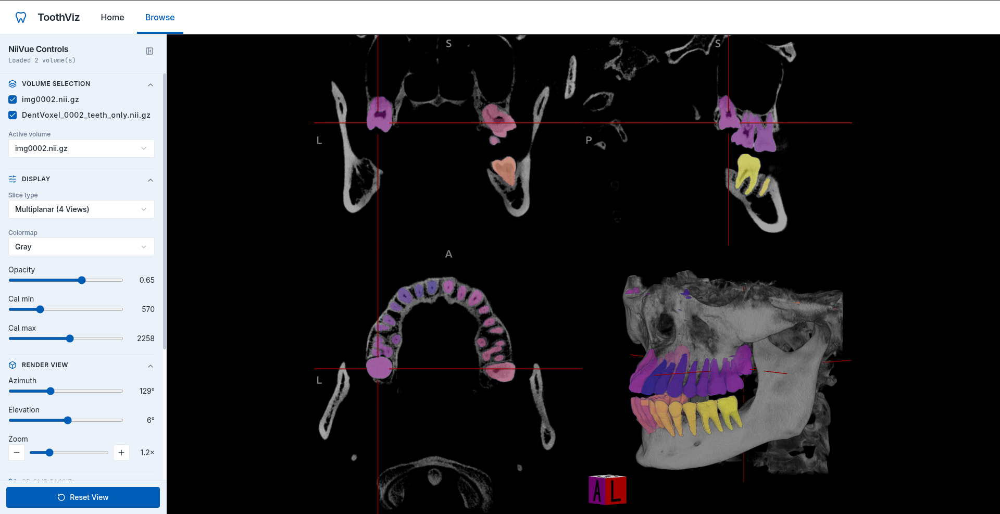

# ToothViz - Dental CBCT Visualisation and Tooth Segmentation

ToothViz is a local-first desktop application for analysis of dental cone-beam
computed tomography (CBCT) scans, automatic ML-based teeth segmentation, and visualisation of
results in an interactive 2D and 3D viewer.

The application accepts NIfTI data, runs the processing pipeline on the
user's machine, and overlays the resulting segmentation mask on the original
volume - all done locally, performant on the CPU and not uploaded to an external service.

ToothViz is being developed as part of an engineering thesis by Paweł Fornagiel,
Katarzyna Bęben, Łukasz Dragon, and Emil Żychowicz.

[How it works](#how-it-works) · [Quick start](#quick-start) ·
[Development](#development) · [Architecture](#architecture)

## Screenshots

<!--
Add the application screenshots as:
docs/screenshots/start.png
docs/screenshots/pipeline.png
docs/screenshots/visualization.png
-->




## How it works

The application lets the user open a NIfTI volume for a temporary viewing
session, create a named study from a NIfTI file or a DICOM series, or reopen a
study from the local archive. DICOM input is converted to NIfTI automatically.
When creating a study, the user chooses whether to inspect the volume only,
overlay an existing segmentation mask, or run the local ONNX model.

Processing reports progress for each upload, conversion, and segmentation step.
The source volume can be previewed while inference is still running. Once the
pipeline finishes, the scan and the mask (if one was produced) are shown as
separate layers in the 2D/3D viewer, where the user can window the CT, switch
layouts, and clip the volume.

## Quick start

### Prerequisites

- Python 3.11 or newer
- [uv](https://docs.astral.sh/uv/)
- Node.js 20 or newer with npm
- GNU Make
- [Git LFS](https://git-lfs.com/) for the ONNX model files

Clone the repository, retrieve the model assets, and install the dependencies:

```bash
git clone https://github.com/pFornagiel/tooth.git
cd tooth

git lfs install
git lfs pull

cd packages/application
make install
make desktop-dev
```

`make desktop-dev` installs the frontend and Electron dependencies when needed,
starts the local FastAPI backend, and opens the Electron window.

The automatic mode requires the Git LFS object at
`packages/models/tooth_seg_semantic.onnx`. If the model is unavailable, raw
volume viewing and precomputed masks can still be used.

### Run without the model

Dummy mode generates a disposable test mask instead of running inference. It is
useful when developing the upload, pipeline, or viewer workflow:

```bash
cd packages/application
SEGMENTATION_MODE=dummy make desktop-dev
```

The generated mask is random and has no clinical or analytical meaning.

## Development

### Browser-based frontend development

After completing the dependency installation above, run the backend and frontend
in separate terminals.

Terminal 1 — API:

```bash
cd packages/application
uv run uvicorn backend.app:app \
  --reload \
  --host 127.0.0.1 \
  --port 8000
```

Terminal 2 — frontend:

```bash
cd packages/application/frontend
npm run dev
```

Open <http://127.0.0.1:5173>. The API is available at
<http://127.0.0.1:8000>, with interactive OpenAPI documentation at
<http://127.0.0.1:8000/docs>.

To use the dummy segmentation worker in this setup, prefix the API command with
`SEGMENTATION_MODE=dummy`.

### Build a desktop installer

```bash
cd packages/application
make desktop-dist
```

Build artefacts are written to `packages/application/desktop/release/`.
Packaging is still under development: the generated application does not yet
bundle Python and uv, so those tools must be available on the target system.

### Tests and static checks

Run these commands from the repository root:

```bash
uv run pytest
npm --prefix packages/application/frontend run test
npm --prefix packages/application/frontend run typecheck
npm --prefix packages/application/frontend run lint
```

## Architecture

The Electron main process allocates a free loopback port and launches FastAPI as
a child process. The React interface communicates with that API over HTTP and
receives job updates over a WebSocket. FastAPI coordinates uploads, study
metadata, content-addressed file storage, DICOM conversion, and segmentation
workers. NiiVue renders the resulting volumes in the React interface.

The main technologies are:

- **Desktop:** Electron and TypeScript
- **Interface:** React, Vite, Tailwind CSS, Material UI, and NiiVue
- **Backend:** FastAPI, SQLAlchemy, and SQLite
- **Medical imaging:** dicom2nifti and NiBabel
- **Inference:** ONNX Runtime with the CPU execution provider

## Segmentation model

Right now the app ships a test ONNX model. It is enough to run automatic
segmentation end to end and overlay a mask in the viewer, but it is not the
model this project is aiming for.

The real weights are still being trained. We forked nnU-Net and changed two
things so the network can run on a laptop CPU instead of needing a full 3D
U-Net. First, the convolutions are depth-wise separable — the same trick
MobileNet uses — which cuts the parameter count a lot. Second, the model is
2.5D: it still segments one slice at a time, but each slice is stacked with a
neighbour a little above and a little below, so it has some 3D context without
the cost of looking at the whole volume. It is trained on ToothFairy3 to label
each of the 32 adult teeth, and that export will replace the test model in the
final product.

Inference today still goes through ONNX Runtime on CPU: intensity
normalisation, resampling, sliding-window prediction with Gaussian blending,
then mapping the mask back onto the original volume. Model files live in Git
LFS, so run `git lfs pull` after cloning if you want automatic segmentation.

## Data and configuration

In the desktop application, the SQLite database, uploaded scans, and generated
artefacts are stored under Electron's per-user application data directory. When
FastAPI is run directly, the default location is
`packages/application/data/`.

The desktop-managed backend listens only on `127.0.0.1`. The application does
not intentionally transmit scan data, masks, or study metadata to an external
service.

The backend supports these optional environment variables:

- `TOOTH_DATA_ROOT` — override the data and database directory.
- `TOOTH_MODEL_PATH` — use a different ONNX model.
- `SEGMENTATION_MODE` — select `normal` or `dummy` inference.
- `TOOTH_FRONTEND_DIST` — override the built frontend directory.
- `TOOTH_SERVE_FRONTEND` — set to `1`, `true`, or `yes` to serve the built
  frontend from FastAPI.

## Repository layout

```text
packages/
├── application/
│   ├── backend/       FastAPI service, storage, database, and workers
│   ├── desktop/       Electron main process and packaging
│   ├── frontend/      React application and NiiVue integration
│   └── tests/         Backend unit and integration tests
├── models/            Git LFS-managed ONNX model assets
└── prototyping/       Earlier experiments and proofs of concept

notes/                 Research notes and thesis resources
```

## Disclaimer

This repository contains research and educational software developed as part of
an engineering thesis. ToothViz is not a medical device, has not been certified
for diagnostic use, and must not be relied upon for clinical decisions.
