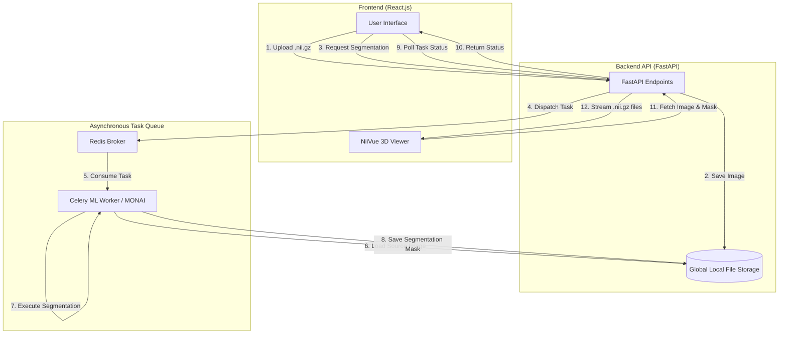

This document is the architecture proposal for **CBCT Image Analysis Application**

### System Overview

This document outlines the architecture for a web-based application designed to upload, visualize, and analyze Cone Beam Computed Tomography (CBCT) medical images in the NIfTI format (`.nii.gz`). The system focuses on performing deep learning-based tooth segmentation while maintaining responsive user experience.

The system is decoupled into three primary domains: the client-side visualization interface, the backend API for file and task management, and the asynchronous message queue for executing machine learning workloads.

### Architecture Structure

### Technologies

| Component          | Technology                        | Role                                            |
| :----------------- | :-------------------------------- | :---------------------------------------------- |
| **Frontend UI**    | React.js                          | Single Page Application (SPA) shell.            |
| **3D Viewer**      | NiiVue                            | WebGL 2.0 rendering of NIfTI files.             |
| **Backend API**    | FastAPI                           | REST API, file routing, and task dispatching.   |
| **Task Queue**     | XXXXX                             | Background job management.                      |
| **Message Broker** | XXXXX                             | Message transport.                              |
| **ML Framework**   | PyTorch + MONAI                   | 3D Image processing and model execution.        |
| **Storage**        | Local File System / Local Databse | Global persistent storage for images and masks. |

### Infomration FLow

1. `[Frontend]` The user selects a NIfTI file via the React UI. A POST request sends the file to FastAPI.

2. `[Backend]` FastAPI writes the file to the shared local disk (e.g., app/data/images/scan_001.nii.gz) and returns a unique file identifier to the frontend.

3. `[Frontend]` The React component passes the file URL to NiiVue, which fetches the NIfTI file from FastAPI and renders it on the canvas.

4. `[Frontend]` The user clicks "Run Segmentation". React sends a request to FastAPI with the file identifier.

5. `[Backend]` FastAPI creates a unique Task ID, places a segmentation job onto the Redis queue, and immediately returns the Task ID to the frontend.

6. `[Task-Queue]` The TASK-QUEUE worker picks up the job. It loads the file from the local storage, normalizes the data (resampling, intensity clipping), and runs the inference using MONAI (e.g., using a Swin UNETR model).

7. `[Task-Queue]` The TASK-QUEUE worker generates a binary mask of the segmented teeth and saves it back to the global storage (e.g., app/data/masks/scan_001_mask.nii.gz).

8. `[Frontend]` The frontend periodically polls FastAPI with the Task ID. Once FastAPI reports the task as "Completed", React receives the URL for the newly generated mask.

9. `[Frontend/Backend]` NiiVue fetches the mask URL and overlays the segmentation on top of the original CBCT scan.