https://radiologie.usmf.md/wp-content/blogs.dir/131/files/sites/131/2018/04/1_Color-Atlas-of-Dental-Medicine-Radiology.pdf

Macleod, Iain & Heath, Neil. (2008). Cone-Beam Computed Tomography (CBCT) in Dental Practice. Dental Update. 35. 590-598. 10.12968/denu.2008.35.9.590. 

https://www.physicamedica.com/article/S1120-1797(21)00251-9/fulltext

https://github.com/DataCurationNetwork/data-primers/blob/main/Neuroimaging%20DICOM%20and%20NIfTI%20Data%20Curation%20Primer/neuroimaging-dicom-and-nifti-data-curation-primer.md

https://brainder.org/2012/09/23/the-nifti-file-format/

https://www.sciencedirect.com/science/article/pii/S0300571224002999

https://arxiv.org/html/2312.12990

https://www.nature.com/articles/s41467-022-29637-2

https://pmc.ncbi.nlm.nih.gov/articles/PMC3948928/

https://www.researchgate.net/publication/239808108_Working_with_the_DICOM_and_NIfTI_Data_Standards_inR

### Introduction

In modern day medicine radiology has become an integral component in the assessment of the dental patient. Among the others, the clinical practice of dentistry has been observed to exhibit increasing use of digital three-dimensional data that can be gathered from computed tomography (CT), cone beam computed tomography (CBCT) and alike methods. This data has improved diagnosis, treatment planning, intervention, and patient follow-up in several areas of dentistry, allowing for computer-assisted surgical planning or navigation, tooth auto-transplantation planning, and virtual treatment planning for orthodontic treatments.

For most dental practitioners there is a growing requirement in a number of clinical situations for not only more multiplanar imaging but also complimentary tooling. To obtain a patient-specific 3D model from a CT or CBCT scan, the anatomical structures of interest must be carefully delineated on the 3D image slices, a process called segmentation. Segmentic individual teeth and alveolar bony structures from CBCT images to reconstruct a precise 3D model has, at this point, become essential in digital dentistry. Moreover, presence of severe artifacts in the imaging sparks a need for proper denoising technology.

Becasue of the growing need of such medical imagining over the years, different standards of the scan data representation have been created and adopted. Some intended to standardize the images generated by diagnostic modalities, e.g., Dicom, others were envised with the aim to facilitate and strengthen post-processing analysis, such as Nifti, Analyze and Mint.  

Above reasons motivate the development of dedicated software capable of accommodating such requirements, providing both comprehensive volumetric visualization, image segmentation and augmentation while utilising modern state-of-the-art techniques - particularly those grounded in machine learning. This thesis describes the current demand for such a solution and documents the efforts undertaken to engineer an application designed to support dentists in their daily clinical tasks, encompassing its architectural design and implementation.

### Client

The target group of the solution consists of orthodontic and endodontic practitioners who are not highly tech‑savvy, but have a basic knowledge of software usage and are willing to follow instructions in the case of a more demanding process, such as software installation.

The client representing this user group expressed dissatisfaction with existing solutions, mainly due to the need to switch between multiple tools in order to complete the full tooth scan analysis workflow. Additionally, the visualization tools currently used were described as overly complex, containing many features that are not relevant to dental practice, which makes the processing of CBCT scans more difficult.

The collaboration provided the contextual foundation for the problem definition while leaving all technical design decisions and implementation choices within the scope of this thesis.

### Problem overview

The problem addressed in this project is the development of an end‑to‑end, standalone application for the analysis of dental CBCT images, including their visualization and tooth segmentation, with smooth rendering and a user‑friendly, minimal interface.

The main issue addressed by this work is the lack of applications that enable direct, end‑to‑end processing of CBCT images stored in the NIfTI format, without requiring additional format conversion, the use of multiple external tools, or technical expertise from the end user. An additional feature of the proposed solution is support for the DICOM format, ensuring compatibility in case of future changes in image data formats.

Significant attention was paid to ease of use for dental practitioners, rather than research‑oriented tooling or cloud‑based processing. In‑depth discussions with the client indicated that smooth and responsive visualization is a key part of the application. Another important consideration, given the medical domain, is data privacy, with local execution identified as the preferred mode of operation.

### Motivation

Although many medical imaging tools and platforms are available, most existing solutions focus on processing DICOM‑format files and either general‑purpose scan visualization or research‑oriented machine‑learning purposes. As a result, none of these tools fully meet the requirements of local execution, NIfTI support, full workflow integration, and ease of use for dentists. Moreover, there is no open‑source solution dedicated specifically to dental practitioners.

This work is aimed at filling the identified gap. The publicly available ToothFairy3 dataset provides a reference point for validating the proposed segmentation solution, while simultaneously serving as realistic input data. The outcome of this project is an open‑source, self‑contained application that supports the analysis of CBCT tooth images. A significant advantage of the proposed solution is that end users are not required to understand complex file formats or machine‑learning pipelines. An additional benefit is a straightforward and intuitive usage flow. 

### Existing solution analysis

Numerous tools for the visualization and segmentation of medical images already exist on the market, ranging from minimal research libraries to fully integrated clinical applications. This part briefly examines the key categories, emphasizing their constraints and the elements that motivated the elements of the proposed system.

The available options vary significantly regarding the user's expected technical proficiency, monetisation model, and licensing, making it impossible to determine which one is the best or most universally applicable. It does, however, hightlight areas of improvements over the currently available approaches.

---

#### 1. Lightweight visualization tools

First category we can point out is the code-first approach. VolViz can serve as one of the examples, being a minimal Python library that allows for interactive rendering of 3D NumPy arrays directly within notebook environments such as Jupyter or Google Colab. ([1]) Its work characteristics make it well-suited for research pipelines in which the data scientist operates entirely within a programmatic context. Nonetheless, these solutions assume an understanding of programmatic knowledge, rendering them unsuitable for clinical implementation.

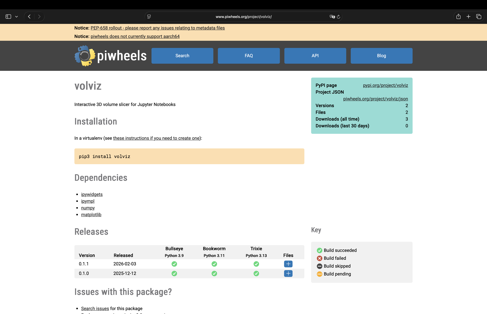
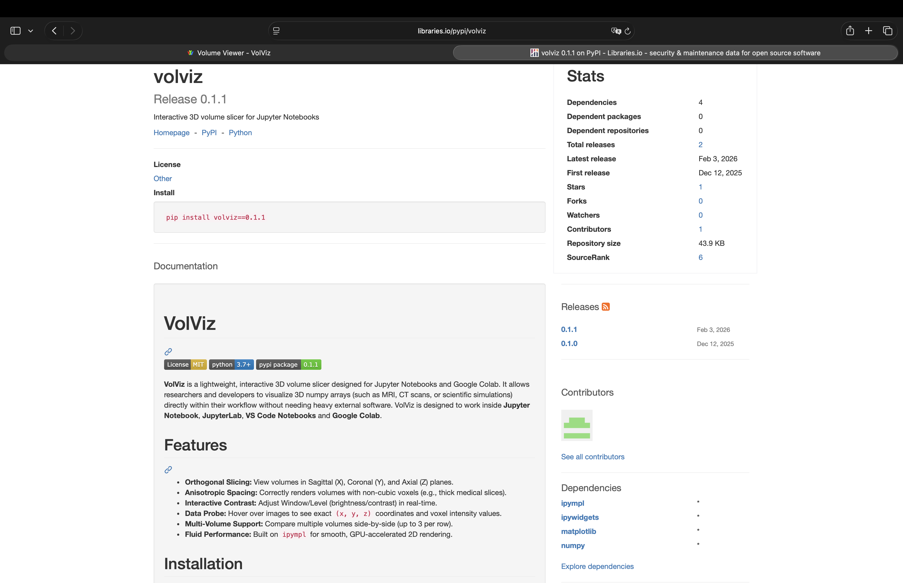

This category provides inspiration by demonstrating that responsive 3D visualization can be realized without substantial overhead. The capacity to rapidly load volumetric data and transform it directly into an interactive visual representation influenced the performance‑focused design of the offered application.

At the same time, such tools are not suitable for clinical dental application. They require programming knowledge, manual file handling, and operate entirely within developer‑oriented environments. They also provide no segmentation capabilities and fail to tackle CBCT-specific issues like noise and metal artifacts, which are well recognized in dental radiology literature and were noted by the client. These shortcomings indicate the need to preserve lightweight rendering principles while fully abstracting technical complexity away from the end user.

---

#### 2. Web‑based medical image viewers

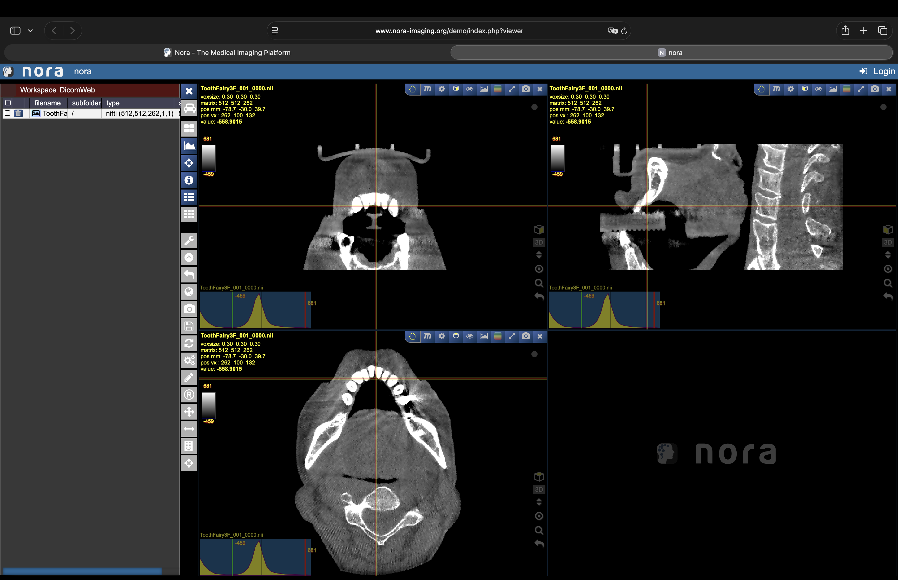
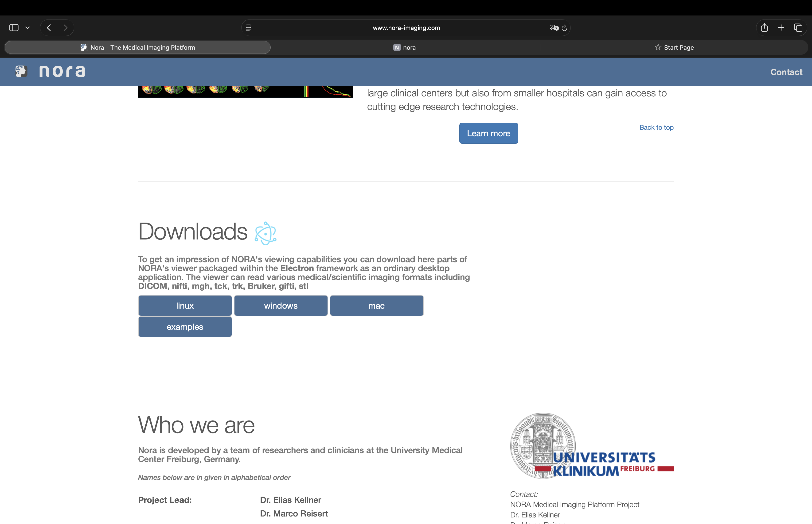
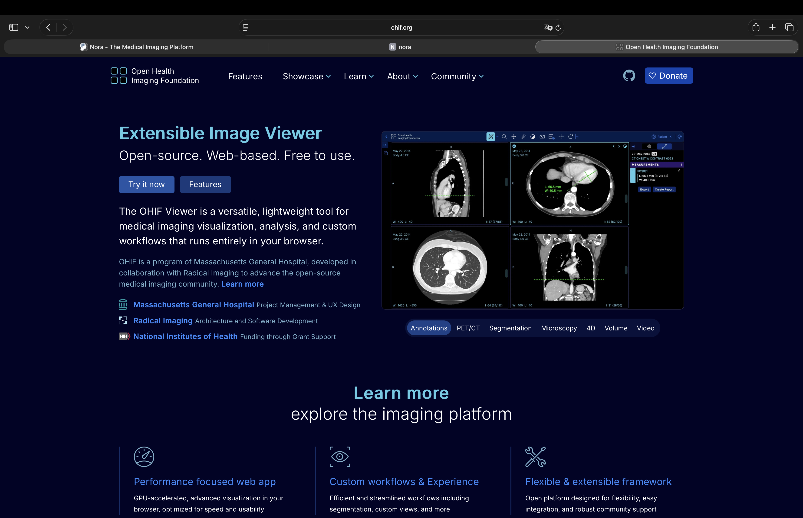
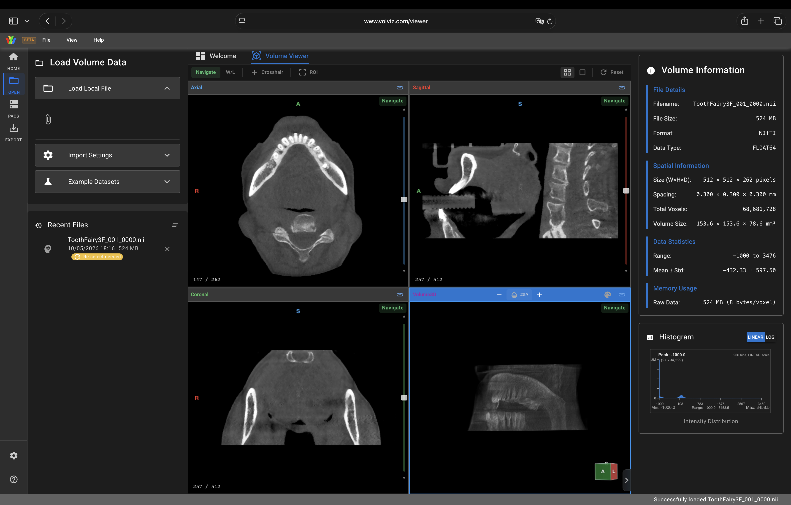

Web-based viewers like **Nora Imaging**, **OHIF Viewer**, and **VolViz Volume Viewer** (beta version) extend lightweight visualization ideas into complete interactive applications. Nora Imaging is highly significant, as it accommodates both DICOM and NIfTI formats, offers multi-planar reconstruction, overlays, regions of interest, and basic labeling, and can be accessed directly in a browser without any installation requirements.

These platforms significantly impacted the interaction design of the proposed system. Loading file picker, instant visualization without complex configuration, and seamless reslicing through anatomical planes acted as usability benchmarks. Deployments based on browsers and Electron-style further illustrate effective cross-platform distribution methods.

Nevertheless, practical constraints arise when these viewers are utilized for dental CBCT data. Extensive CBCT volumes frequently surpass browser memory limits, resulting in strict file size restrictions or unstable performance. When accessible, segmentation features are generally experimental and not dependable for dental structures. The OHIF Viewer, while established and effective in radiology workflows, is exclusively focused on DICOM and does not accommodate NIfTI, highlighting the divide between clinical acquisition formats and research-focused post-processing pipelines. These limitations motivate the choice of local execution while retaining web-inspired interaction styles.

---

#### 3. General‑purpose medical imaging platforms

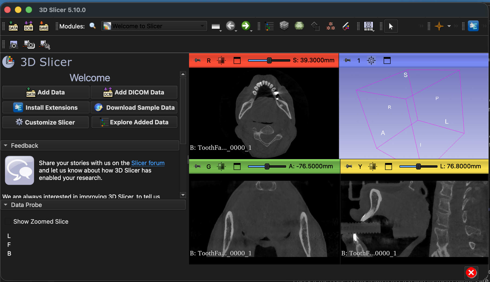
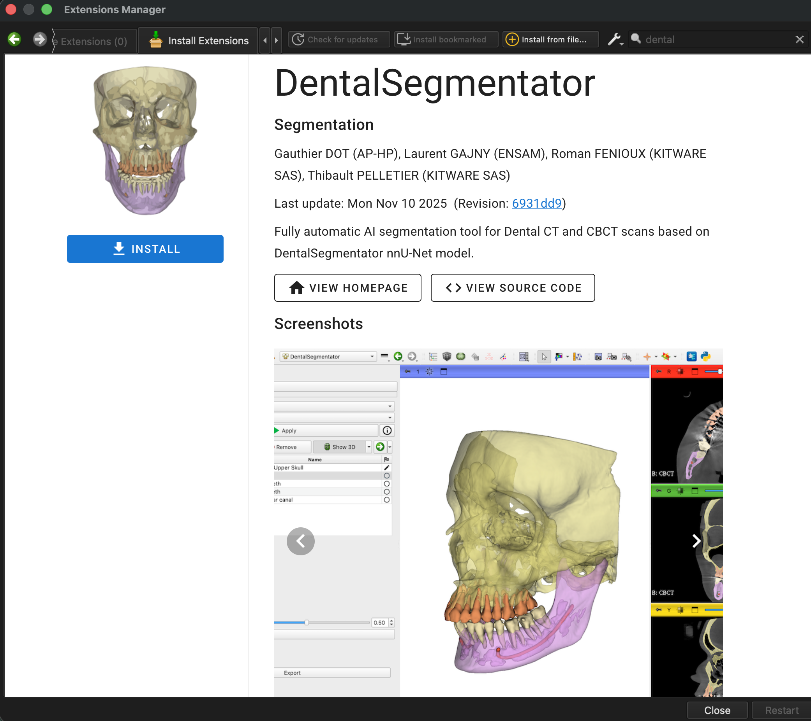

Desktop platform like **3D Slicer** is among the most feature-rich open-source options available for analyzing medical images. It accommodates both DICOM and NIfTI formats, offers advanced 3D visualization, manual and AI-assisted segmentation, and allows extensibility via plugins ([4]). From a technical standpoint, they confirm the feasibility of combining complex image-processing and segmentation processes into a unified platform.

The **Dental Segmentator** extension further illustrates that automatic segmentation of dental structures—like teeth, mandible, and mandibular canal—from CT and CBCT scans is clinically achievable. This establishes that tooth-level segmentation using CBCT data is not only a research issue but also a viable task.

However, platforms such as 3D Slicer demonstrate a significant usability compromise. Their interfaces provide various tools and settings designed for different medical fields, leading to a challenging learning experience. Even straightforward workflows demand in-depth expertise, which does not align with the expectations of dentists looking for quick and consistent analyses. Although their segmentation abilities influenced the technical aims of this thesis, their complexity prompted a more targeted design specific to dentistry.

---

#### 4. Commercial end‑to‑end dental solutions

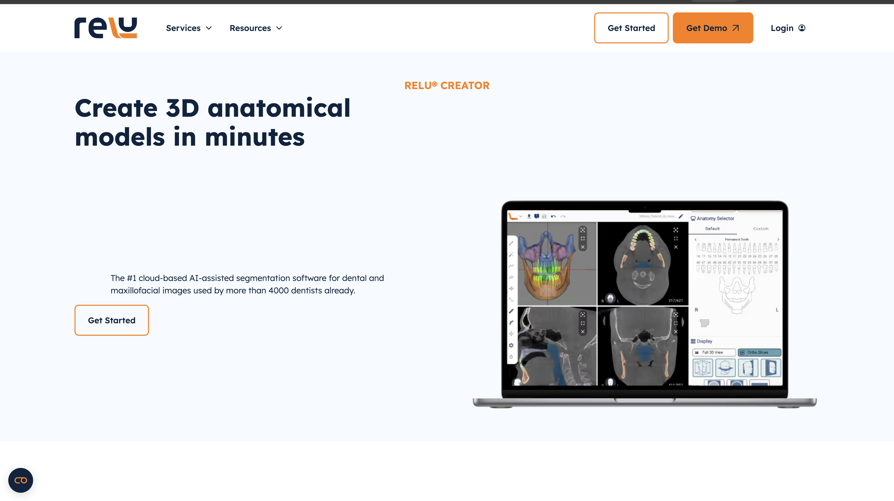
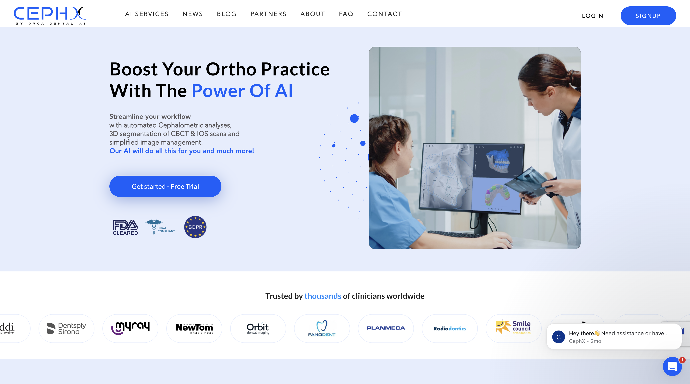
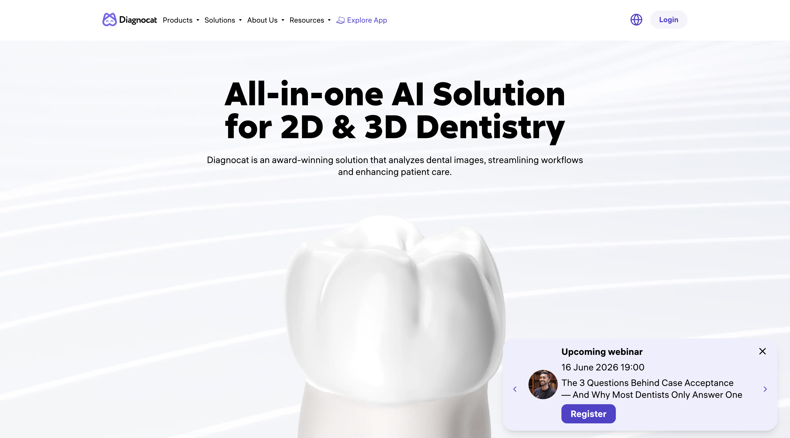
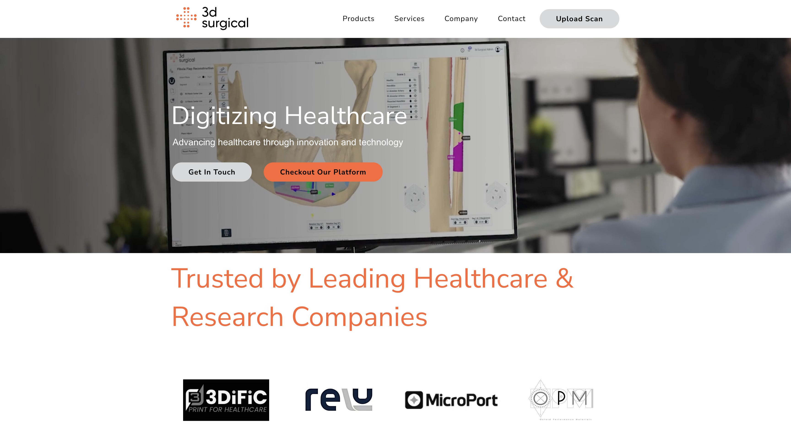

Commercial platforms like **Relu Creator**, **CephX**, **Diagnocat**, **3D Surgical** establish the present condition of clinical practice in imaging for dental and maxillofacial fields. These systems offer automated workflows that include data uploading, AI-driven segmentation, 3D visualization, and treatment planning, clearly indicating a significant clinical need for comprehensive dental CBCT solutions.

These products greatly impacted the workflow design of the suggested system. Automation-first strategies, minimal necessary user engagement, and visually straightforward display of segmentation outcomes set a standard for usability tailored to dentists. Their extensive range demonstrates that intricate image analysis can be successfully concealed behind user-friendly interfaces.

At the same time, these solutions expose significant limitations. They are mainly proprietary and cloud-based, raising concerns related to patient data privacy, compliance with regulations, and expenses. Their workflows are mostly tightly coupled to DICOM, with no native NIfTI support, limiting interoperability with research pipelines and modern machine‑learning workflows. Their closed ecosystems also prevent customization or inspection of underlying algorithms, motivating the development of a local, open‑source alternative.

---

#### 5. Backend frameworks and AI classification models

Backend-focused frameworks like **MIST**, foundational models such as **MedSAM2**, or the 3DSlicer extension **DentalSegmentator** exemplify the cutting edge in medical image segmentation studies. They show that high-quality, versatile 3D segmentation can be accomplished across imaging modalities, such as CT and CBCT, by employing contemporary deep-learning architectures trained on extensive datasets ([2], [3]).

These tools mainly shaped the internal structure of the suggested system instead of its outward design. They motivated modular pipelines, differentiation between inference and visualization, and the reuse of pretrained models. Nonetheless, their absence of graphical user interfaces, workflow orchestration, and visualization features renders them inappropriate for direct clinical application. Their computational requirements and dependence on specialized skills further highlight the necessity of integrating sophisticated algorithms into a user-friendly dental application.

#### 6. Synthesis and recognized gap

Across all assessed categories, existing solutions address only subsets of the client’s requirements, while failing to satisfy others or directly conflicting with them. Lightweight tools focus on efficiency or easy usage in developer environment but lack usability and clinical workflow support. Web-based viewers prioritize accessibility, yet face challenges with scalability and specialization. Research‑oriented platforms offer powerful segmentation capabilities but remain overly complex and unsuitable for routine clinical use. Commercial systems provide end-to-end workflows while compromising on openness, local execution, and format flexibility. The most crucial aspect - none of reviewed products is a comprehensive, free app dedicated specifically to the analysis of dental CBCT tooth images.

No evaluated solution integrates **native NIfTI and DICOM compatibility**, **local and offline processing**, **seamless visualization of extensive CBCT volumes**, **tooth-specific segmentation**, and a **simple, dentist-focused interface** within a single, free, standalone application. The proposed system aims to integrate the best concepts from current tools while directly tackling their identified shortcomings, establishing the basis for the design and implementation decisions discussed in later chapters.

---

### References

1. https://github.com/RJPaneque/volviz

2. Isensee, F., et al. (2022). Foundation models for medical image segmentation. *Nature Communications*, 13, 29637.  
   https://www.nature.com/articles/s41467-022-29637-2

3. Ma, J., et al. (2023). Segment Anything for 3D medical images. *arXiv preprint arXiv:2312.12990*.  
   https://arxiv.org/html/2312.12990

4. Fedorov A, Beichel R, Kalpathy-Cramer J, Finet J, Fillion-Robin JC, Pujol S, Bauer C, Jennings D, Fennessy F, Sonka M, Buatti J, Aylward S, Miller JV, Pieper S, Kikinis R. 3D Slicer as an image computing platform for the Quantitative Imaging Network. Magn Reson Imaging. 2012;30(9):1323–41. doi: 10.1016/j.mri.2012.05.001. [DOI](https://www.sciencedirect.com/science/article/abs/pii/S0730725X12001816?via%3Dihub)

 

### Domain knowledge

<!-- Because of its growing usage, different standards of the scan data representation have been adopted, which also neccesitates creation of computer software that will support these formats. The most prominent ones at the moment are the DICOM and NiFTI files. 

The DICOM standard - Digital Imaging and Communications in Medicine (DICOM) - is used to exchange images and information and has been around for over over 20 years. The use of the DICOM format started to take off in the mid-nineties. DICOM comes with several support layers, allowing image senders and receivers to exchange information about the analyzed images. 

The Neuroimaging Informatics Technology Initiative (NIfTI) was established to work with medical and research device users and manufacturers to address some of the problems and shortfalls of other imaging standards. The NIfTI standard was specifically designed to address these challenges in the neuroimaging field, focusing on functional magnetic resonance imaging (fMRI).  -->

