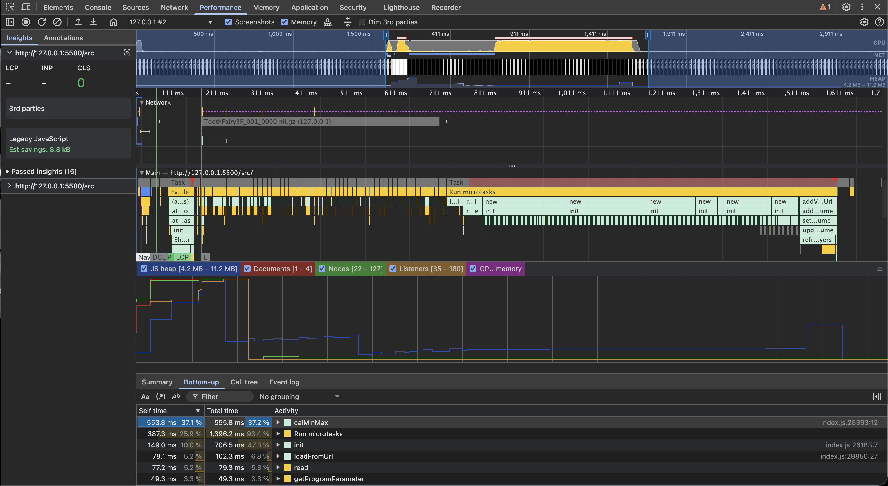
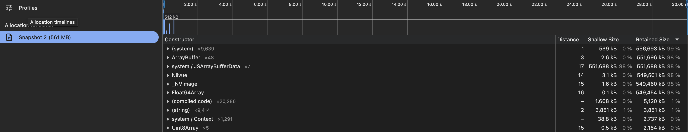

# Niivue

## Wymagania sprzętowe

Działa całkiem płynnie na laptopie zintegrowaną kartą graficzną:
 - CPU: Intel(R) Core(TM) i5-8250U CPU @ 1.60GHz
 - RAM: 16GB

Ładowanie obrazu trwa to na tym laptopie ~3s, na MacBooku Pro ~1s.
(na obrazie 1 widać profiler z macbooka od załadowania strony (zaznaczony obszar))

po załadowaniu zużywa lekko więcej niż nieskompresowany obraz (~540MB dla obrazu ~500MB) 
(zależy ile widoków mamy otwartych)
(obraz 2 pokazuje zuzycie pamięci od załadowania strony)

1: 
2: 

## Licencja

**BSD BSD 2-Clause "Simplified"**, więc nie ma problemu
z uzyciem, nawet komercyjnie.`

## Dokumentacja

Dokumentacja jest całkiem dobra, wrzucę tu co zwrócił mi LLM:

# ======== info od LLMa ========

# NiiVue Visualization Library Overview

## What is NiiVue?

**NiiVue** is a modern, WebGL-based medical image visualization library designed for displaying neuroimaging data directly in web browsers. It's particularly focused on visualizing NIfTI (Neuroimaging Informatics Technology Initiative) format files, which are commonly used in medical imaging and neuroscience research.

## Core Features

### 1. Medical Image Visualization
- **3D Volume Rendering**: Displays volumetric medical imaging data (CT, MRI, PET scans)
- **Multi-planar Views**: Shows axial, coronal, and sagittal slices simultaneously
- **Overlay Support**: Can display multiple image layers with adjustable opacity and color maps
- **Mesh Rendering**: Supports 3D surface meshes (brain surfaces, segmentations)

### 2. File Format Support
- **Primary**: NIfTI (.nii, .nii.gz)
- **Also supports**: DICOM, NRRD, MGH/MGZ, and other neuroimaging formats
- Can load files from URLs or local file system

### 3. Interactive Controls
- Pan, zoom, and rotate capabilities
- Crosshair navigation across slices
- Window/level adjustments for contrast
- Slice scrolling and orientation changes

### 4. Customization Options
- Multiple color maps (grayscale, hot, cool, jet, etc.)
- Adjustable opacity and blending modes
- Clipping planes for selective visualization
- Custom shaders support

## Segmentation Mask Visualization

NiiVue provides excellent support for displaying segmentation masks:

- **Overlay volumes**: Load masks as overlay volumes on top of original images
- **Multi-label support**: Both binary and multi-label segmentations
- **Color assignment**: Assign different colors to each label/class
- **Transparency control**: Adjustable transparency to see underlying anatomy
- **Multiple layers**: Display multiple segmentation layers simultaneously
- **Label-specific colormaps**: Custom color maps for different labels (e.g., label 1 = red, label 2 = blue)

### Example: Segmentation Overlay

```javascript
import { Niivue } from '@niivue/niivue'

const nv = new Niivue()
nv.attachToCanvas(document.getElementById('gl'))

// Load original image and segmentation mask
await nv.loadVolumes([
  { 
    url: './scan.nii.gz', 
    colormap: 'gray' 
  },  // Original CT/MRI scan
  { 
    url: './mask.nii.gz', 
    colormap: 'red', 
    opacity: 0.5 
  }  // Segmentation overlay
])
```

### Multi-Label Segmentation Example

```javascript
// Display multiple segmentation classes with different colors
await nv.loadVolumes([
  { url: './scan.nii.gz', colormap: 'gray' },
  { url: './teeth_mask.nii.gz', colormap: 'red', opacity: 0.4 },
  { url: './nerve_mask.nii.gz', colormap: 'blue', opacity: 0.4 },
  { url: './bone_mask.nii.gz', colormap: 'green', opacity: 0.3 }
])
```

## Technical Architecture

```
┌─────────────────────────────────────┐
│         NiiVue Library              │
├─────────────────────────────────────┤
│                                     │
│  ┌──────────────────────────────┐  │
│  │  WebGL Rendering Engine      │  │
│  ├──────────────────────────────┤  │
│  │  • Volume Renderer           │  │
│  │  • Mesh Renderer             │  │
│  │  • 2D Slice Renderer         │  │
│  └──────────────────────────────┘  │
│                                     │
│  ┌──────────────────────────────┐  │
│  │  File Loaders                │  │
│  ├──────────────────────────────┤  │
│  │  • NIfTI Parser              │  │
│  │  • DICOM Parser              │  │
│  │  • Other Format Parsers      │  │
│  └──────────────────────────────┘  │
│                                     │
│  ┌──────────────────────────────┐  │
│  │  UI Controls                 │  │
│  ├──────────────────────────────┤  │
│  │  • Mouse/Touch Events        │  │
│  │  • Keyboard Shortcuts        │  │
│  │  • GUI Widgets               │  │
│  └──────────────────────────────┘  │
│                                     │
└─────────────────────────────────────┘
```

## Key Advantages

1. **Zero Installation**: Runs entirely in the browser without plugins
2. **Cross-Platform**: Works on desktop and mobile devices
3. **Performance**: Hardware-accelerated WebGL2 rendering
4. **Open Source**: MIT licensed, actively maintained
5. **Framework Agnostic**: Can integrate with React, Vue, Angular, or vanilla JavaScript
6. **Modern Stack**: Built with TypeScript and modern web standards

## Common Use Cases

- **Research**: Visualizing brain imaging studies
- **Clinical**: Reviewing medical scans in web-based PACS systems
- **Education**: Teaching neuroanatomy and radiology
- **Quality Control**: Checking image preprocessing pipelines
- **Data Sharing**: Publishing interactive figures in papers
- **Model Validation**: Comparing AI segmentation results with ground truth

## Basic Usage Example

```javascript
import { Niivue } from '@niivue/niivue'

// Initialize NiiVue with options
const nv = new Niivue({
  backColor: [0, 0, 0, 1],      // Black background
  show3Dcrosshair: true,         // Show crosshair
  onLocationChange: handleClick  // Callback for interactions
})

// Attach to HTML canvas element
nv.attachToCanvas(document.getElementById('gl'))

// Load and display a volume
await nv.loadVolumes([{
  url: './brain.nii.gz',
  colormap: 'gray',
  opacity: 1.0
}])

// Set slice position
nv.setSliceType(nv.sliceTypeMultiplanar)
```

## Integration with VISTA3D Project

Given your workspace contains VISTA3D medical imaging data (ToothFairy dataset with `.nii.gz` files), NiiVue would be an excellent choice for:

### Visualization Tasks
- **Training Data Preview**: Visualize dental CT scans before/after processing
- **Quality Assurance**: Verify segmentation results against ground truth
- **Interactive Demos**: Create web-based viewers for model outputs
- **Debugging**: Inspect intermediate results during model development
- **Multi-class Segmentation**: Display different tooth structures with distinct colors

### Example for Dental Segmentation

```javascript
// Load dental CT scan with tooth segmentation
await nv.loadVolumes([
  { 
    url: './ToothFairy3P_001_0000.nii.gz', 
    colormap: 'gray',
    cal_min: -1000,  // Hounsfield units for CT
    cal_max: 3000
  },
  { 
    url: './ToothFairy3P_001_seg.nii.gz', 
    colormap: 'warm',  // Color map for segmentation
    opacity: 0.5
  }
])
```

## Comparison with Alternatives

| Feature | NiiVue | Papaya | BrainBrowser | AMI |
|---------|--------|--------|--------------|-----|
| Modern Stack | ✅ WebGL2 | ⚠️ WebGL1 | ⚠️ WebGL1 | ✅ WebGL2 |
| Active Development | ✅ | ❌ | ❌ | ✅ |
| TypeScript | ✅ | ❌ | ❌ | ✅ |
| Mesh Support | ✅ | ❌ | ✅ | ✅ |
| Mobile Friendly | ✅ | ⚠️ | ⚠️ | ✅ |
| Segmentation Overlays | ✅ | ✅ | ⚠️ | ✅ |
| Documentation | ✅ Excellent | ⚠️ Limited | ⚠️ Limited | ✅ Good |

## Installation

### NPM
```bash
npm install @niivue/niivue
```

### Yarn
```bash
yarn add @niivue/niivue
```

### CDN
```html
<script src="https://unpkg.com/@niivue/niivue"></script>
```

## Resources

- **GitHub Repository**: [niivue/niivue](https://github.com/niivue/niivue)
- **Documentation**: [niivue.github.io/niivue](https://niivue.github.io/niivue/)
- **Live Demos**: Interactive examples on the documentation site
- **NPM Package**: [@niivue/niivue](https://www.npmjs.com/package/@niivue/niivue)
- **API Reference**: Complete API documentation available online

## Advanced Features

### Drawing Tools
- ROI (Region of Interest) drawing
- Annotation support
- Measurement tools

### 3D Rendering
- Volume rendering with ray casting
- Maximum intensity projection (MIP)
- Surface rendering for meshes

### Performance Optimization
- Lazy loading for large datasets
- Progressive rendering
- GPU-accelerated computations

## Browser Compatibility

- ✅ Chrome/Edge (Chromium-based)
- ✅ Firefox
- ✅ Safari (with WebGL2 support)
- ✅ Mobile browsers (iOS Safari, Chrome Mobile)

## Conclusion

NiiVue represents the current state-of-the-art for web-based medical image visualization, combining modern web technologies with specialized neuroimaging expertise. It's particularly well-suited for projects requiring interactive 3D visualization of volumetric medical data in browser environments, with excellent support for segmentation mask overlays making it ideal for AI/ML model validation and demonstration.