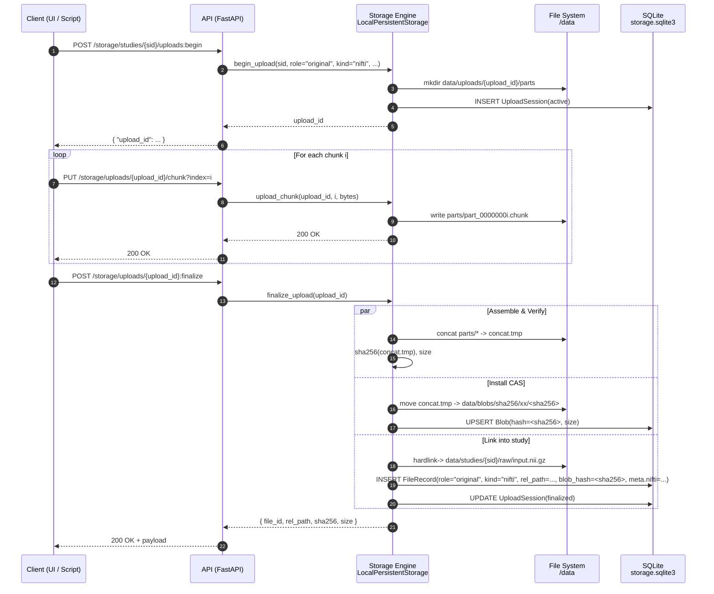

## NIfTI File Upload Flow

The following sequence describes the complete data flow in the system — from submitting a NIfTI file by the client to its final storage in the system (CAS + study directories) and registration in the SQLite metadata database.


---

### 1. Upload Initialization — `begin_upload`

1. The client initiates the upload process by calling:
```
POST /storage/studies/{study_id}/uploads:begin
```
2. The backend:
- verifies that the provided `study_id` exists,
- generates a unique `upload_id` (UUID),
- stores upload metadata in `storage.sqlite3` (table: `uploads`),
- creates a temporary upload directory:

  ```
  data/uploads/<upload_id>/
    meta.json
    parts/
  ```

- returns the generated `upload_id`.

---

### 2. Chunk Uploading — `upload_chunk`

NIfTI files may be large (hundreds of MB). They are therefore uploaded in equal‑sized chunks (e.g., 16 MB).

For each chunk:

1. The client sends:
```
PUT /storage/uploads/{upload_id}/chunk?index=N
```
with the binary chunk in multipart form.

2. The backend stores the chunk as:
```
data/uploads/<upload_id>/parts/part_0000000N.chunk
```
The operation is **idempotent** — chunks may be resent safely in case of network interruption.  
The upload continues until all chunks have been transmitted.

---

### 3. Upload Finalization — `finalize_upload`

After all chunks have been sent, the client requests finalization:
```
POST /storage/uploads/{upload_id}:finalize
```
The backend then performs the full assembly and registration process.

---

### 3.1. Chunk Stitching

All chunks are ordered and merged into a temporary file:
```
data/uploads/<upload_id>/concat.tmp
```

---

### 3.2. Integrity Verification

The system computes:

- the SHA‑256 checksum of the assembled file,
- its final size.

If the client provided `expected_size` and/or `expected_sha256`, the system validates both.

---

### 3.3. Write to CAS (Content‑Addressed Storage)

The file is moved **atomically** into the content‑addressed storage structure:
```
data/blobs/sha256/<prefix>/<sha256></sha256></prefix>
```

where:

- `sha256` — the hash of the file contents,
- `prefix` — the first two characters of the SHA‑256 hash (used to distribute files across directories).

If a blob with the same hash already exists, **no new blob is created** (content deduplication).

---

### 3.4. Create a Link in the Study Structure

The system generates a user‑friendly path inside the study:
```
data/studies/<study_id>/raw/<filename>.nii.gz</filename>
```

This path is a **hardlink** to the blob file.  
If hardlinks are not supported on the filesystem, a fallback copy is created.

---

### 3.5. Register the File in the SQLite Database

A new entry is added to the `files` table with:

- `file_id` (UUID),
- `study_id`,
- `role` = `"original"`,
- `kind` = `"nifti"`,
- `rel_path` = `studies/<study_id>/raw/input.nii.gz`,
- `blob_hash` (SHA‑256),
- file size,
- content type,
- `meta`:
  - if the file is NIfTI, the system automatically extracts:
    - `shape`,  
    - voxel spacing (`pixdim`),  
    - transformation matrix (`affine`).

---

### 3.6. Upload Cleanup

The temporary upload directory is removed:

```
data/uploads/<upload_id>/
```

All chunk files and temporary artifacts are deleted.

---

## 4. Final State — Where Does the File End Up?

After the upload is complete, the file exists in three representations:

---

### 1. Raw File (CAS)

```
data/blobs/sha256/<xx>/<sha256></sha256></xx>
```
- No extension.  
- Identified exclusively by its SHA‑256 hash.  
- Immutable.  
- Used for deduplication and integrity.

---

### 2. User‑Friendly Copy (Study Structure)
```
data/studies/<study_id>/raw/input.nii.gz
```
This is the file used by:

- **Niivue** for visualization,
- **Celery** for preprocessing and segmentation,
- **FastAPI** for returning files to the client.

---

### 3. Database Entry (Metadata)

The `files` table contains:

- full metadata for the file,
- the location of the study‑friendly link (`rel_path`),
- the associated blob hash,
- any extracted NIfTI header information.

---

