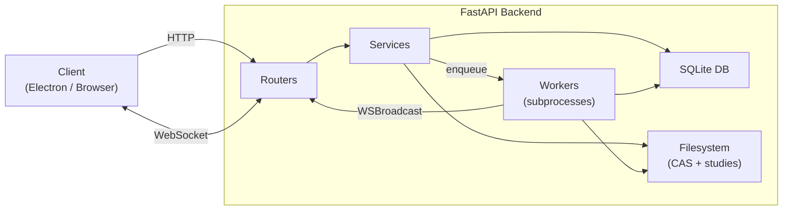
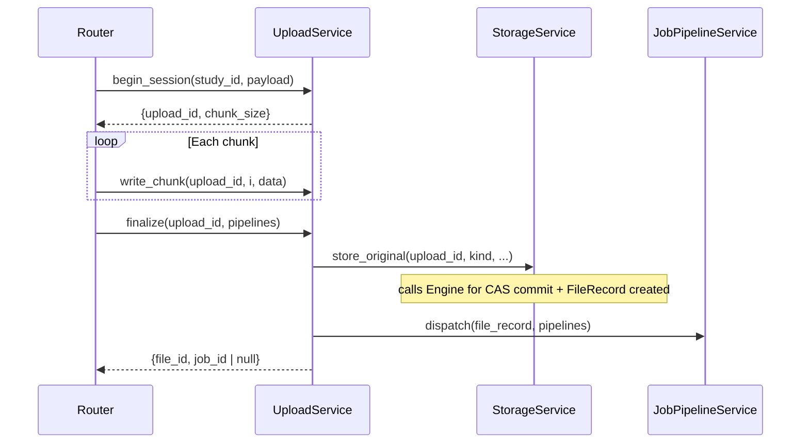
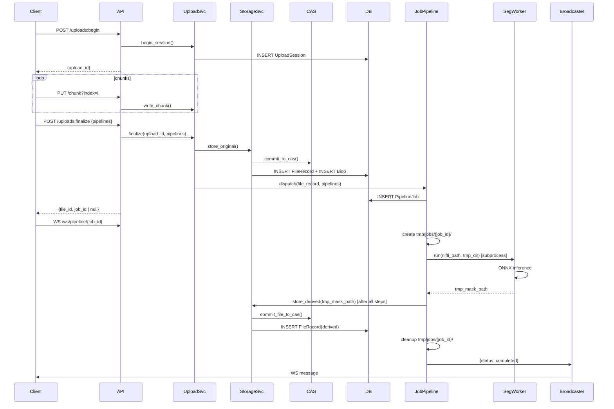
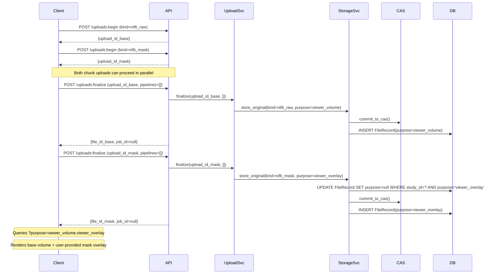
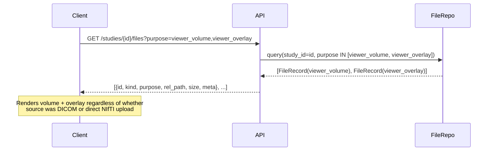

# Architecture Reference: CBCT Backend (Step-by-Step)

This document is the single source of truth for the backend architecture. It supersedes all notes and POC readmes.

---

## System Overview



---

## Target Directory Layout

```
backend/
├── main.py                    # uvicorn entrypoint
├── app.py                     # FastAPI factory + lifespan
├── config.py                  # All settings (paths, chunk size)
├── schemas.py                 # Pydantic request/response models
├── exceptions.py              # Custom HTTP exceptions
│
├── routers/
│   ├── studies.py             # Study CRUD
│   ├── uploads.py             # Chunked upload endpoints
│   ├── files.py               # File content retrieval
│   └── ws.py                  # WebSocket progress
│
├── services/
│   ├── upload_service.py      # Upload state machine
│   ├── storage_service.py     # CAS commit + FileRecord creation
│   ├── study_service.py       # Study CRUD logic
│   └── job_pipeline_service.py # JobPipelineService: step routing, job creation, dispatch
│
├── workers/
│   ├── steps/
│   │   ├── base.py            # PipelineStep protocol, StepContext, StepResult
│   │   ├── dicom_to_nifti.py  # DicomToNiftiStep
│   │   └── segment_nifti.py   # SegmentNiftiStep
│   ├── pipeline_runner.py     # run_pipeline() async orchestrator
│   ├── worker_pool.py         # WorkerPool: ProcessPoolExecutor wrapper (generic)
│   ├── subprocesses/          # Subfolder for pure compute kernels
│   │   ├── dicom_fn.py        # Top-level subprocess fn: convert_dicom(path) → path
│   │   └── segmentation_fn.py # Top-level subprocess fn: run_segmentation(path) → path
│   └── ws_broadcaster.py      # WebSocket registry + broadcast
│
├── db/
│   ├── models.py              # SQLAlchemy ORM (4 models)
│   ├── session.py             # Engine + session factory
│   └── repos/
│       ├── upload_session_repo.py
│       ├── file_repo.py
│       └── pipeline_job_repo.py
│
└── storage/
    ├── engine.py              # StorageEngine protocol
    └── local_engine.py        # LocalStorageEngine implementation
```

### Runtime Data Layout

```
data/
├── blobs/sha256/{xx}/{full_hash}    # Immutable CAS blobs
├── studies/{study_id}/
│   ├── raw/                         # Hardlinks → CAS for originals
│   └── derived/                     # Hardlinks → CAS for outputs
└── uploads/{upload_id}/
    └── parts/                       # Temporary chunks
```

---

## Layer 1: Database Models

### `Study`

| Column | Type | Notes |
|---|---|---|
| `id` | UUID (str) | PK |
| `external_id` | str? | Optional external reference, UNIQUE |
| `status` | str | `created`, `processing`, `ready` |
| `created_at` | datetime | |
| `meta` | JSON | Study-level metadata |

### `FileRecord`

| Column | Type | Notes |
|---|---|---|
| `id` | UUID (str) | PK |
| `study_id` | UUID (str) | FK → Study |
| `pipeline_job_id` | UUID? | FK → PipelineJob, null for originals |
| `role` | str | `original` / `derived` |
| `kind` | str? | `dicom_zip` / `nifti_raw` / `nifti_derived` / `segmentation_mask` |
| `purpose` | str? | See **Purpose Enum** below. `null` = not intended for viewer |
| `rel_path` | str | Path relative to data root |
| `blob_hash` | str(64) | FK → Blob.hash, serves as CAS pointer |
| `content_type` | str? | MIME type |
| `size` | int | Bytes |
| `created_at` | datetime | |
| `meta` | JSON | NIfTI header info, etc. |

### `Blob`

| Column | Type | Notes |
|---|---|---|
| `hash` | str(64) | PK (SHA-256) |
| `size` | int | |
| `created_at` | datetime | |

### `UploadSession`

| Column | Type | Notes |
|---|---|---|
| `id` | UUID (str) | PK |
| `study_id` | UUID (str) | FK → Study |
| `role` | str | |
| `kind` | str | |
| `filename` | str | |
| `content_type` | str? | |
| `expected_size` | int? | |
| `expected_sha256` | str? | |
| `chunk_size` | int | Negotiated chunk size |
| `state` | str | `active` / `finalized` / `aborted` / `expired` |
| `created_at` | datetime | |

### `PipelineJob`

| Column | Type | Notes |
|---|---|---|
| `id` | UUID (str) | PK, returned to client as `job_id` |
| `study_id` | UUID (str) | FK → Study |
| `source_file_id` | UUID (str) | FK → FileRecord that triggers the job |
| `steps` | JSON | Array of step name strings — audit log only |
| `status` | str | `queued` / `running` / `completed` / `failed` / `cancelled` |
| `created_at` | datetime | |
| `started_at` | datetime? | |
| `finished_at` | datetime? | |
| `error` | str? | |

> [!IMPORTANT]
> The old `Task` model from the POC must be replaced by `PipelineJob`.

---

## Canonical Enums

### `kind` — file format / type

| Value | Provenance | Description |
|---|---|---|
| `dicom_zip` | `original` | DICOM series ZIP uploaded by user |
| `nifti_raw` | `original` | Base-scan NIfTI uploaded directly by user |
| `nifti_mask` | `original` | Pre-computed segmentation mask NIfTI uploaded directly by user |
| `nifti_derived` | `derived` | NIfTI produced by the DICOM→NIfTI pipeline step |
| `segmentation_mask` | `derived` | Binary/label NIfTI produced by automated segmentation inference |

### `purpose` — viewer intent

| Value | Who sets it | Viewer usage |
|---|---|---|
| `null` | Default | Not sent to viewer (e.g. archive DICOM zip) |
| `viewer_volume` | `UploadService.finalize()` for `nifti_raw`; `DicomToNiftiStep` for DICOM-derived NIfTI | Primary 3D volume to render |
| `viewer_overlay` | `UploadService.finalize()` for `nifti_mask`; `SegmentNiftiStep` for auto-generated mask | Segmentation mask overlay |

> [!IMPORTANT]
> Only **one** `FileRecord` with `purpose=viewer_volume` should be active per study at a time.
> For NIfTI uploads, `purpose=viewer_volume` is set synchronously at finalize time — before any step runs.
> For DICOM uploads, `DicomToNiftiStep` sets it on the derived NIfTI; the original DICOM zip keeps `purpose=null`.
>
> Only **one** `FileRecord` with `purpose=viewer_overlay` should be active per study at a time.
> **Supersede rule:** whenever a new `FileRecord` is created for a specific purpose (either `viewer_volume` or `viewer_overlay`), `StorageService` must set `purpose=null` on any existing record for the same study with that identical purpose before inserting the new one. This enforces last-write-wins semantics and prevents viewer conflicts.

### `pipeline name` — user-requested pipeline steps

These are the string identifiers sent by the frontend in `FinalizeRequest.pipelines`. They represent **optional, user-driven** pipeline steps. They are distinct from **auto-driven** steps (e.g., DICOM→NIfTI conversion), which are always determined by `file_record.kind` and never appear in this list.

Valid names are enforced by `PipelineRequestItem.name: Literal["segment_nifti"]` in `schemas.py`. An unknown name causes a 422 validation error before `dispatch()` is ever called.

| Name | Step class | Description | Triggered by |
|---|---|---|---|
| `segment_nifti` | `SegmentNiftiStep` | ONNX segmentation inference on a NIfTI file | User selects automated segmentation in UI |

> [!IMPORTANT]
> **Mutual exclusion (UX-enforced, backend supersedes):** A user who uploads a `nifti_mask` should not simultaneously request `segment_nifti`. The frontend enforces this by disabling the mask upload field when automated segmentation is selected (and vice versa). If both somehow occur (e.g., sequential actions), the backend supersedes the earlier `viewer_overlay` with the newer one — no error is raised.

**Frontend → API mapping:**

| UI selection | `BeginUploadRequest.kind` for mask entry | `pipelines` in `FinalizeRequest` |
|---|---|---|
| Pre-computed mask chosen | `nifti_mask` | `[]` |
| Automated DL segmentation chosen | *(mask upload disabled)* | `[{"name": "segment_nifti", "config": {}}]` |
| Neither chosen | *(no mask upload)* | `[]` |

---

## Layer 2: Storage Abstraction (`storage/`)

### `StorageEngine` Protocol (`storage/engine.py`)

Defines the abstract interface for binary I/O operations. This decouples file manipulation from database logic.

```python
class StorageEngine(Protocol):
    def initialize_upload(self, upload_id: str) -> None: ...
    def write_chunk(self, upload_id: str, index: int, data: bytes) -> None: ...
    def get_chunk_size(self, upload_id: str, index: int) -> int | None: ...
    def list_uploaded_chunks(self, upload_id: str) -> list[int]: ...
    
    def abort_upload(self, upload_id: str) -> None: ...
    def commit_upload_to_cas(self, upload_id: str, expected_sha256: str | None, expected_size: int | None) -> tuple[str, int]: ...
    def commit_file_to_cas(self, src_path: Path) -> tuple[str, int]: ...
    
    def link_file_to_study(self, study_id: str, role: str, filename: str, blob_hash: str) -> Path | str: ...
    def remove_study_data(self, study_id: str) -> None: ...
    def delete_blob(self, blob_hash: str) -> None: ...
    def sweep_orphaned_blobs(self) -> int: ...
    def get_job_workspace_dir(self, job_id: str) -> Path: ...
```

### `LocalStorageEngine` (`storage/local_engine.py`)

Implements `StorageEngine` using the local filesystem.
- Manages `data/blobs/`, `data/studies/`, and `data/uploads/` on disk.
- `commit_upload_to_cas`: Stitches parts, computers SHA-256, atomic `os.replace` into CAS.
- `link_file_to_study`: Creates hardlinks in `data/studies/{study_id}/{role}/{filename}`.

---

## Layer 3: Services

### StorageService

Stateless service that combines Database logic (`FileRecord` management) with the injected `StorageEngine`.
Used by both `UploadService` (for originals) and pipeline step classes (for derived files).
Instantiated once at startup with `engine` and `session_factory`.

```python
class StorageService:
    def __init__(self, engine: StorageEngine, session_factory: Callable): ...

    def store_original(
        self, upload_id, study_id, filename, kind, purpose, expected_sha256, expected_size
    ) -> FileRecord: ...

    def store_derived(
        self, src_path, study_id, job_id, filename, kind, purpose
    ) -> FileRecord: ...

    def sweep_orphans(self) -> int: ...
```

`store_original` is called by `UploadService.finalize()`.
`store_derived` is called by the `JobPipelineService` (specifically the async orchestrator `run_pipeline`) at the end of a successful job. Step classes have no direct knowledge of sessions, CAS internals, or the `StorageService`.

**`purpose` supersede:** Both `store_original` (e.g., for `nifti_raw` or `nifti_mask`) and `store_derived` (for downstream outputs) must, before inserting the new `FileRecord`, execute:
```sql
UPDATE file_records SET purpose = NULL
WHERE study_id = :study_id AND purpose = :purpose
```
This ensures last-write-wins semantics and keeps exactly one active volume and one active overlay per study.

### UploadService



Key behaviors:
- `begin_session` → creates `UploadSession` row + parts dir, returns negotiated `chunk_size`
- `write_chunk` → validates session is `active`, checks idempotency by on-disk chunk size
- `get_status` → returns uploaded chunk indices and session state for resume
- `abort_session` → explicitly invoked by UI `DELETE` request; calls `engine.abort_upload()` to reclaim temp space
- `finalize(upload_id, pipelines)` → delegates to `StorageService.store_original()`, then `JobPipelineService.dispatch(file_record, pipelines)`
  - For `kind=nifti_raw`: sets `purpose=viewer_volume` on the `FileRecord` before dispatching
  - For `kind=nifti_mask`: sets `purpose=viewer_overlay` on the `FileRecord` before dispatching; `StorageService` supersedes any prior overlay for the same study
  - For `kind=dicom_zip`: sets `purpose=null` (overlay is produced downstream by steps)
  - `pipelines` comes directly from `FinalizeRequest.pipelines` (see `schemas.py`)
  - Returns `job_id=null` when no pipeline steps are needed

### JobPipelineService

Single point of entry for all background job execution. Owns step routing, `PipelineJob` creation, and dispatch to the `WorkerPool`.

Step routing is split into two independent phases:
- **Phase 1 — auto-steps**: derived from `file_record.kind` only, never user-controllable. `DicomToNiftiStep` is always prepended when `kind="dicom_zip"`. Ordering is guaranteed structurally.
- **Phase 2 — user steps**: derived from the `pipelines` argument (forwarded from `FinalizeRequest.pipelines`). Currently only `"segment_nifti"` → `SegmentNiftiStep`.

If both phases produce an empty step list, `dispatch` returns `None` (no `PipelineJob` is created) and `finalize` returns `job_id=null` to the client.

```python
class JobPipelineService:
    def __init__(
        self,
        worker_pool: WorkerPool,
        session_factory: Callable,
        storage_service: StorageService,
        broadcaster: WSBroadcaster,
        step_registry: dict[str, StepFactory],  # name → factory; injected from app.py
    ): ...

    def dispatch(
        self,
        file_record: FileRecord,
        pipelines: list[dict],  # from FinalizeRequest.pipelines
        db,
    ) -> str | None:
        """Build step list, create PipelineJob, fire asyncio task. Returns job_id or None."""
        # Phase 1: auto-steps — determined by file kind, always ordered first
        auto_steps: list[PipelineStep] = []
        if file_record.kind == "dicom_zip":
            auto_steps.append(DicomToNiftiStep())

        # Phase 2: user-requested steps — registry-driven loop
        # Names are already validated to Literal values by PipelineRequestItem.name
        user_steps: list[PipelineStep] = []
        for item in pipelines:
            factory = self._step_registry[item["name"]]  # KeyError = programming bug, not user error
            user_steps.append(factory(item.get("config", {})))

        steps = auto_steps + user_steps
        if not steps:
            return None  # nothing to run

        job = PipelineJobRepo(db).create(
            study_id=file_record.study_id,
            source_file_id=file_record.id,
            steps=[s.name for s in steps],
        )
        ctx = StepContext(
            job_id=job.id,
            study_id=file_record.study_id,
            current_input_path=storage_engine.get_cas_blob_path(file_record.blob_hash),
            work_dir=storage_engine.get_job_workspace_dir(job.id),
            broadcaster=self._broadcaster,
            _worker_pool=self._worker_pool,
        )
        handle = asyncio.create_task(run_pipeline(job.id, steps, ctx))
        self._running[job.id] = handle
        handle.add_done_callback(lambda _: self._running.pop(job.id, None))
        return job.id

    def cancel(self, job_id: str) -> bool:
        """Cancel in-flight asyncio task. Called by StudyService.delete()."""

    def get_status(self, job_id: str, db) -> PipelineJob:
        return PipelineJobRepo(db).get(job_id)

    async def shutdown(self):
        """Cancel all in-flight tasks and shut down worker pool."""
```

> [!NOTE]
> `PipelineJob.steps` stores a list of step name strings as an **audit log only**.
> Step routing is done in Python — the JSON column is never interpreted at runtime.

### StudyService

- `list()` / `create()` / `rename()` / `delete()`
- Delete cascades: cancel active `PipelineJob`, remove FileRecords from DB; `StorageEngine` purges study directory; inline DB-reference counting identifies unneeded `blob_hash`es and calls `StorageEngine.delete_blob(hash)` to scrub them without Service-layer OS violations.

---

## Layer 4: Workers & Pipeline

### WorkerPool (`workers/worker_pool.py`)

A thin, generic wrapper around `ProcessPoolExecutor`. Decouples pool management from any specific model or initializer. The initializer for the segmentation model is passed in at startup — `WorkerPool` itself has no knowledge of segmentation or DICOM.

```python
class WorkerPool:
    def __init__(
        self,
        max_workers: int = 1,
        initializer: Callable | None = None,
        initargs: tuple = (),
    ):
        self._pool = ProcessPoolExecutor(
            max_workers=max_workers,
            initializer=initializer,
            initargs=initargs,
        )

    async def run(self, fn: Callable, *args) -> Any:
        """Offload a plain function call to the process pool. Returns result."""
        loop = asyncio.get_running_loop()
        return await loop.run_in_executor(self._pool, fn, *args)

    def shutdown(self, wait: bool = False) -> None:
        self._pool.shutdown(wait=wait)
```

This allows `app.py` to configure the initializer at startup without baking it into the `JobPipelineService` or the step classes. If a future step requires a different initializer (e.g., a GPU-based DICOM convertor), a second `WorkerPool` instance can be created with its own `initializer=` and `max_workers=`.

### StepContext (`workers/steps/base.py`)

```python
@dataclass
class StepContext:
    job_id: str
    study_id: str
    current_input_path: Path   # points to CAS blob or previous step's tmp output
    work_dir: Path             # ephemeral dir: data/tmp/jobs/{job_id}/
    broadcaster: WSBroadcaster
    _worker_pool: WorkerPool = field(repr=False)

    async def run_subprocess(self, fn: Callable, *args) -> Any:
        """Offloads fn(*args) to the worker pool. Returns result."""
        return await self._worker_pool.run(fn, *args)
```

### PipelineStep Protocol (`workers/steps/base.py`)

```python
@dataclass
class OutputArtifact:
    path: Path
    kind: str
    purpose: str | None

@dataclass
class StepResult:
    next_input_path: Path
    artifacts: list[OutputArtifact]

class PipelineStep(Protocol):
    name: str
    async def run(self, ctx: StepContext) -> StepResult: ...

# Factory type: receives the validated config dict, returns a step instance.
# Used by the STEP_REGISTRY in app.py.
StepFactory = Callable[[dict], PipelineStep]
```

### Step Classes (`workers/steps/`)

Each step class is a `@dataclass` implementing `PipelineStep`. Step classes accept an optional `config: dict` field (default `{}`) so they can be parameterized by the registry factory. Behavior falls back to hardcoded defaults when config is empty.

Each step's `run` method:
1. Generates an output path inside `ctx.work_dir`.
2. Calls `await ctx.run_subprocess(fn, str(ctx.current_input_path), str(output_path))` — offloads to worker pool.
3. Broadcasts step completion via `ctx.broadcaster`.
4. Returns a `StepResult` with the new forward path and any `OutputArtifact`s it wishes to securely persist.

**`DicomToNiftiStep`** — Runs `convert_dicom(zip_path, out_dir)` in subprocess. Returns `next_input_path=nifti_path`, `artifacts=[OutputArtifact(nifti_path, "nifti_derived", "viewer_volume")]`.

**`SegmentNiftiStep`** — Runs `run_segmentation(nifti_path, out_dir)` in subprocess. Returns `next_input_path=ctx.current_input_path` (passes volume forward unchanged), `artifacts=[OutputArtifact(mask_path, "segmentation_mask", "viewer_overlay")]`.

**Key invariant:** subprocess functions (`workers/subprocesses/dicom_fn.py`, `workers/subprocesses/segmentation_fn.py`) receive and return **plain path strings only**. No ORM objects, sessions, or service instances ever cross the process boundary. Steps do **not** write to the database or storage service whatsoever.

### Pipeline Runner (`workers/pipeline_runner.py`)

Module-level async function `run_pipeline(job_id, steps, ctx, storage_service)`. Runs steps sequentially in the event loop:
1. Create `work_dir` at `data/tmp/jobs/{job_id}/`.
2. Mark `PipelineJob.status = running`.
3. Loop over each step. Collect result `OutputArtifact`s in a dictionary mapping `purpose` to `artifact` (enforcing last-write-wins). Update `ctx.current_input_path` to `result.next_input_path`.
4. On success: loop through aggregated artifacts and call `storage_service.store_derived()` exactly once per successful artifact. Set `Study.status = ready`, broadcast completion, mark job `completed`.
5. On Error: mark job failed/cancelled, broadcast error.
6. Finally block: `shutil.rmtree(work_dir)` to physically wipe all temporary outputs.

### WebSocket Broadcaster (`workers/ws_broadcaster.py`)

- Registry: `dict[job_id, list[WebSocket]]`
- `register(job_id, ws)` / `unregister(job_id, ws)` / `broadcast(job_id, payload)`
- Called **directly** from the async pipeline runner — no `mp.Queue` bridge needed.

> [!NOTE]
> The WebSocket URL and client references use `job_id` (previously `task_id`).
> The `PipelineJob.id` is the value returned to the client as `job_id` and used as the WS path parameter.

---

## Layer 5: Routers (Thin)

### Studies

| Method | Path | Handler |
|---|---|---|
| `GET` | `/storage/studies` | `StudyService.list()` (supports `?external_id=` filter) |
| `POST` | `/storage/studies` | `StudyService.create()` |
| `PATCH` | `/storage/studies/{study_id}` | `StudyService.rename()` |
| `DELETE` | `/storage/studies/{study_id}` | `StudyService.delete()` |

### Uploads

| Method | Path | Handler |
|---|---|---|
| `POST` | `/storage/studies/{study_id}/uploads:begin` | `UploadService.begin_session()` |
| `PUT` | `/storage/uploads/{upload_id}/chunk?index={i}` | `UploadService.write_chunk()` |
| `GET` | `/storage/uploads/{upload_id}/status` | `UploadService.get_status()` |
| `POST` | `/storage/uploads/{upload_id}:finalize` | `UploadService.finalize()` |
| `DELETE` | `/storage/uploads/{upload_id}` | `UploadService.abort_session()` (explicit abort) |

### Files

| Method | Path | Handler |
|---|---|---|
| `GET` | `/storage/studies/{study_id}/files` | List all files for study (optional `?purpose=` filter) |
| `GET` | `/storage/studies/{study_id}/files?purpose=viewer_volume,viewer_overlay` | **Frontend viewer query** — returns only renderable files |
| `GET` | `/storage/studies/{study_id}/files/{file_id}/content` | `FileResponse` (single GET fetch, natively decompressed by client) |

The `?purpose=` query param accepts a comma-separated list of purpose values. `FileRepo` translates this to an `IN` clause. No business logic in the router.

### WebSocket

| Protocol | Path | Handler |
|---|---|---|
| `WS` | `/ws/pipeline/{job_id}` | Register + receive loop |

---

## Layer 6: Application Startup (`app.py`)

**Startup (lifespan):**
1. `Base.metadata.create_all(engine)` (dev) or Alembic (prod)
2. Wipe on Startup: find and abort any lingering `active` UploadSessions
3. CAS OS Sweep Failsafe: sweep `data/blobs/` for orphans (`st_nlink == 1`)
4. Create `WorkerPool(max_workers=1, initializer=_init_segmentation, initargs=(model_path,))`
4. Create `StorageService(data_root, SessionLocal)`
5. Create `WSBroadcaster()`
6. Create `JobPipelineService(worker_pool, SessionLocal, storage_service, broadcaster)`, store as `app.state.job_pipeline_service`

**Shutdown:**
1. `await job_pipeline_service.shutdown()` — cancels in-flight tasks, shuts down pool

```python
@asynccontextmanager
async def lifespan(app: FastAPI):
    Base.metadata.create_all(engine)   # dev; use Alembic in prod
    
    # Wipe on Startup: abort abandoned active UploadSessions
    
    # CAS OS Sweep Failsafe: invoke the engine sweep for st_nlink == 1
    storage_service.sweep_orphans()

    worker_pool = WorkerPool(
        max_workers=1,
        initializer=_init_segmentation,
        initargs=(str(config.MODEL_PATH),),
    )
    storage_engine = LocalStorageEngine(config.DATA_ROOT)
    storage_service = StorageService(storage_engine, SessionLocal)
    broadcaster = WSBroadcaster()

    # Step registry: maps pipeline name → factory callable.
    # Adding a new user-requested step only requires adding an entry here.
    step_registry: dict[str, StepFactory] = {
        "segment_nifti": lambda cfg: SegmentNiftiStep(config=cfg),
    }

    job_pipeline_service = JobPipelineService(
        worker_pool, SessionLocal, storage_service, broadcaster,
        step_registry=step_registry,
    )

    app.state.job_pipeline_service = job_pipeline_service
    app.state.storage_service = storage_service
    app.state.broadcaster = broadcaster

    yield

    await job_pipeline_service.shutdown()
```

No `mp.Queue`. No drain coroutine.

---

## End-to-End Data Flows

### Flow A: NIfTI Upload + Segmentation



### Flow B: DICOM Upload + Auto-Convert + Segmentation

Same as Flow A, but:
1. `finalize` payload includes `pipelines=[{"name": "segment_nifti"}]` (user requested segmentation) **and** `kind="dicom_zip"`
2. `dispatch` Phase 1 prepends `DicomToNiftiStep`; Phase 2 appends `SegmentNiftiStep` → `steps = [DicomToNiftiStep(), SegmentNiftiStep()]`
3. Job creates `tmp/jobs/{job_id}/` workspace.
4. `DicomToNiftiStep` runs first → produces NIfTI in `tmp` → yields `Artifact(purpose=viewer_volume)`.
5. Original DICOM zip `FileRecord` keeps `purpose=null` (never sent to viewer).
6. `SegmentNiftiStep` runs second on the `tmp` NIfTI → produces mask in `tmp` → yields `Artifact(purpose=viewer_overlay)`.
7. Pipeline completes, orchestrator collects both artifacts, calls `store_derived()` twice. Workspace is deleted.

> [!NOTE]
> If the user uploads DICOM but requests no segmentation (`pipelines=[]`), Phase 1 still produces `[DicomToNiftiStep()]`. The DICOM→NIfTI conversion is automatic and non-negotiable.

### Flow D: NIfTI Upload + Pre-Computed Mask



> [!NOTE]
> No `PipelineJob` is created for either upload. The mask is stored as `role=original, kind=nifti_mask`.
> If the user later triggers automated segmentation on the same study (e.g., from the study browser),
> `SegmentNiftiStep` will call `store_derived()` which supersedes the `nifti_mask`'s `viewer_overlay`.

### Flow C: Frontend File Resolution



The client does **not** need to know whether the study originated from DICOM or NIfTI — it always requests the same two purpose values and receives exactly the files it needs to render.

---

## Key Design Decisions

| Decision | Rationale |
|---|---|
| **Process pool, not threads** | MONAI/ONNX allocate large memory; process isolation prevents crashing FastAPI |
| **Async pipeline runner, not subprocess orchestrator** | Only compute kernels cross process boundary; DB writes, CAS commits, WS broadcast stay in the event loop — no serialization problems |
| **`WorkerPool` as a generic wrapper** | Decouples `ProcessPoolExecutor` lifecycle and initializer from `JobPipelineService` and step classes. Multiple `WorkerPool` instances can coexist if needed (e.g., separate CPU vs GPU pools) |
| **`JobPipelineService` as single dispatch point** | Owns step routing, `PipelineJob` creation, and `asyncio.Task` handle registry; enables clean cancellation on study delete |
| **Artifact Collector Strategy** | Steps never touch `StorageService`. They emit `OutputArtifact`s pointing into a temporary workspace. The orchestrator collects, deduplicates by purpose, and commits them securely at the very end. Eliminates intermediate DB bloat and double-writes to CAS. |
| **`StorageService` shared** | Single implementation of "commit to CAS + create FileRecord". Called strictly by `UploadService.finalize()` and `JobPipelineService` (end-of-pipeline). |
| **`session_factory` in `StepContext`, not a session** | Each step creates its own short-lived session scope; no session held across awaits |
| **Step registry (`STEP_REGISTRY`) injected into `JobPipelineService`** | Phase 2 (user-steps) uses a `dict[str, StepFactory]` built in `app.py` and injected at construction. Adding a new user-requested step requires only a registry entry — `dispatch()` itself never changes. Auto-steps (Phase 1) are deliberately excluded from the registry; they are always file-kind-driven and non-negotiable. |
| **`PipelineRequestItem.name: Literal[...]`** | Step name validation happens at the Pydantic schema boundary (422 error) rather than inside `dispatch()`. This means `dispatch()` can safely assume all names are known and use `self._step_registry[name]` without additional guarding. |
| **`config: dict` on step classes** | User-supplied config is passed through the registry factory to the step instance, making future per-step parameterization (e.g., segmentation threshold) a zero-friction addition. Empty `{}` is the default — no behavioral change from the previous no-arg construction. |
| **Subprocess fns receive/return strings only** | Guarantees picklability; no ORM or service instances ever cross the fork boundary |
| **No `mp.Queue` or drain coroutine** | `WSBroadcaster.broadcast()` called directly from the async runner — simpler, no hidden third process |
| **`PipelineStep` (protocol) vs `PipelineJob` (DB record)** | "Step" = one atomic compute unit; "Job" = one full execution run (persisted). Clear semantic boundary. |
| **Hardlinks, not symlinks** | Survive blob relocation; inode-level dedup; `stat()` shows correct size |
| **CAS by SHA-256** | Dedup, integrity verification, immutable blobs |
| **SQLite WAL** | Good concurrency for single-node; easy migration to PostgreSQL later |
| **`os.replace()` for atomicity** | POSIX atomic rename prevents partial writes appearing as valid blobs |
| **Upload Cleanup (Local-First)** | Local apps bypass the 24h resumability guarantee. Abandoned chunks are wiped instantly on backend boot (FastAPI lifespan) or via frontend `DELETE` to conserve local space. `APScheduler` is omitted. |
| **Storage Abstraction Supremacy** | `StorageEngine` acts as an absolute physical boundary. Operations like `app.py` dispatching `sweep_orphans()` and `StudyService` counting unreferenced `blob_hash`es trigger abstract methods (`sweep_orphaned_blobs` and `delete_blob(hash)`). This guarantees future migration to cloud buckets remains completely transparent to the internal backend business logic. |
| **Inline Blob GC + OS Sweep** | Instant local space recovery is critical. `StudyService.delete` checks DB references and delegates physical deletion `delete_blob()` instantly. An OS-level `st_nlink==1` sweep on startup acts as a hidden failsafe inside `LocalStorageEngine`. |
| **`purpose` tag on FileRecord** | Decouples viewer file resolution from file format (`kind`). Frontend always queries `?purpose=viewer_volume,viewer_overlay` regardless of upload source. |
| **`pipelines` in `FinalizeRequest`, not `BeginUploadRequest`** | User intent is expressed at the commit boundary (finalize), matching the UX event that triggers it. No DB column on `UploadSession` needed for pipeline intent. |
| **Two-phase `dispatch` (auto-steps + user-steps)** | DICOM→NIfTI is structurally prepended by `file_record.kind`; user-controllable steps follow. Ordering is guaranteed by list concatenation — impossible to accidentally put DICOM conversion after segmentation. |
| **`nifti_mask` vs `segmentation_mask` kind distinction** | `nifti_mask` = user-uploaded pre-computed mask (`role=original`). `segmentation_mask` = pipeline-produced mask (`role=derived`). Distinguishing provenance enables accurate audit trails, UI labeling, and future GC logic without ambiguity. |
| **`viewer_overlay` last-write-wins supersede in `StorageService`** | Both `store_original` (for `nifti_mask`) and `store_derived` (for `segmentation_mask`) atomically null out any prior `viewer_overlay` for the study before inserting the new record. This ensures exactly one active overlay at all times. The frontend enforces mutual exclusion; the backend enforces idempotent correctness if both actions occur sequentially. |
