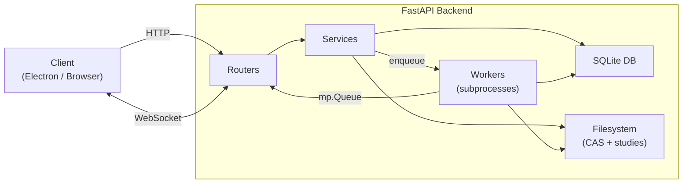
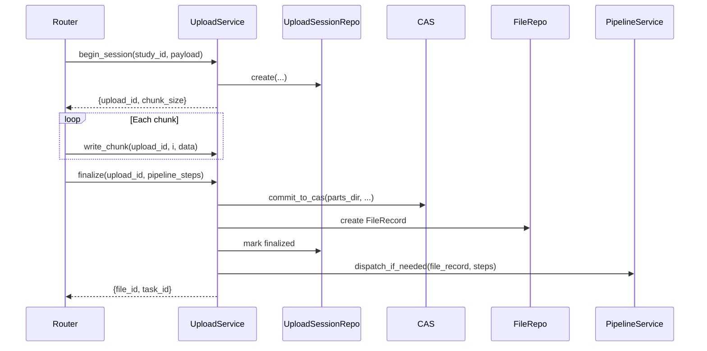
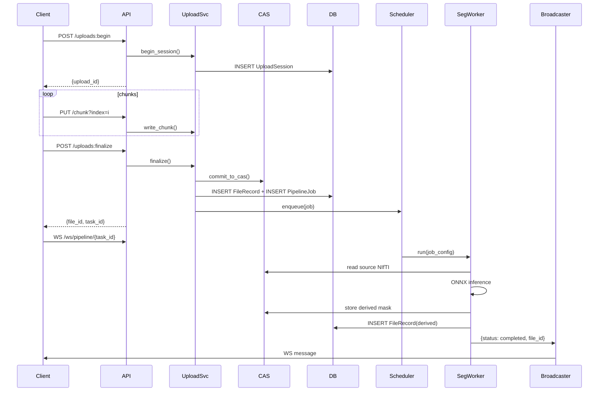
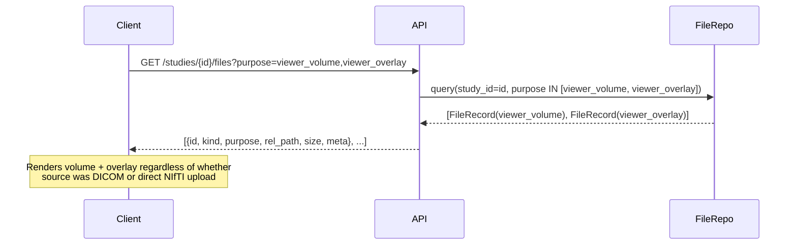

# Architecture Reference: CBCT Backend (Step-by-Step)

This document is the single source of truth for the backend architecture. It supersedes all notes and POC readmes.

---

## System Overview



---

## Target Directory Layout

```
backend/
├── main.py                    # uvicorn entrypoint
├── app.py                     # FastAPI factory + lifespan
├── config.py                  # All settings (paths, chunk size, TTL)
├── schemas.py                 # Pydantic request/response models
├── exceptions.py              # Custom HTTP exceptions
│
├── routers/
│   ├── studies.py             # Study CRUD
│   ├── uploads.py             # Chunked upload endpoints
│   ├── files.py               # File content retrieval
│   └── ws.py                  # WebSocket progress
│
├── services/
│   ├── upload_service.py      # Upload state machine
│   ├── storage_service.py     # CAS commit for derived files
│   ├── pipeline_service.py    # Job creation + dispatch
│   └── study_service.py       # Study CRUD logic
│
├── workers/
│   ├── scheduler.py           # ProcessPoolExecutor wrapper
│   ├── ws_broadcaster.py      # WebSocket registry + broadcast
│   ├── dicom_worker.py        # DICOM→NIfTI conversion
│   └── segmentation_worker.py # MONAI/ONNX inference
│
├── db/
│   ├── models.py              # SQLAlchemy ORM (4 models)
│   ├── session.py             # Engine + session factory
│   └── repos/
│       ├── upload_session_repo.py
│       ├── file_repo.py
│       └── pipeline_job_repo.py
│
└── storage/
    ├── cas.py                 # CAS commit logic
    ├── upload_session.py      # Chunk I/O
    └── paths.py               # Pure path computation
```

### Runtime Data Layout

```
data/
├── blobs/sha256/{xx}/{full_hash}    # Immutable CAS blobs
├── studies/{study_id}/
│   ├── raw/                         # Hardlinks → CAS for originals
│   └── derived/                     # Hardlinks → CAS for outputs
└── uploads/{upload_id}/
    └── parts/                       # Temporary chunks
```

---

## Layer 1: Database Models

### `Study`

| Column | Type | Notes |
|---|---|---|
| `id` | UUID (str) | PK |
| `external_id` | str? | Optional external reference |
| `status` | str | `created`, `processing`, `ready` |
| `created_at` | datetime | |
| `meta` | JSON | Study-level metadata |

### `FileRecord`

| Column | Type | Notes |
|---|---|---|
| `id` | UUID (str) | PK |
| `study_id` | UUID (str) | FK → Study |
| `pipeline_job_id` | UUID? | FK → PipelineJob, null for originals |
| `role` | str | `original` / `derived` |
| `kind` | str? | `dicom_zip` / `nifti_raw` / `nifti_derived` / `segmentation_mask` |
| `purpose` | str? | See **Purpose Enum** below. `null` = not intended for viewer |
| `rel_path` | str | Path relative to data root |
| `blob_hash` | str(64) | FK → Blob.hash, serves as CAS pointer |
| `content_type` | str? | MIME type |
| `size` | int | Bytes |
| `created_at` | datetime | |
| `meta` | JSON | NIfTI header info, etc. |

### `Blob`

| Column | Type | Notes |
|---|---|---|
| `hash` | str(64) | PK (SHA-256) |
| `size` | int | |
| `created_at` | datetime | |

### `UploadSession`

| Column | Type | Notes |
|---|---|---|
| `id` | UUID (str) | PK |
| `study_id` | UUID (str) | FK → Study |
| `role` | str | |
| `kind` | str | |
| `filename` | str | |
| `content_type` | str? | |
| `expected_size` | int? | |
| `expected_sha256` | str? | |
| `chunk_size` | int | Negotiated chunk size |
| `state` | str | `active` / `finalized` / `aborted` / `expired` |
| `created_at` | datetime | For TTL |

### `PipelineJob`

| Column | Type | Notes |
|---|---|---|
| `id` | UUID (str) | PK, returned to client as `task_id` |
| `study_id` | UUID (str) | FK → Study |
| `source_file_id` | UUID (str) | FK → FileRecord that triggers the job |
| `steps` | JSON | Array of `{name, config}` |
| `status` | str | `queued` / `running` / `completed` / `failed` |
| `created_at` | datetime | |
| `started_at` | datetime? | |
| `finished_at` | datetime? | |
| `error` | str? | |

> [!IMPORTANT]
> The old `Task` model from the POC must be replaced by `PipelineJob`.

---

## Canonical Enums

### `kind` — file format / type

| Value | Description |
|---|---|
| `dicom_zip` | Original DICOM series ZIP, uploaded by user |
| `nifti_raw` | NIfTI uploaded directly by user |
| `nifti_derived` | NIfTI produced by the DICOM→NIfTI pipeline step |
| `segmentation_mask` | Binary/label NIfTI produced by segmentation inference |

### `purpose` — viewer intent (set by pipeline steps)

| Value | Who sets it | Viewer usage |
|---|---|---|
| `null` | Default | Not sent to viewer (e.g. archive DICOM zip) |
| `viewer_volume` | `save_nifti_raw` or `save_uploaded_nifti` step | Primary 3D volume to render |
| `viewer_overlay` | `save_segmentation` step | Segmentation mask overlay |

> [!IMPORTANT]
> Only **one** `FileRecord` with `purpose=viewer_volume` should be active per study at a time.
> When the DICOM→NIfTI step runs, it creates the `viewer_volume` record. The original DICOM zip gets `purpose=null`.
> This prevents the viewer from receiving both DICOM and NIfTI as candidates.

---

## Layer 2: Storage (Pure Logic)

### `paths.py` — Zero I/O

```python
def upload_parts_dir(upload_id: str) -> Path
def cas_blob_path(sha256_hash: str) -> Path
def study_raw_link(study_id: str, filename: str) -> Path
def study_derived_link(study_id: str, filename: str) -> Path
```

All functions are pure; they take `data_root: Path` as first argument.

### `cas.py` — CAS Commit

Single critical function: `commit_to_cas(parts_dir, expected_sha256, expected_size) -> (actual_hash, blob_path)`

Flow:
1. Stitch all `part_*.chunk` into `concat.tmp`
2. Compute SHA-256 during stitching (single pass)
3. Validate hash + size against expectations
4. `os.replace()` → `blobs/sha256/xx/hash` (atomic on POSIX)
5. Skip if blob exists (dedup)
6. Return `(hash, blob_path)`

### `upload_session.py` — Chunk I/O

- `write_chunk(upload_dir, index, data)` — write `part_{i:08d}.chunk`, idempotent
- `get_chunk_size(upload_dir, index)` → `int?` — for idempotency check
- `list_uploaded_chunks(upload_dir)` → `list[int]` — for resume status

---

## Layer 3: Services

### UploadService



Key behaviors:
- `begin_session` → creates DB row + parts dir, returns negotiated `chunk_size`
- `write_chunk` → validates session is `active`, checks idempotency, writes chunk
- `get_status` → returns uploaded chunk indices for resume
- `finalize` → CAS commit, FileRecord creation, session state update, pipeline dispatch

### StorageService

Single method: `store_derived_file(study_id, job_id, local_path, kind, purpose=None)`:
1. Compute SHA-256 of local file
2. Move into CAS
3. Create `Blob` row if needed
4. Hardlink into `studies/{sid}/derived/`
5. Create `FileRecord(role="derived", kind=kind, purpose=purpose)`

Used ONLY by background workers to persist their outputs. The `purpose` parameter is passed from the pipeline step config — workers themselves are unaware of viewer semantics.

### PipelineService

- `dispatch_if_needed(file_record, requested_steps)`:
  - If `kind == "dicom_zip"` → prepend `dicom_to_nifti` step (with `output_purpose="viewer_volume"`)
  - If `kind == "nifti_raw"` → set `output_purpose="viewer_volume"` on the implicit `save_uploaded_nifti` step
  - Create `PipelineJob` row with `steps` JSON, enqueue via scheduler
  - Return `task_id` or `None`
- `get_job_status(task_id)` → pass-through to repo

#### Pipeline Step Config Shape

The `steps` JSON array on `PipelineJob` stores per-step config:

```json
[
  { "name": "dicom_to_nifti",    "output_kind": "nifti_derived",     "output_purpose": "viewer_volume" },
  { "name": "segment_nifti",      "output_kind": "segmentation_mask", "output_purpose": "viewer_overlay" }
]
```

Workers read `output_kind` and `output_purpose` from their step config and pass them through to `StorageService.store_derived_file()`. No viewer logic lives in the worker itself.

### StudyService

- `list()` / `create()` / `rename()` / `delete()`
- Delete cascades: remove FileRecords from DB, unlink study dir hardlinks, purge study dir

---

## Layer 4: Workers

### Scheduler (`scheduler.py`)

- Wraps `ProcessPoolExecutor` (NOT thread pool — MONAI/PyTorch need process isolation)
- `enqueue(job)` → serialize job config, submit to pool
- `shutdown()` → drain queue, wait for in-flight jobs
- Updates `PipelineJob.status` to `running` before dispatch, `completed`/`failed` after

### WebSocket Broadcaster (`ws_broadcaster.py`)

- Registry: `dict[task_id, list[WebSocket]]`
- `register(task_id, ws)` / `unregister(task_id, ws)` / `broadcast(task_id, payload)`

**Worker-to-API Bridge:**
```
Worker subprocess → multiprocessing.Queue → asyncio drain task → broadcaster.broadcast()
```

Workers cannot call `broadcast()` directly (separate process, no access to event loop). Instead they put dicts on a shared `mp.Queue`. A background coroutine in `app.py` drains this queue and forwards to the broadcaster.

### Worker Functions

Both `dicom_worker.py` and `segmentation_worker.py` follow the same pattern:
1. Accept serialized job config dict
2. Read source file from CAS
3. Process (convert / infer)
4. Emit progress messages to shared `mp.Queue`
5. Call `StorageService.store_derived_file()` to persist output
6. Emit completion/failure message

---

## Layer 5: Routers (Thin)

### Studies

| Method | Path | Handler |
|---|---|---|
| `GET` | `/storage/studies` | `StudyService.list()` |
| `POST` | `/storage/studies` | `StudyService.create()` |
| `PATCH` | `/storage/studies/{study_id}` | `StudyService.rename()` |
| `DELETE` | `/storage/studies/{study_id}` | `StudyService.delete()` |

### Uploads

| Method | Path | Handler |
|---|---|---|
| `POST` | `/storage/studies/{study_id}/uploads:begin` | `UploadService.begin_session()` |
| `PUT` | `/storage/uploads/{upload_id}/chunk?index={i}` | `UploadService.write_chunk()` |
| `GET` | `/storage/uploads/{upload_id}/status` | `UploadService.get_status()` |
| `POST` | `/storage/uploads/{upload_id}:finalize` | `UploadService.finalize()` |

### Files

| Method | Path | Handler |
|---|---|---|
| `GET` | `/storage/studies/{study_id}/files` | List all files for study (optional `?purpose=` filter) |
| `GET` | `/storage/studies/{study_id}/files?purpose=viewer_volume,viewer_overlay` | **Frontend viewer query** — returns only renderable files |
| `GET` | `/storage/studies/{study_id}/files/{file_id}/content` | `FileResponse` with range support |

The `?purpose=` query param accepts a comma-separated list of purpose values. `FileRepo` translates this to an `IN` clause. No business logic in the router.

### WebSocket

| Protocol | Path | Handler |
|---|---|---|
| `WS` | `/ws/pipeline/{task_id}` | Register + receive loop |

---

## Layer 6: Application Startup (`app.py`)

**Startup (lifespan):**
1. `Base.metadata.create_all(engine)` (dev) or Alembic (prod)
2. Start APScheduler
3. Create shared `mp.Queue`
4. Launch async queue-drain task

**Shutdown:**
1. Signal drain task to stop, flush
2. `scheduler.shutdown()`, wait for jobs

---

## End-to-End Data Flows

### Flow A: NIfTI Upload + Segmentation



### Flow B: DICOM Upload + Auto-Convert + Segmentation

Same as Flow A, but:
1. `kind = "dicom_zip"` triggers auto-prepend of `dicom_to_nifti` step (with `output_purpose="viewer_volume"`)
2. DICOM worker runs first → produces NIfTI → stored as `derived`, `purpose=viewer_volume`
3. Original DICOM zip `FileRecord` keeps `purpose=null` (never sent to viewer)
4. Segmentation worker runs second on the derived NIfTI → output stored as `purpose=viewer_overlay`

### Flow C: Frontend File Resolution



The client does **not** need to know whether the study originated from DICOM or NIfTI — it always requests the same two purpose values and receives exactly the files it needs to render.

---

## Key Design Decisions

| Decision | Rationale |
|---|---|
| **Process pool, not threads** | MONAI/ONNX allocate large memory; process isolation prevents crashing FastAPI |
| **Hardlinks, not symlinks** | Survive blob relocation; inode-level dedup; `stat()` shows correct size |
| **CAS by SHA-256** | Dedup, integrity verification, immutable blobs |
| **SQLite WAL** | Good concurrency for single-node; easy migration to PostgreSQL later |
| **`mp.Queue` bridge** | Only way to get subprocess messages into async FastAPI event loop |
| **`os.replace()` for atomicity** | POSIX atomic rename prevents partial writes appearing as valid blobs |
| **No blob deletion on study delete** | Other studies may reference same blob; GC handles orphans separately |
| **`purpose` tag on FileRecord** | Decouples viewer file resolution from file format (`kind`). Frontend always queries `?purpose=viewer_volume,viewer_overlay` regardless of upload source. Workers read purpose from step config — no viewer logic in worker code. |
