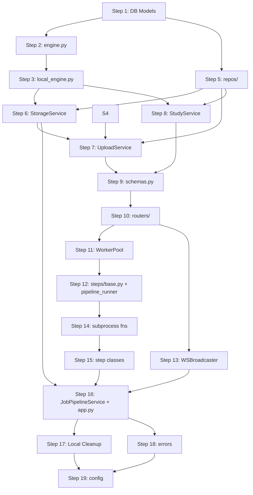

# Implementation Flow: POC → Production Backend

Step-by-step guide for an implementing agent. Each step produces a testable increment.

---

## Pre-Work: Project Restructure

**Create the new directory layout** under `src/backend/`:

```
src/backend/
├── __init__.py
├── main.py
├── app.py
├── config.py
├── schemas.py
├── exceptions.py
├── routers/
├── services/
├── workers/
│   ├── steps/
│   └── subprocesses/
├── db/
│   └── repos/
└── storage/
```

> [!IMPORTANT]
> Do NOT delete `src/poc_file_storage/` or `src/poc_ml_worker/` yet. Port code from them into the new structure.

---

## Phase 1: Foundation (Steps 1–5)

### Step 1: `db/session.py` + `db/models.py`

**Port from:** `src/db/database.py` and `src/db/models.py`

| Action | Details |
|---|---|
| Port `session.py` | Copy `engine`, `SessionLocal`, WAL pragmas from `database.py`. Use `config.STORAGE_DB_URL` instead of hardcoded path. |
| Port `Study`, `Blob`, `FileRecord` | Direct copy from POC `models.py`. Ensure `Study.external_id` has `unique=True`. |
| **Add `purpose` to `FileRecord`** | New nullable `str` column. Values: `null` / `viewer_volume` / `viewer_overlay`. See Canonical Enums in `architecture_reference.md` |
| **Expand `kind` values in `FileRecord`** | Use: `dicom_zip` / `nifti_raw` / `nifti_mask` / `nifti_derived` / `segmentation_mask`. `nifti_mask` = user-uploaded pre-computed mask (`role=original`); `segmentation_mask` = pipeline-derived (`role=derived`) |
| Port `UploadSession` | Add missing `chunk_size` column (int, nullable). `kind` accepts: `dicom_zip` / `nifti_raw` / `nifti_mask` |
| **Replace** `Task` with `PipelineJob` | New model: add `source_file_id`, `steps` (JSON), `started_at`, `finished_at`, `error` columns |
| Remove `checksum_sha256` from `FileRecord` | Redundant with `blob_hash`; OR keep for backwards compat but document as alias |

**Test:** Import models, call `Base.metadata.create_all()`, verify tables exist.

---

### Step 2: `storage/engine.py`

**New file.** Defines the `StorageEngine` python `Protocol` containing abstract methods for binary I/O operations:
`initialize_upload`, `write_chunk`, `list_uploaded_chunks`, `abort_upload`, `commit_upload_to_cas`, `commit_file_to_cas`, `link_file_to_study`, `remove_study_data`, `delete_blob`, `get_job_workspace_dir`, `sweep_orphaned_blobs`.

---

### Step 3: `storage/local_engine.py`

**New file.** Implements `LocalStorageEngine` which fulfills the `StorageEngine` protocol.

**Port from:** `local.py` methods (CAS commit stitching, moving blobs, creating hardlinks, creating chunk files). Also implements `abort_upload` to forcefully wipe a session's `parts/` directory, and `sweep_orphaned_blobs` to scan `data/blobs/` for `st_nlink == 1` and remove them.

**Test:** Unit test local filesystem manipulations (create chunks, commit to cas, verify hardlink creation).

---

### Step 4: (Consolidated into Step 3)

*(Skip to Step 5: Repos)*

---

### Step 5: `db/repos/`

**New files.** Thin wrappers:

- `upload_session_repo.py` → CRUD for `UploadSession`
- `file_repo.py` → CRUD for `FileRecord` + `Blob`
- `pipeline_job_repo.py` → CRUD for `PipelineJob`

**Port from:** Inline SQLAlchemy in `local.py` (e.g., `s.get(Blob, sha)`, `s.query(FileRecord)...`).

**Test:** Integration test with in-memory SQLite.

---

## Phase 2: Services & API (Steps 6–10)

### Step 6: `services/storage_service.py`

**New file.** Combines the `StorageEngine` output with DB tracking. Used by
`UploadService` (for originals) and `JobPipelineService` (for derived outputs at the end of a job).

```python
class StorageService:
    def __init__(self, engine: StorageEngine, session_factory: Callable): ...

    def store_original(
        self, upload_id, study_id, filename, kind, purpose,
        expected_sha256, expected_size
    ) -> FileRecord:
        """Calls engine.commit_upload_to_cas() and engine.link_file_to_study(), then creates FileRecord(role=original)."""

    def store_derived(
        self, src_path, study_id, job_id, filename, kind, purpose
    ) -> FileRecord:
        """Calls engine.commit_file_to_cas() and engine.link_file_to_study(), then creates FileRecord(role=derived)."""

    def sweep_orphans(self) -> int:
        """Delegates to engine.sweep_orphaned_blobs() to perform the OS sweep."""
```

**`purpose` supersede:** When a non-null `purpose` (e.g., `viewer_volume` or `viewer_overlay`) is passed, both `store_original` and `store_derived` must atomically null out any prior record for the same study with that exact purpose before inserting the new `FileRecord`. This enforces last-write-wins semantics for all viewer purposes.

**Port from:** the CAS + FileRecord creation logic in `LocalPersistentStorage.finalize_upload()`
and `store_from_local_path()`, now split cleanly by call site.

---

### Step 7: `services/upload_service.py`

**Port from:** `LocalPersistentStorage` methods `begin_upload`, `upload_chunk`, `finalize_upload`.

- `begin_session()` → calls `UploadSessionRepo.create()` + `mkdir parts dir`
- `write_chunk()` → calls `upload_session.write_chunk()` + validates session state via repo
- `get_status()` → calls `upload_session.list_uploaded_chunks()`
- `abort_session(upload_id)` → sets state to `aborted`, calls `storage_service.engine.abort_upload(upload_id)`
- `finalize(upload_id, pipelines)` → purpose resolution by kind:
  - `nifti_raw` → `purpose=viewer_volume`
  - `nifti_mask` → `purpose=viewer_overlay` (StorageService supersedes any prior overlay)
  - `dicom_zip` → `purpose=null`
  Then calls `storage_service.store_original()` + `UploadSessionRepo.update_state()` + `job_pipeline_service.dispatch(file_record, pipelines)`. Returns `{file_id, job_id | None}`.

**Key difference from POC:** No `meta.json` on disk. All state in DB.

---

### Step 8: `services/study_service.py`

**Port from:** `LocalPersistentStorage.create_study()`, `ensure_study()`, `save_metadata()`, `get_metadata()`, `delete_file()`, `garbage_collect()`.

- `create(external_id?, meta?)` → DB insert + `mkdir raw/ derived/`
- `list(external_id_filter?)` → `StudyRepo.list(external_id=...)`
- `rename(study_id, name)` → update `meta` JSON
- `delete(study_id)`:
  1. Find active `PipelineJob` for this study
  2. Call `job_pipeline_service.cancel(job.id)` if found
  3. Mark `FileRecord`s deleted in DB
  4. Unlink `data/studies/{study_id}/` hardlinks
  5. Purge directory entirely
  6. **Inline CAS GC**: Check if any deleted `FileRecord`'s `blob_hash` is solely used by this study. If count is 0, call `storage_service.engine.delete_blob(blob_hash)` to instantly reclaim space without breaking abstraction.

---

### Step 9: `schemas.py`

**New file.** Define Pydantic models for:
- `BeginUploadRequest` — `kind: Literal["dicom_zip", "nifti_raw", "nifti_mask"]`. Accepted kinds: `dicom_zip` (DICOM ZIP), `nifti_raw` (base scan NIfTI), `nifti_mask` (pre-computed mask NIfTI).
- `BeginUploadResponse`
- `ChunkUploadResponse`
- `UploadStatusResponse`
- `PipelineRequestItem` — `{name: Literal["segment_nifti"], config: dict = {}}`. The `name` must be constrained to known valid step identifiers to catch invalid queries with a 422 before dispatch.
- `FinalizeRequest` — `{expected_sha256?, expected_size?, pipelines: list[PipelineRequestItem] = []}`. The `pipelines` field carries user intent; it is **never** used to select auto-driven steps (those are determined by `file_record.kind` in `JobPipelineService`).
- `FinalizeResponse` — `{file_id, job_id | None}`. `job_id=null` when no steps were dispatched.
- `StudyResponse` / `CreateStudyRequest`
- `FileRecordResponse`
- `PipelineJobResponse`

---

### Step 10: `routers/` (all 4)

**Port from:** `poc_file_storage/api/storage_router.py` (expand).

| Router | New endpoints |
|---|---|
| `uploads.py` | Add `GET /status` endpoint; add `DELETE /{upload_id}` to call `abort_session()` |
| `files.py` | **New**. `GET /studies/{study_id}/files?purpose=viewer_volume,viewer_overlay` (optional filter, `IN` query via `FileRepo`); `GET /{file_id}/content` → `FileResponse` |
| `studies.py` | **New**. Full CRUD. `list` endpoint supports `?external_id=` filter |
| `ws.py` | **New**. WebSocket pipeline progress → `/ws/pipeline/{job_id}` |

**Key:** Routers call services only. No business logic. Return Pydantic schemas.

---

## Phase 3: Workers & Real-time (Steps 11–16)

### Step 11: `workers/worker_pool.py`

**New file.** Generic `ProcessPoolExecutor` wrapper. Has no knowledge of any specific model
or compute function — the initializer is injected at startup by `app.py`.

```python
class WorkerPool:
    def __init__(
        self,
        max_workers: int = 1,
        initializer: Callable | None = None,
        initargs: tuple = (),
    ):
        self._pool = ProcessPoolExecutor(
            max_workers=max_workers,
            initializer=initializer,
            initargs=initargs,
        )

    async def run(self, fn: Callable, *args) -> Any:
        loop = asyncio.get_running_loop()
        return await loop.run_in_executor(self._pool, fn, *args)

    def shutdown(self, wait: bool = False) -> None:
        self._pool.shutdown(wait=wait)
```

---

### Step 12: `workers/steps/base.py` + `workers/pipeline_runner.py`

#### `workers/steps/base.py` — shared contracts

```python
@dataclass
class StepContext:
    job_id: str
    study_id: str
    current_input_path: Path
    work_dir: Path
    broadcaster: WSBroadcaster
    _worker_pool: WorkerPool = field(repr=False)

    async def run_subprocess(self, fn: Callable, *args) -> Any:
        return await self._worker_pool.run(fn, *args)

@dataclass
class OutputArtifact:
    path: Path
    kind: str
    purpose: str | None

@dataclass
class StepResult:
    next_input_path: Path
    artifacts: list[OutputArtifact]

class PipelineStep(Protocol):
    name: str
    async def run(self, ctx: StepContext) -> StepResult: ...
```

#### `workers/pipeline_runner.py` — pipeline orchestrator

```python
async def run_pipeline(job_id: str, steps: list[PipelineStep], ctx: StepContext, storage_service: StorageService):
    ctx.work_dir.mkdir(parents=True, exist_ok=True)
    with storage_service.session_factory() as db:
        PipelineJobRepo(db).set_status(job_id, "running")
    try:
        collected_artifacts: dict[str, OutputArtifact] = {}
        for step in steps:
            result = await step.run(ctx)
            ctx = replace(ctx, current_input_path=result.next_input_path)
            for artifact in result.artifacts:
                key = artifact.purpose if artifact.purpose else artifact.kind
                collected_artifacts[key] = artifact

        for artifact in collected_artifacts.values():
            storage_service.store_derived(
                artifact.path, ctx.study_id, job_id, artifact.path.name, artifact.kind, artifact.purpose
            )

        with storage_service.session_factory() as db:
            PipelineJobRepo(db).set_status(job_id, "completed")
            StudyRepo(db).set_status(ctx.study_id, "ready")
        await ctx.broadcaster.broadcast(job_id, {"status": "completed"})
    except Exception as exc:
        with storage_service.session_factory() as db:
            PipelineJobRepo(db).set_status(job_id, "failed" if not isinstance(exc, asyncio.CancelledError) else "cancelled", error=str(exc))
        if not isinstance(exc, asyncio.CancelledError):
            await ctx.broadcaster.broadcast(job_id, {"status": "failed", "error": str(exc)})
        raise
    finally:
        shutil.rmtree(ctx.work_dir, ignore_errors=True)
```

#### ONNX model — `initializer=` pattern still applies

`ort.InferenceSession` is not picklable. Load it once per worker process via
`WorkerPool(initializer=_init_segmentation, initargs=(model_path,))`.
The `run_segmentation` function (in `workers/segmentation_fn.py`) uses a module-level global `_model`.
The `WorkerPool` class itself does **not** import or reference `_init_segmentation`.

---

### Step 13: `workers/ws_broadcaster.py`

**New.** WebSocket registry:
- `register(job_id, ws)` / `unregister(job_id, ws)`
- `broadcast(job_id, payload)`

---

### Step 14: Subprocess compute functions

#### `workers/subprocesses/dicom_fn.py`

```python
def convert_dicom(input_zip_path: str) -> str:
    """Pure compute: unzip DICOM, convert to NIfTI. Returns output path string."""
    ...
```

#### `workers/subprocesses/segmentation_fn.py`

```python
_model = None

def _init_segmentation(model_path: str):
    global _model
    _model = load_onnx_model(model_path)

def run_segmentation(input_nifti_path: str) -> str:
    """Pure compute: runs ONNX inference. Returns output mask path string."""
    ...
```

**Port from:** `poc_ml_worker/engine.py` — extract only the inference kernel. Discard all storage, queue, and orchestration code from the POC.

---

### Step 15: `workers/steps/dicom_to_nifti.py` + `workers/steps/segment_nifti.py`

Each step class (e.g., `@dataclass class SegmentNiftiStep:`):
1. Accepts an optional `config: dict = field(default_factory=dict)`
2. Generates an output path inside `ctx.work_dir`
3. Calls `await ctx.run_subprocess(fn, str(ctx.current_input_path), str(output_path))` — offloads pure compute to pool
4. Broadcasts step progress via `ctx.broadcaster`
5. Returns `StepResult(next_input_path, artifacts=[OutputArtifact(...)])`

Step classes contain **zero viewer logic** internally — they simply package the hardcoded constants for `kind` and `purpose` into the `OutputArtifact` to be saved at the end of the pipeline.

---

### Step 16: `services/job_pipeline_service.py` + `app.py` startup

#### `services/job_pipeline_service.py` — JobPipelineService

Step routing uses two independent phases:
- **Phase 1 — auto-steps**: always runs before user steps; determined by `file_record.kind` (e.g., `DicomToNiftiStep` for `dicom_zip`). Never user-configurable.
- **Phase 2 — user steps**: registry-driven loop matching the requested `names` to a dictionary of factory callables injected at startup.

Returns `None` (no job created) if both phases produce an empty list.

```python
StepFactory = Callable[[dict], PipelineStep]

class JobPipelineService:
    def __init__(self, worker_pool, session_factory, storage_service, broadcaster, step_registry: dict[str, StepFactory]): ...

    def dispatch(
        self,
        file_record: FileRecord,
        pipelines: list[dict],  # from FinalizeRequest.pipelines
        db,
    ) -> str | None:
        # Phase 1: auto-steps — file-kind driven, always first
        auto_steps: list[PipelineStep] = []
        if file_record.kind == "dicom_zip":
            auto_steps.append(DicomToNiftiStep())

        # Phase 2: user-requested steps — registry loop
        user_steps: list[PipelineStep] = []
        for item in pipelines:
            factory = self._step_registry[item["name"]]
            user_steps.append(factory(item.get("config", {})))

        steps = auto_steps + user_steps
        if not steps:
            return None

        job = PipelineJobRepo(db).create(...)
        ctx = StepContext(job_id=job.id, current_input_path=..., work_dir=...)
        handle = asyncio.create_task(run_pipeline(job.id, steps, ctx, self._storage_service))
        self._running[job.id] = handle
        handle.add_done_callback(lambda _: self._running.pop(job.id, None))
        return job.id

    def cancel(self, job_id: str) -> bool: ...

    async def shutdown(self): ...
```

#### `app.py` — Wire startup

```python
@asynccontextmanager
async def lifespan(app: FastAPI):
    Base.metadata.create_all(engine)
    
    # Wipe on Startup: abort abandoned active UploadSessions
    # ... loop over DB and upload_service.abort_session() ...
    
    # CAS OS Sweep Failsafe
    storage_service.sweep_orphans()

    worker_pool = WorkerPool(
        max_workers=1,
        initializer=_init_segmentation,
        initargs=(str(config.MODEL_PATH),),
    )
    storage_engine = LocalStorageEngine(config.DATA_ROOT)
    storage_service = StorageService(storage_engine, SessionLocal)
    broadcaster = WSBroadcaster()

    # Step registry maps pipeline name -> factory callable
    step_registry: dict[str, StepFactory] = {
        "segment_nifti": lambda cfg: SegmentNiftiStep(config=cfg),
    }

    job_pipeline_service = JobPipelineService(
        worker_pool, SessionLocal, storage_service, broadcaster, step_registry
    )

    app.state.job_pipeline_service = job_pipeline_service
    app.state.storage_service = storage_service
    app.state.broadcaster = broadcaster

    yield

    await job_pipeline_service.shutdown()
```

No `mp.Queue`, no drain coroutine.

---

## Phase 4: Hardening (Steps 17–19)

### Step 17: Local Cleanup (Replaces TTL)

Implement the two lifespan hooks in `app.py`:
1. Loop over hanging `active` UploadSessions and abort them.
2. Background OS sweep for blobs with `st_nlink == 1`.

### Step 18: Error Handling

Create `exceptions.py` with proper HTTP exception classes. Replace bare `except Exception` in routers with specific exception handlers.

### Step 19: Config Consolidation

Move all magic numbers to `config.py`:
- Default chunk size (16MB)
- Data root path
- DB URL
- Model path

---

## Verification Plan

### Automated
1. **Unit tests** for `storage/paths.py` (pure functions)
2. **Unit tests** for `storage/cas.py` (temp dirs, verify hash + blob location)
3. **Unit tests** for `storage/upload_session.py` (chunk write/read)
4. **Integration tests** for repos (in-memory SQLite)
5. **Integration test** for upload flow: `begin → chunk × N → finalize` via HTTP (TestClient)
6. **Existing tests** in `tests/unit/poc_file_storage/test_storage_local.py` can be adapted

### Manual
- Run `uvicorn backend.main:app`, execute `upload_nifti.sh` against new API
- Verify file lands in `data/blobs/` and `data/studies/` correctly

---

## Dependencies Between Steps


