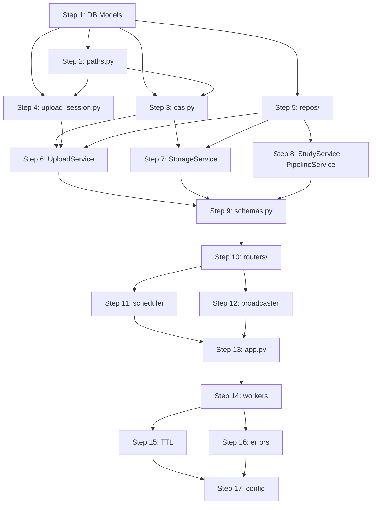

# Implementation Flow: POC → Production Backend

Step-by-step guide for an implementing agent. Each step produces a testable increment.

---

## Pre-Work: Project Restructure

**Create the new directory layout** under `src/backend/`:

```
src/backend/
├── __init__.py
├── main.py
├── app.py
├── config.py
├── schemas.py
├── exceptions.py
├── routers/
├── services/
├── workers/
├── db/
│   └── repos/
└── storage/
```

> [!IMPORTANT]
> Do NOT delete `src/poc_file_storage/` or `src/poc_ml_worker/` yet. Port code from them into the new structure.

---

## Phase 1: Foundation (Steps 1–5)

### Step 1: `db/session.py` + `db/models.py`

**Port from:** `src/db/database.py` and `src/db/models.py`

| Action | Details |
|---|---|
| Port `session.py` | Copy `engine`, `SessionLocal`, WAL pragmas from `database.py`. Use `config.STORAGE_DB_URL` instead of hardcoded path. |
| Port `Study`, `Blob`, `FileRecord` | Direct copy from POC `models.py` |
| **Add `purpose` to `FileRecord`** | New nullable `str` column. Values: `null` / `viewer_volume` / `viewer_overlay`. See Canonical Enums in `architecture_reference.md` |
| **Expand `kind` values in `FileRecord`** | Use: `dicom_zip` / `nifti_raw` / `nifti_derived` / `segmentation_mask` (replaces old generic `nifti` / `segmentation`) |
| Port `UploadSession` | Add missing `chunk_size` column (int, nullable) |
| **Replace** `Task` with `PipelineJob` | New model: add `source_file_id`, `steps` (JSON), `started_at`, `finished_at`, `error` columns |
| Remove `checksum_sha256` from `FileRecord` | Redundant with `blob_hash`; OR keep for backwards compat but document as alias |

**Test:** Import models, call `Base.metadata.create_all()`, verify tables exist.

---

### Step 2: `storage/paths.py`

**New file.** Extract path logic from `LocalPersistentStorage`.

```python
def upload_parts_dir(data_root: Path, upload_id: str) -> Path
def cas_blob_path(data_root: Path, sha256_hash: str) -> Path
def study_raw_link(data_root: Path, study_id: str, filename: str) -> Path
def study_derived_link(data_root: Path, study_id: str, filename: str) -> Path
```

**Port from:** `local.py` methods `_upload_dir()`, `_blob_path()`, `_study_dir()`.

**Test:** Unit test — pure functions, no I/O needed.

---

### Step 3: `storage/cas.py`

**Port from:** `LocalPersistentStorage.finalize_upload()` lines 177–218 (the stitch + verify + move logic).

Single function:
```python
def commit_to_cas(
    data_root: Path,
    parts_dir: Path,
    expected_sha256: str | None,
    expected_size: int | None,
) -> tuple[str, int, Path]:
    """Returns (actual_hash, actual_size, blob_path)"""
```

Also port the `store_from_local_path` CAS logic (hash file, move to blob):
```python
def commit_file_to_cas(
    data_root: Path,
    src_path: Path,
) -> tuple[str, int, Path]:
```

**Test:** Create temp parts dir with fake chunks, run `commit_to_cas`, verify blob exists at correct path.

---

### Step 4: `storage/upload_session.py`

**Port from:** `LocalPersistentStorage.upload_chunk()` + chunk listing logic.

```python
def write_chunk(parts_dir: Path, index: int, data: bytes) -> None
def get_chunk_size(parts_dir: Path, index: int) -> int | None
def list_uploaded_chunks(parts_dir: Path) -> list[int]
```

**Test:** Unit test — write chunks, verify files, list them back.

---

### Step 5: `db/repos/`

**New files.** Thin wrappers:

- `upload_session_repo.py` → CRUD for `UploadSession`
- `file_repo.py` → CRUD for `FileRecord` + `Blob`
- `pipeline_job_repo.py` → CRUD for `PipelineJob`

**Port from:** Inline SQLAlchemy in `local.py` (e.g., `s.get(Blob, sha)`, `s.query(FileRecord)...`).

**Test:** Integration test with in-memory SQLite.

---

## Phase 2: Services & API (Steps 6–10)

### Step 6: `services/upload_service.py`

**Port from:** `LocalPersistentStorage` methods `begin_upload`, `upload_chunk`, `finalize_upload`.

Decompose the god-object:
- `begin_session()` → calls `UploadSessionRepo.create()` + `mkdir parts dir`
- `write_chunk()` → calls `upload_session.write_chunk()` + validates session state via repo
- `get_status()` → calls `upload_session.list_uploaded_chunks()`
- `finalize()` → calls `cas.commit_to_cas()` + `FileRepo.create()` + `UploadSessionRepo.update_state()` + `PipelineService.dispatch_if_needed()`

**Key difference from POC:** No `meta.json` on disk. All state in DB.

---

### Step 7: `services/storage_service.py`

**Port from:** `LocalPersistentStorage.store_from_local_path()`.

Single method `store_derived_file(study_id, job_id, local_path, kind, purpose=None)` — used by workers.

- `kind` and `purpose` come from the pipeline step config JSON; the worker passes them through without interpreting them.
- Creates `FileRecord(role="derived", kind=kind, purpose=purpose)`.

---

### Step 8: `services/study_service.py` + `services/pipeline_service.py`

**StudyService** — Port from `LocalPersistentStorage.create_study()`, `ensure_study()`, `save_metadata()`, `get_metadata()`, `delete_file()`, `garbage_collect()`.

**PipelineService** — Mostly new:
- `dispatch_if_needed(file_record, requested_steps)` — check kind, build steps JSON, create job, enqueue
  - If `kind == "dicom_zip"` → prepend `{"name": "dicom_to_nifti", "output_kind": "nifti_derived", "output_purpose": "viewer_volume"}` step
  - If `kind == "nifti_raw"` → first step is `{"name": "save_uploaded_nifti", "output_kind": "nifti_raw", "output_purpose": "viewer_volume"}` (sets purpose on upload)
  - Segmentation step always appended as `{"name": "segment_nifti", "output_kind": "segmentation_mask", "output_purpose": "viewer_overlay"}`
- `get_job_status(task_id)` — repo pass-through

---

### Step 9: `schemas.py`

**New file.** Define Pydantic models for:
- `BeginUploadRequest` / `BeginUploadResponse`
- `ChunkUploadResponse`
- `UploadStatusResponse`
- `FinalizeResponse`
- `StudyResponse` / `CreateStudyRequest`
- `FileRecordResponse`
- `PipelineJobResponse`

---

### Step 10: `routers/` (all 4)

**Port from:** `poc_file_storage/api/storage_router.py` (expand).

| Router | New endpoints |
|---|---|
| `uploads.py` | Add `GET /status` endpoint |
| `files.py` | **New**. `GET /studies/{study_id}/files?purpose=viewer_volume,viewer_overlay` (optional filter, `IN` query via `FileRepo`); `GET /{file_id}/content` → `FileResponse` |
| `studies.py` | **New**. Full CRUD |
| `ws.py` | **New**. WebSocket pipeline progress |

**Key:** Routers call services only. No business logic. Return Pydantic schemas.

---

## Phase 3: Workers & Real-time (Steps 11–14)

### Step 11: `workers/scheduler.py`

**New.** Async-friendly wrapper around `concurrent.futures.ProcessPoolExecutor`.

#### Chosen approach: `ProcessPoolExecutor` + `loop.run_in_executor`

```python
from concurrent.futures import ProcessPoolExecutor
import asyncio, logging

logger = logging.getLogger(__name__)

class Scheduler:
    def __init__(self, max_workers: int = 1, initializer=None, initargs=()):
        self._pool = ProcessPoolExecutor(
            max_workers=max_workers,
            initializer=initializer,   # ← load ONNX model ONCE per worker process
            initargs=initargs,
        )

    async def enqueue(self, fn, *args):
        """Offload fn(*args) to the process pool without blocking the event loop."""
        loop = asyncio.get_running_loop()
        return await loop.run_in_executor(self._pool, fn, *args)

    def shutdown(self):
        self._pool.shutdown(wait=True)
```

#### Why not joblib / other alternatives

| Option | Decision | Reason |
|---|---|---|
| `ProcessPoolExecutor` (stdlib) | ✅ **Use this** | Zero deps; `run_in_executor` gives native `async/await`; `initializer=` solves ONNX load cost |
| `loky` (engine under joblib) | ⚠️ Optional upgrade | Auto-respawns dead workers; tiny dep (`pip install loky`); drop-in replacement |
| `joblib.Parallel` | ❌ Skip | Batch/blocking tool — no per-job `Future`, no `await`, incompatible with WS push |
| Huey-SQLite / SAQ | ❌ Skip | Overkill; more dep surface than needed for a single-slot queue |
| Celery / Redis | ❌ Out of scope | Explicitly excluded |

#### Critical implementation detail — ONNX pickling

`ort.InferenceSession` is **not picklable** and cannot cross the process boundary directly.
Use `initializer=` to load the model **once per worker process** into a module-level global:

```python
# workers/segmentation_worker.py
_model = None

def _init_worker(model_path: str):
    global _model
    _model = load_onnx_model(model_path)

def run_segmentation(input_path: str, task_id: str) -> str:
    # uses module-level _model — no pickle overhead
    ...

# In app startup:
scheduler = Scheduler(
    max_workers=1,
    initializer=_init_worker,
    initargs=(str(MODEL_PATH),),
)
```

#### Pre-requisite refactor before implementing this step

The current `MLWorker.orchestrate_task` is an **instance method** — methods are not picklable across process boundaries. The inference logic must be extracted into a **top-level module function** (`run_segmentation` above) before `enqueue` will work.

### Step 12: `workers/ws_broadcaster.py`

**New.** WebSocket registry:
- `register(task_id, ws)` / `unregister(task_id, ws)`
- `broadcast(task_id, payload)`

### Step 13: `app.py` — Wire startup

**New.** FastAPI lifespan:
- Startup: create tables, start scheduler, create `mp.Queue`, launch drain coroutine
- Shutdown: stop drain, shutdown scheduler

### Step 14: Workers (DICOM + Segmentation)

**Port `segmentation_worker.py` from:** `poc_ml_worker/engine.py` + `ml_worker.py` — extract inference logic, adapt to use `StorageService.store_derived_file(kind=step["output_kind"], purpose=step["output_purpose"])` + `mp.Queue` for progress.

**`dicom_worker.py`** — New. Follow the spec in `notes/arch/dicom_handling.md`.

Both workers follow the same pattern for output persistence:
1. Read `output_kind` and `output_purpose` from the step config dict passed at dispatch time
2. Call `StorageService.store_derived_file(..., kind=output_kind, purpose=output_purpose)`
3. Worker code contains **zero viewer logic** — it only moves data through the step config it was given

---

## Phase 4: Hardening (Steps 15–17)

### Step 15: Upload TTL + Cleanup

Add background task to expire `active` sessions older than 24h, delete their parts dirs.

### Step 16: Error Handling

Create `exceptions.py` with proper HTTP exception classes. Replace bare `except Exception` in routers with specific exception handlers.

### Step 17: Config Consolidation

Move all magic numbers to `config.py`:
- Default chunk size (16MB)
- Upload TTL (24h)
- Data root path
- DB URL

---

## Verification Plan

### Automated
1. **Unit tests** for `storage/paths.py` (pure functions)
2. **Unit tests** for `storage/cas.py` (temp dirs, verify hash + blob location)
3. **Unit tests** for `storage/upload_session.py` (chunk write/read)
4. **Integration tests** for repos (in-memory SQLite)
5. **Integration test** for upload flow: `begin → chunk × N → finalize` via HTTP (TestClient)
6. **Existing tests** in `tests/unit/poc_file_storage/test_storage_local.py` can be adapted

### Manual
- Run `uvicorn backend.main:app`, execute `upload_nifti.sh` against new API
- Verify file lands in `data/blobs/` and `data/studies/` correctly

---

## Dependencies Between Steps


