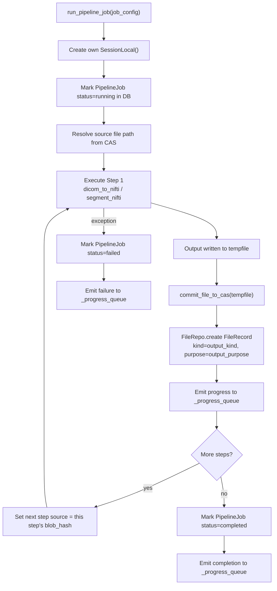

# Pipeline Deep-Dive: Problems, Discrepancies & Proposed Solutions

## What We're Trying to Achieve

The pipeline should work like this end-to-end:

```
Upload finalized
  → PipelineService builds steps JSON
  → PipelineJob row created (status=queued)
  → Job config dict submitted to ProcessPoolExecutor
    → Worker executes steps sequentially
    → Each step saves its output to CAS + creates a FileRecord
    → Progress emitted to mp.Queue after each step
  → Drain coroutine in app.py broadcasts progress via WebSocket
```

---

## Problem 1: ProcessPoolExecutor and Instance Methods

**Current POC:** `MLWorker.orchestrate_task()` is an **instance method**. `ProcessPoolExecutor` pickles the callable before submitting — instance methods are not picklable across process boundaries.

**Fix (already documented in implementation_flow.md Step 11):** The inference logic must become a **top-level module function**:

```python
# workers/pipeline_runner.py
def run_pipeline_job(job_config: dict) -> dict:
    """Top-level function — picklable, no self."""
    ...
```

This is the entry point submitted to `Scheduler.enqueue()`. All context the worker needs must be in `job_config`.

---

## Problem 2: StorageService Cannot Cross the Process Boundary

This is the **most critical issue not yet addressed in the plan.**

`StorageService` is a class instance. Its DB session is bound to the SQLAlchemy connection pool of the **main FastAPI process**. None of this crosses the process fork:

- SQLAlchemy `Session` objects → **not thread-safe, definitely not process-safe**
- SQLAlchemy engine connection pool → **each process must create its own**
- The `StorageService` instance itself → **not picklable** (holds a session factory)

### Two options

#### Option W-A: Worker creates its own DB session (Recommended)

Workers import `session.py`, construct a fresh `SessionLocal()` from the DB URL (available from config), and call storage logic directly. This works because:

- **SQLite WAL mode** allows concurrent writers from multiple connections
- Config values (DB URL, data root path) are plain strings — trivially picklable
- There is no shared state to corrupt

```python
# workers/pipeline_runner.py
from db.session import make_engine_and_session
from storage.cas import commit_file_to_cas
from db.repos.file_repo import FileRepo

def run_pipeline_job(job_config: dict) -> None:
    engine, SessionLocal = make_engine_and_session(job_config["db_url"])
    with SessionLocal() as db:
        file_repo = FileRepo(db)
        _execute_steps(job_config, file_repo)
```

The `job_config` dict passed to the worker contains **only primitive types**: strings, ints, lists, dicts. No ORM objects, no sessions, no service instances.

#### Option W-B: Worker sends file paths back via mp.Queue, main process does the DB writes

Worker does only filesystem ops (puts output in a temp path), then puts a message on `mp.Queue`. The drain coroutine in `app.py` picks it up and calls `StorageService.store_derived_file()`.

**Problem:** The drain coroutine now has two jobs (broadcast WS + write to storage). If it is slow writing, the queue backs up. Worse: if the worker is waiting for the next step's input (the just-written FileRecord's `file_id`), it **deadlocks** — multi-step pipelines require the FileRecord to exist before the next step can read it.

> [!CAUTION]
> Option W-B breaks multi-step pipelines because Step 2 needs the FileRecord created by Step 1 **synchronously inside the worker process**. If Step 1's save is deferred to the main process via mp.Queue, Step 2 has no `file_id` to operate on.

**Chosen solution: Option W-A.** Workers own their DB session. The `mp.Queue` is used **only for progress/completion events**, not for data persistence.

---

## Problem 3: The mp.Queue Passability Issue

A plain `multiprocessing.Queue` is picklable on Linux (fork-based start) but becomes problematic with `spawn` (default on macOS/Windows, and default in Python 3.12+ on all platforms via `ProcessPoolExecutor`).

### Issue

`ProcessPoolExecutor` uses `spawn` by default. Spawned processes do **not** inherit the parent's memory — the queue must be pickled and passed as an argument or via `initializer=`.

### Solution

Pass the queue via `initializer=` to ensure it is available as a module-level global before any job runs:

```python
# workers/pipeline_runner.py
_progress_queue = None

def _worker_init(q: multiprocessing.Queue):
    global _progress_queue
    _progress_queue = q

# In app.py lifespan:
q = multiprocessing.Manager().Queue()  # Manager queue is process-safe everywhere
scheduler = Scheduler(
    max_workers=1,
    initializer=_worker_init,
    initargs=(q,),
)
```

> [!NOTE]
> Use `multiprocessing.Manager().Queue()` rather than `multiprocessing.Queue()` directly. A Manager queue is backed by a server process and is safe under both `fork` and `spawn` start methods. This future-proofs the code for when Python defaults to `spawn`.

---

## Problem 4: The `save_uploaded_nifti` Step Discrepancy

The plan documents a step called `save_uploaded_nifti` with `output_purpose="viewer_volume"` for direct NIfTI uploads. But there is a problem:

**When `UploadService.finalize()` runs, the NIfTI file is already saved to CAS and a `FileRecord` is already created.** There is nothing for `save_uploaded_nifti` to save — the file exists.

What actually needs to happen is different: the `FileRecord` for the original NIfTI should have its `purpose` column set to `viewer_volume`. But this happens **before** the pipeline even runs, and the pipeline may not be necessary at all for NIfTI-only uploads with no segmentation requested.

### Solution: Two distinct pipeline entry states

| Upload type | `FileRecord.purpose` at finalize | Pipeline steps |
|---|---|---|
| DICOM zip | `null` (DICOM is never a viewer volume) | `[dicom_to_nifti, segment_nifti]` |
| NIfTI (direct) | `viewer_volume` (set immediately at finalize) | `[segment_nifti]` |

`UploadService.finalize()` is responsible for setting `purpose=viewer_volume` on the NIfTI `FileRecord` directly — no pipeline step needed for this. `PipelineService.dispatch_if_needed()` then only adds `segment_nifti` to the steps list, skipping any save step for the original.

> [!IMPORTANT]
> Remove `save_uploaded_nifti` from the pipeline steps entirely. `UploadService` sets `purpose` on the FileRecord at finalize time. The pipeline only starts **after** the original file is already persisted and purposed correctly.

---

## Proposed Concrete Pipeline Job Config

The dict passed to `run_pipeline_job` (fully picklable):

```python
{
    "job_id":         "uuid-...",
    "study_id":       "uuid-...",
    "db_url":         "sqlite:////data/storage.db",
    "data_root":      "/data",
    "source_blob_hash": "sha256hex...",   # locate input in CAS
    "source_file_id": "uuid-...",          # FK for FileRecord.pipeline_job_id
    "steps": [
        {
            "name":           "dicom_to_nifti",
            "output_filename": "scan.nii.gz",
            "output_kind":    "nifti_derived",
            "output_purpose": "viewer_volume",
            "config":         {}
        },
        {
            "name":           "segment_nifti",
            "output_filename": "mask.nii.gz",
            "output_kind":    "segmentation_mask",
            "output_purpose": "viewer_overlay",
            "config":         {}
        }
    ]
}
```

- Worker does **not** receive service instances, sessions, or ORM objects.
- Steps are executed in array order; each step's output becomes the next step's input.
- `source_blob_hash` is used to locate the input file (CAS path is deterministic).

---

## Step Execution Flow (Inside the Worker)



Key invariants:
- Each step gets the **previous step's blob_hash** as its source input (chains naturally)
- Both DB write and progress emit happen **inside the worker** for each step
- Temp files are deleted after CAS commit (same as current `engine.py` context manager pattern)

---

## Discrepancy Summary

| # | Discrepancy | Fix |
|---|---|---|
| 1 | `orchestrate_task` is an instance method, not picklable | Extract to top-level `run_pipeline_job` in `pipeline_runner.py` |
| 2 | `StorageService` can't cross process boundary | Workers create own `SessionLocal` from `db_url` in job config |
| 3 | Regular `mp.Queue` unreliable under `spawn` | Use `Manager().Queue()`, inject via `initializer=` |
| 4 | `save_uploaded_nifti` step is redundant | `UploadService.finalize()` sets `purpose=viewer_volume` directly; pipeline skips this step |
| 5 | Steps JSON had no chaining model (how does step 2 get step 1's output?) | Each step result passes its `blob_hash` as the next step's source input |
| 6 | `PipelineJob.source_file_id` was a single FK | Sufficient — it points to the *original* source; intermediate results chain via step output blob hashes |

---

## Revised `implementation_flow.md` Impact

Steps that need updating based on this analysis:

- **Step 6 (UploadService):** `finalize()` must set `purpose=viewer_volume` on NIfTI `FileRecord` directly
- **Step 7 (StorageService):** Clarify this is called from **workers with their own DB session**, not the main process
- **Step 8 (PipelineService):** Remove `save_uploaded_nifti` from NIfTI dispatch path; only add `segment_nifti`
- **Step 11 (Scheduler):** Document `Manager().Queue()` and `initializer=` pattern for queue injection
- **Step 14 (Workers):** Rename to `pipeline_runner.py`; document `run_pipeline_job` signature + step chaining

