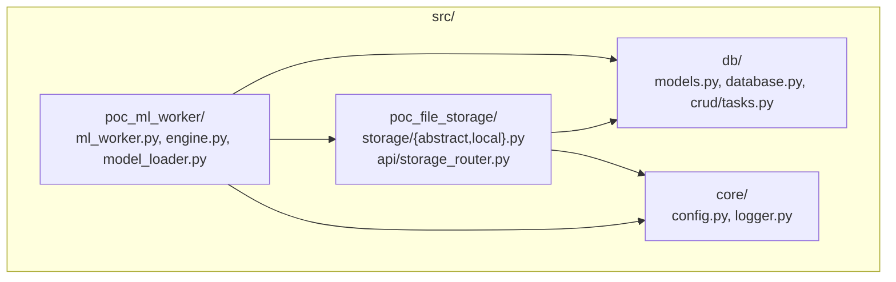

# POC Analysis: File Storage & Backend Plan Gap Assessment

## 1. Current POC Architecture Summary

The POC has **4 packages** under `src/`:

### What the POC Proves

| Capability | Status | Implementation |
|---|---|---|
| CAS blob storage (SHA-256, dedupe) | ✅ Working | `local.py` — atomic `os.replace` into `blobs/sha256/xx/hash` |
| Chunked resumable upload | ✅ Working | `begin_upload → upload_chunk → finalize_upload` |
| Hardlink study references | ✅ Working | Hardlink to `studies/{sid}/raw/` with copy fallback |
| NIfTI metadata extraction | ✅ Working | `nibabel` header parsing on finalize |
| Store derived files from local path | ✅ Working | `store_from_local_path()` for ML outputs |
| Abstract storage interface | ✅ Working | `AbstractPersistentStorage` for future S3 swap |
| SQLite WAL mode | ✅ Working | `database.py` pragmas |
| ML inference (ONNX) | ✅ Working | Polling-based worker with ONNX runtime |
| HTTP upload API | ⚠️ Minimal | Only 3 endpoints, no status/resume/file-serve |
| Garbage collection | ✅ Working | `garbage_collect()` removes orphan blobs |

---

## 2. Problems & Discrepancies (POC vs Plan)

### 2.1 Structural Mismatches

| # | Issue | POC State | Plan Expectation | Severity |
|---|---|---|---|---|
| S1 | **Monolithic storage class** | `LocalPersistentStorage` is a god-object (443 lines) combining upload orchestration, CAS logic, study CRUD, file queries, garbage collection | Plan separates into `UploadService`, `StorageService`, `StudyService` + thin repos | 🔴 High |
| S2 | **No repository pattern** | Service methods directly use `self.Session()` and raw SQLAlchemy queries inline | Plan requires `UploadSessionRepo`, `FileRepo`, `PipelineJobRepo` | 🟡 Medium |
| S3 | **No service layer** | Router creates `LocalPersistentStorage` globally, calls it directly | Plan requires routers → services → repos (3-layer) | 🔴 High |
| S4 | **Flat project structure** | Code lives in `poc_file_storage/` and `poc_ml_worker/` silos | Plan expects a unified `backend/` with `routers/`, `services/`, `workers/`, `db/`, `storage/` | 🟡 Medium |
| S5 | **No `PipelineJob` model** | `Task` model in `db/models.py` is a simplified version (no `steps`, `source_file_id`, `started_at`, `finished_at`, `error` fields) | Plan requires `PipelineJob` with full lifecycle tracking | 🔴 High |
| S6 | **Dual metadata storage** | `begin_upload()` writes BOTH `meta.json` on disk AND `UploadSession` row in DB — redundant | Plan uses DB-only state management | 🟡 Medium |

### 2.2 Missing Features

| # | Feature | Status | Notes |
|---|---|---|---|
| F1 | **Upload status/resume endpoint** | ❌ Missing | `GET /uploads/{id}/status` not implemented. POC has no way to resume uploads |
| F2 | **File content serving** | ❌ Missing | `GET /files/{id}/content` with `FileResponse` + range requests not implemented |
| F3 | **Study CRUD routes** | ❌ Missing | No `GET/POST/PATCH/DELETE /studies` endpoints |
| F4 | **WebSocket progress** | ❌ Missing | No `ws_broadcaster.py`, no `WS /ws/pipeline/{task_id}` |
| F5 | **Pipeline dispatch on finalize** | ❌ Missing | `finalize_upload()` returns `StoredFile` but never creates jobs or dispatches workers |
| F6 | **APScheduler / process pool** | ❌ Missing | ML worker uses a bare polling loop (`while True: sleep(2)`) instead of scheduler |
| F7 | **Worker-to-API bridge** | ❌ Missing | No `multiprocessing.Queue` bridge between worker subprocess and FastAPI event loop |
| F8 | **DICOM handling** | ❌ Missing | `dicom_worker.py` not implemented. Architecture notes exist but no code |
| F9 | **Upload TTL/expiry** | ❌ Missing | No cleanup of stale `active` upload sessions |
| F10 | **Chunk size negotiation** | ❌ Missing | Plan says `begin_session` returns `chunk_size`; POC hardcodes 16MB in bash script |

### 2.3 Code Quality Issues

| # | Issue | Location | Impact |
|---|---|---|---|
| Q1 | **Bare `except Exception` everywhere** | `storage_router.py` catches all exceptions as 400 | Hides 500-level bugs, wrong HTTP status codes |
| Q2 | **No Pydantic response models** | Routers return raw dicts | No API contract validation |
| Q3 | **Module-level `store` singleton** | `storage_router.py` L11 creates instance at import time | Prevents dependency injection, testing |
| Q4 | **`datetime.utcnow()` deprecated** | All models use it | Should use `datetime.now(UTC)` |
| Q5 | **No `chunk_size` in UploadSession** | DB model missing the field | Plan specifies it as part of negotiation |
| Q6 | **`checksum_sha256` duplicates `blob_hash`** | `FileRecord` stores same value twice | Redundant; plan only has `cas_hash` |
| Q7 | **Import path coupling** | `storage_router.py` imports `from storage.local import ...` — relative to `poc_file_storage/` | Will break when restructured |

### 2.4 Discrepancies Between Architecture Notes

| # | Discrepancy | Where |
|---|---|---|
| D1 | `notes/arch/upload.md` says "symlink or reference" for study links; POC uses hardlinks; plan says hardlinks | Minor terminology mismatch |
| D2 | `notes/arch/upload.md` mentions Celery; `backend_implementation_plan.md` uses APScheduler + ProcessPool | Fundamental architecture difference — **which one?** |
| D3 | Plan's `PipelineJob` has `steps` (JSON array) for multi-step pipelines; POC's `Task` has none | Plan is more flexible |
| D4 | Plan says routers return Pydantic schemas; POC readme mentions `Celery` but plan says `APScheduler` | Inconsistent worker approach |

---

## 3. What Works Well (Keep From POC)

> [!TIP]
> These POC components are solid and should be preserved in the refactor:

1. **CAS commit logic** in `finalize_upload()` — atomic `os.replace`, hash verification, dedup check, hardlink+fallback. This is production-quality.
2. **`AbstractPersistentStorage` interface** — clean abstraction for future S3 swap.
3. **`StoredFile` dataclass** — good canonical return type.
4. **NIfTI metadata extraction** — valuable for downstream visualization.
5. **SQLite WAL configuration** — correct for single-node dev.
6. **`store_from_local_path()`** — correctly handles the "worker output → CAS" flow.
7. **Idempotent chunk upload** — size-check dedup is correct.

---

## 4. What Needs to Change (POC → Production)

### Phase 1: Structure & Foundation
1. Restructure from `poc_*/` to unified `backend/` package layout
2. Split `LocalPersistentStorage` god-object into focused modules:
   - `storage/paths.py` — pure path computation
   - `storage/cas.py` — CAS commit logic (extract from `finalize_upload`)
   - `storage/upload_session.py` — chunk I/O
3. Create repository classes wrapping SQLAlchemy
4. Upgrade `Task` model → `PipelineJob` with full lifecycle fields

### Phase 2: Services & API
5. Create service layer (`UploadService`, `StorageService`, `PipelineService`, `StudyService`)
6. Implement all missing router endpoints (file serve, study CRUD, upload status)
7. Add Pydantic request/response schemas
8. Proper HTTP error handling (correct status codes)

### Phase 3: Workers & Real-time
9. Implement `scheduler.py` with `ProcessPoolExecutor`
10. Implement `ws_broadcaster.py` + queue bridge
11. Wire finalize → pipeline dispatch
12. Add the DICOM worker

### Phase 4: Hardening
13. Upload TTL expiry + cleanup
14. Chunk size negotiation
15. `app.py` lifespan (startup/shutdown)
