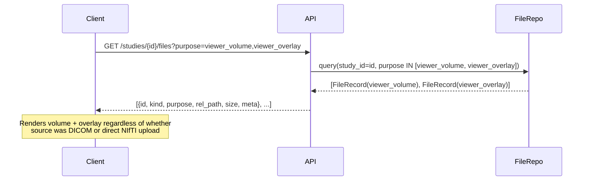
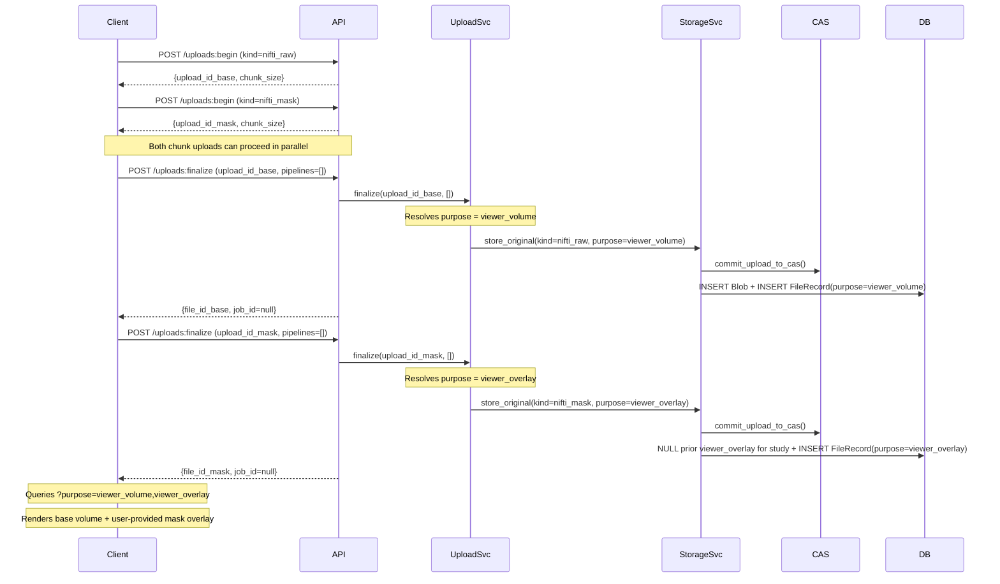
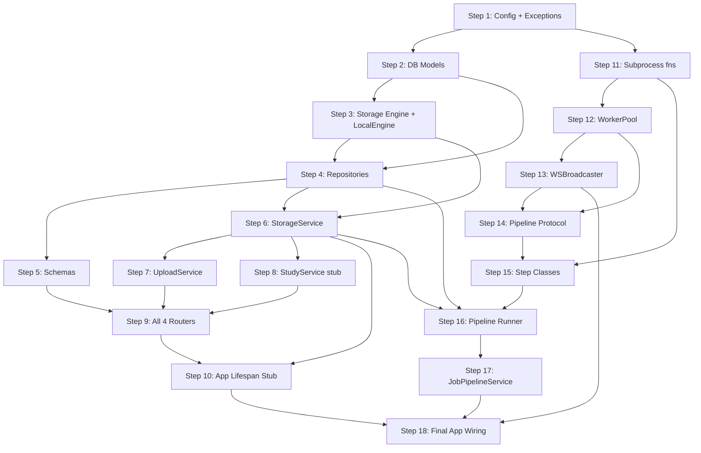

# Unified Backend Implementation Plan — CBCT Backend

> [!IMPORTANT]
> This document is the single, comprehensive implementation guide for the CBCT Backend.
> It supersedes **both** `backend_implementation_plan.md` **and** `implementation_flow.md`.
> It is intentionally kept consistent with `architecture_reference.md` except where
> explicitly noted in the **Schema Enhancements** callout in Step 2.
>
> Structure: **Section 1 — Reference** (contracts, schemas, rationale) →
> **Section 2 — Build Sequence** (18 ordered steps) →
> **Section 3 — Verification Plan**.
> Follow Section 2 top-to-bottom; consult Section 1 for detail as you go.

---

# Section 1 — Reference

## Directory Layout

```
backend/
├── main.py                    # uvicorn entrypoint
├── app.py                     # FastAPI factory + lifespan
├── config.py                  # All settings (paths, chunk size, model path)
├── schemas.py                 # Pydantic request/response models
├── exceptions.py              # Custom HTTP exceptions
│
├── routers/
│   ├── studies.py             # Study CRUD
│   ├── uploads.py             # Chunked upload endpoints
│   ├── files.py               # File content retrieval
│   └── ws.py                  # WebSocket progress
│
├── services/
│   ├── upload_service.py      # Upload state machine
│   ├── storage_service.py     # CAS commit + FileRecord creation
│   ├── study_service.py       # Study CRUD logic
│   └── job_pipeline_service.py # Step routing, job creation, dispatch
│
├── workers/
│   ├── steps/
│   │   ├── base.py            # PipelineStep protocol, StepContext, StepResult, OutputArtifact
│   │   ├── dicom_to_nifti.py  # DicomToNiftiStep
│   │   └── segment_nifti.py   # SegmentNiftiStep
│   ├── pipeline_runner.py     # run_pipeline() async orchestrator
│   ├── worker_pool.py         # WorkerPool: ProcessPoolExecutor wrapper
│   ├── subprocesses/
│   │   ├── dicom_fn.py        # Subprocess fn: convert_dicom(path) → path
│   │   └── segmentation_fn.py # Subprocess fn: run_segmentation(path) → path
│   └── ws_broadcaster.py      # WebSocket registry + broadcast
│
├── db/
│   ├── models.py              # SQLAlchemy ORM (5 models)
│   ├── session.py             # Engine + SessionLocal factory
│   └── repos/
│       ├── study_repo.py      # StudyRepo: Study CRUD queries
│       ├── upload_session_repo.py
│       ├── file_repo.py       # FileRepo: FileRecord + Blob queries
│       └── pipeline_job_repo.py
│
└── storage/
    ├── engine.py              # StorageEngine protocol
    └── local_engine.py        # LocalStorageEngine implementation
```

> [!CAUTION]
> Do NOT delete `src/poc_file_storage/` or `src/poc_ml_worker/` yet.
> Port code from them into this structure as you proceed through the build steps.

---

## Database Models

### `Study`

| Field | Type | Notes |
|---|---|---|
| `id` | UUID (str) | PK |
| `name` | str | Display name; dedicated column for performant UI sorting and `rename()` |
| `external_id` | str? | Optional external reference (e.g. PACS ID), UNIQUE index |
| `status` | str | `created` / `processing` / `ready` |
| `created_at` | datetime | |
| `updated_at` | datetime | Tracks last state change for lifecycle events |
| `meta` | JSON | Arbitrary study-level metadata |

### `FileRecord`

| Field | Type | Notes |
|---|---|---|
| `id` | UUID (str) | PK |
| `study_id` | UUID (str) | FK → Study (indexed) |
| `pipeline_job_id` | UUID? | FK → PipelineJob; null for originals |
| `role` | str | `original` / `derived` |
| `kind` | str | `dicom_zip` / `nifti_raw` / `nifti_mask` / `nifti_derived` / `segmentation_mask` |
| `purpose` | str? | `null` / `viewer_volume` / `viewer_overlay` (indexed for fast filter queries) |
| `original_filename` | str | Original upload filename; persisted here because `UploadSession` is ephemeral |
| `rel_path` | str | Path relative to data root |
| `blob_hash` | str(64) | SHA-256; FK → Blob.hash |
| `content_type` | str? | MIME type |
| `size` | int | Bytes |
| `created_at` | datetime | |
| `meta` | JSON | NIfTI header info (shape, pixdim, affine) if applicable |

> [!IMPORTANT]
> `checksum_sha256` from the POC is **removed** — it was a duplicate of `blob_hash`.

### `Blob`

| Field | Type | Notes |
|---|---|---|
| `hash` | str(64) | PK (SHA-256). Maps to `data/blobs/sha256/{xx}/{full_hash}` |
| `size` | int | Bytes |
| `created_at` | datetime | |

### `UploadSession`

| Field | Type | Notes |
|---|---|---|
| `id` | UUID (str) | PK |
| `study_id` | UUID (str) | FK → Study |
| `filename` | str | Original filename |
| `role` | str | Always `original` |
| `kind` | str | `dicom_zip` / `nifti_raw` / `nifti_mask` |
| `content_type` | str? | MIME type |
| `expected_size` | int? | Total bytes declared by client |
| `expected_sha256` | str? | Hash declared by client for finalize verification |
| `chunk_size` | int | Negotiated chunk size in bytes (returned to client at begin) |
| `state` | str | `active` / `finalized` / `aborted` / `expired` (indexed for Wipe-on-Startup) |
| `created_at` | datetime | |
| `updated_at` | datetime | Tracks session activity; used for TTL expiry logic |

### `PipelineJob`

| Field | Type | Notes |
|---|---|---|
| `id` | UUID (str) | PK; returned to client as `job_id` |
| `study_id` | UUID (str) | FK → Study (indexed) |
| `source_file_id` | UUID (str) | FK → FileRecord that triggered the job |
| `steps` | JSON | Audit log — array of step name strings |
| `status` | str | `queued` / `running` / `completed` / `failed` / `cancelled` |
| `created_at` | datetime | |
| `started_at` | datetime? | |
| `finished_at` | datetime? | |
| `error` | str? | Populated on failure |

> [!IMPORTANT]
> The old `Task` model from the POC must be replaced by `PipelineJob`.
> `steps` is an **audit log only** — step routing is performed in Python by
> `JobPipelineService`, never by interpreting this JSON at runtime.

---

## Schema Enhancements vs. `architecture_reference.md`

> [!NOTE]
> The following fields are intentional additions over `architecture_reference.md`.
> They are **not** errors — they make the models sufficient for production lifecycle events.

| Model | Added Field | Rationale |
|---|---|---|
| `Study` | `name` (str) | Dedicated column for `rename()` and performant UI sorting, rather than burying in `meta` JSON |
| `Study` | `updated_at` (datetime) | Accurate lifecycle tracking for status transitions |
| `UploadSession` | `updated_at` (datetime) | Tracks last activity; required for TTL sweep logic |
| `UploadSession` | `expired` state | Restored from architecture reference; marks sessions that outlived TTL without explicit abort |
| `FileRecord` | `original_filename` (str) | `UploadSession` is wiped on cleanup; this preserves the original filename permanently on the `FileRecord` |

---

## Canonical Enums

### `kind` — file format / provenance

| Value | Role | Description |
|---|---|---|
| `dicom_zip` | `original` | DICOM series ZIP uploaded by user |
| `nifti_raw` | `original` | Base-scan NIfTI uploaded directly by user |
| `nifti_mask` | `original` | Pre-computed segmentation mask NIfTI uploaded by user |
| `nifti_derived` | `derived` | NIfTI produced by the `DicomToNiftiStep` |
| `segmentation_mask` | `derived` | Binary/label NIfTI produced by `SegmentNiftiStep` |

### `purpose` — viewer intent

| Value | Who sets it | Viewer usage |
|---|---|---|
| `null` | Default | Not sent to viewer (e.g. archive DICOM zip) |
| `viewer_volume` | `UploadService.finalize()` for `nifti_raw`; `DicomToNiftiStep` for DICOM-derived NIfTI | Primary 3D volume to render |
| `viewer_overlay` | `UploadService.finalize()` for `nifti_mask`; `SegmentNiftiStep` for auto-generated mask | Segmentation mask overlay |

> [!IMPORTANT]
> Only **one** `FileRecord` with `purpose=viewer_volume` and only **one** with
> `purpose=viewer_overlay` should be active per study at a time.
>
> **Supersede rule:** whenever a new `FileRecord` is created for a non-null purpose,
> `StorageService` must atomically set `purpose=null` on any existing record for the
> same study with that identical purpose *before* inserting the new one.
> This enforces last-write-wins semantics and prevents viewer conflicts.

### `pipeline name` — user-requested steps

| Name | Step class | Triggered by |
|---|---|---|
| `segment_nifti` | `SegmentNiftiStep` | User selects automated segmentation in UI |

Valid names are enforced by `PipelineRequestItem.name: Literal["segment_nifti"]` in
`schemas.py`. An unknown name causes a **422** before `dispatch()` is ever called.

**Frontend → API mapping:**

| UI selection | `BeginUploadRequest.kind` | `FinalizeRequest.pipelines` |
|---|---|---|
| Pre-computed mask chosen | `nifti_mask` | `[]` |
| Automated DL segmentation chosen | *(mask upload disabled)* | `[{"name": "segment_nifti", "config": {}}]` |
| Neither chosen | *(no mask upload)* | `[]` |

> [!IMPORTANT]
> **Mutual exclusion (UX-enforced, backend supersedes):** If a user uploads a `nifti_mask`
> and also requests `segment_nifti` (e.g. via sequential actions), the backend supersedes
> the earlier `viewer_overlay` with the newer one — no error is raised.

---

## Storage Abstraction (`storage/`)

### `StorageEngine` Protocol (`storage/engine.py`)

```python
class StorageEngine(Protocol):
    # Upload lifecycle
    def initialize_upload(self, upload_id: str) -> None: ...
    def write_chunk(self, upload_id: str, index: int, data: bytes) -> None: ...
    def get_chunk_size(self, upload_id: str, index: int) -> int | None: ...
    def list_uploaded_chunks(self, upload_id: str) -> list[int]: ...
    def abort_upload(self, upload_id: str) -> None: ...

    # CAS operations
    def commit_upload_to_cas(
        self, upload_id: str,
        expected_sha256: str | None,
        expected_size: int | None,
    ) -> tuple[str, int]: ...                        # returns (blob_hash, size)
    def commit_file_to_cas(self, src_path: Path) -> tuple[str, int]: ...

    # Path resolution (keeps path logic behind the abstraction wall)
    def get_cas_blob_path(self, blob_hash: str) -> Path: ...
    def get_job_workspace_dir(self, job_id: str) -> Path: ...

    # Study filesystem management
    def link_file_to_study(
        self, study_id: str, role: str, filename: str, blob_hash: str
    ) -> Path: ...
    def remove_study_data(self, study_id: str) -> None: ...

    # GC
    def delete_blob(self, blob_hash: str) -> None: ...
    def sweep_orphaned_blobs(self) -> int: ...
```

> [!TIP]
> `get_cas_blob_path` and `get_job_workspace_dir` are deliberate additions to the protocol.
> All path construction is locked inside `LocalStorageEngine`; no service or step class
> ever constructs a CAS path string by hand. This ensures that swapping to
> `S3StorageEngine` keeps the service layer 100% untouched.

### `LocalStorageEngine` (`storage/local_engine.py`)

Implements `StorageEngine` on the local filesystem:
- `commit_upload_to_cas`: stitches chunk parts, computes SHA-256, atomic `os.replace()` into CAS.
- `commit_file_to_cas`: same for an already-assembled file (used for derived outputs).
- `get_cas_blob_path(blob_hash)`: returns `data/blobs/sha256/{blob_hash[:2]}/{blob_hash}`.
- `get_job_workspace_dir(job_id)`: returns `data/tmp/jobs/{job_id}/`.
- `link_file_to_study`: creates hardlinks in `data/studies/{study_id}/{role}/{filename}`.
- `sweep_orphaned_blobs`: scans `data/blobs/` for files with `os.stat().st_nlink == 1` and removes them.

---

## Service Contracts

### `StorageService` (`services/storage_service.py`)

```python
class StorageService:
    def __init__(self, engine: StorageEngine, session_factory: Callable): ...

    def store_original(
        self,
        upload_id: str,
        study_id: str,
        filename: str,
        kind: str,
        purpose: str | None,
        expected_sha256: str | None,
        expected_size: int | None,
    ) -> FileRecord:
        """
        1. engine.commit_upload_to_cas()  → (blob_hash, size)
        2. engine.link_file_to_study()    → rel_path
        3. If purpose is non-null: UPDATE file_records SET purpose=NULL
           WHERE study_id=:study_id AND purpose=:purpose  (atomically, same txn)
        4. INSERT Blob (if not exists), INSERT FileRecord(role='original')
        Returns the new FileRecord.
        """

    def store_derived(
        self,
        src_path: Path,
        study_id: str,
        job_id: str,
        filename: str,
        kind: str,
        purpose: str | None,
    ) -> FileRecord:
        """
        1. engine.commit_file_to_cas()    → (blob_hash, size)
        2. engine.link_file_to_study()    → rel_path
        3. If purpose is non-null: UPDATE file_records SET purpose=NULL
           WHERE study_id=:study_id AND purpose=:purpose  (atomically, same txn)
        4. INSERT Blob (if not exists), INSERT FileRecord(role='derived', pipeline_job_id=job_id)
        Returns the new FileRecord.
        """

    def sweep_orphans(self) -> int:
        """Delegates to engine.sweep_orphaned_blobs(). Returns count of blobs removed."""
```

Called by:
- `UploadService.finalize()` → `store_original()`
- `run_pipeline()` in `pipeline_runner.py` → `store_derived()` (once per artifact, end of pipeline only)
- `app.py` lifespan → `sweep_orphans()`

Step classes **never** call `StorageService` directly.

### `UploadService` (`services/upload_service.py`)

Owns the chunked upload state machine. Injected with `StorageService` and `JobPipelineService`.

**`begin_session(study_id, payload) → {upload_id, chunk_size}`**
Validates study exists. Creates `UploadSession(state='active', role='original', kind=payload.kind, filename=payload.filename)`. Calls `engine.initialize_upload(upload_id)`. Returns negotiated `chunk_size`.

**`write_chunk(upload_id, index, data) → None`**
Validates session is `active`. Calls `engine.get_chunk_size()` for idempotency check. Calls `engine.write_chunk()`.

**`get_status(upload_id) → UploadStatusResponse`**
Returns uploaded chunk indices and session state.

**`abort_session(upload_id) → None`**
Marks DB state as `aborted`. Calls `storage_service.engine.abort_upload(upload_id)` to reclaim temp space.

**`finalize(upload_id, pipelines) → {file_id, job_id | None}`**

```
1. Resolve purpose from kind (BEFORE calling store_original):
     nifti_raw   → purpose = "viewer_volume"
     nifti_mask  → purpose = "viewer_overlay"
     dicom_zip   → purpose = None
2. Call storage_service.store_original(upload_id, study_id, filename, kind, purpose, ...)
   StorageService atomically supersedes any prior record with the same purpose.
   Returns FileRecord.
3. Call job_pipeline_service.dispatch(file_record, pipelines, db)
   Returns job_id (str) or None.
4. Mark UploadSession.state = "finalized". Remove parts dir.
5. Transition Study.status:
     job_id is not None → "processing"
     job_id is None     → "ready"
6. Return {file_id: file_record.id, job_id: job_id}
```

> [!IMPORTANT]
> Purpose resolution (step 1) **must happen before** `store_original()` is called —
> `purpose` is a parameter of `store_original`, not something set after the fact.

### `StudyService` (`services/study_service.py`)

**`create(external_id?, meta?) → StudyResponse`**
DB insert + `mkdir -p data/studies/{id}/raw/ data/studies/{id}/derived/`.

**`list(external_id_filter?) → list[StudyResponse]`**
`StudyRepo.list(external_id=...)`.

**`rename(study_id, name) → StudyResponse`**
`UPDATE studies SET name=:name, updated_at=now() WHERE id=:id`.

**`delete(study_id) → None`**
```
1. Find active PipelineJob for this study via PipelineJobRepo.
2. If found: job_pipeline_service.cancel(job.id).
3. Delete FileRecord rows from DB.
4. Call storage_service.engine.remove_study_data(study_id) to unlink hardlinks + purge directory.
5. Inline CAS GC: for each deleted FileRecord's blob_hash, count remaining DB references.
   If count == 0: call storage_service.engine.delete_blob(blob_hash) immediately.
```

> [!NOTE]
> `StudyService` is constructed in Phase 2 (Step 8) with a deferred reference to
> `JobPipelineService`. At Step 8 build time, pass `job_pipeline_service=None` and guard
> the cancel call with `if self._job_pipeline_service is not None`. The reference is filled
> in by `app.py` once `JobPipelineService` is instantiated in Phase 4 (Step 17).

### `JobPipelineService` (`services/job_pipeline_service.py`)

Single entry point for all background job execution.

```python
StepFactory = Callable[[dict], PipelineStep]

class JobPipelineService:
    def __init__(
        self,
        worker_pool: WorkerPool,
        session_factory: Callable,
        storage_service: StorageService,
        broadcaster: WSBroadcaster,
        step_registry: dict[str, StepFactory],
    ): ...

    def dispatch(
        self,
        file_record: FileRecord,
        pipelines: list[dict],   # forwarded from FinalizeRequest.pipelines
        db,
    ) -> str | None:
        # Phase 1: auto-steps — always ordered first, file-kind driven
        auto_steps: list[PipelineStep] = []
        if file_record.kind == "dicom_zip":
            auto_steps.append(DicomToNiftiStep())

        # Phase 2: user-requested steps — registry-driven loop
        user_steps: list[PipelineStep] = []
        for item in pipelines:
            factory = self._step_registry[item["name"]]   # Literal-validated upstream
            user_steps.append(factory(item.get("config", {})))

        steps = auto_steps + user_steps
        if not steps:
            return None

        job = PipelineJobRepo(db).create(
            study_id=file_record.study_id,
            source_file_id=file_record.id,
            steps=[s.name for s in steps],
        )
        ctx = StepContext(
            job_id=job.id,
            study_id=file_record.study_id,
            # Path resolved via StorageEngine — no manual path construction here
            current_input_path=self._storage_service.engine.get_cas_blob_path(
                file_record.blob_hash
            ),
            work_dir=self._storage_service.engine.get_job_workspace_dir(job.id),
            broadcaster=self._broadcaster,
            _worker_pool=self._worker_pool,
        )
        handle = asyncio.create_task(
            run_pipeline(job.id, steps, ctx, self._storage_service)
        )
        self._running[job.id] = handle
        handle.add_done_callback(lambda _: self._running.pop(job.id, None))
        return job.id

    def cancel(self, job_id: str) -> bool:
        """Cancel the in-flight asyncio.Task. Called by StudyService.delete()."""

    async def shutdown(self) -> None:
        """Cancel all in-flight tasks and shut down worker pool. Called by lifespan."""
```

### `WorkerPool` (`workers/worker_pool.py`)

```python
class WorkerPool:
    def __init__(
        self,
        max_workers: int = 1,
        initializer: Callable | None = None,
        initargs: tuple = (),
    ):
        self._pool = ProcessPoolExecutor(
            max_workers=max_workers,
            initializer=initializer,
            initargs=initargs,
        )

    async def run(self, fn: Callable, *args) -> Any:
        loop = asyncio.get_running_loop()
        return await loop.run_in_executor(self._pool, fn, *args)

    def shutdown(self, wait: bool = False) -> None:
        self._pool.shutdown(wait=wait)
```

Generic wrapper — no knowledge of any specific model or compute function. The initializer is injected at startup by `app.py`.

### `StepContext`, Protocol, and Types (`workers/steps/base.py`)

```python
@dataclass
class StepContext:
    job_id: str
    study_id: str
    current_input_path: Path   # CAS blob path, or previous step's tmp output
    work_dir: Path             # ephemeral: data/tmp/jobs/{job_id}/
    broadcaster: WSBroadcaster
    _worker_pool: WorkerPool = field(repr=False)

    async def run_subprocess(self, fn: Callable, *args) -> Any:
        return await self._worker_pool.run(fn, *args)

@dataclass
class OutputArtifact:
    path: Path
    kind: str
    purpose: str | None

@dataclass
class StepResult:
    next_input_path: Path
    artifacts: list[OutputArtifact]

class PipelineStep(Protocol):
    name: str
    async def run(self, ctx: StepContext) -> StepResult: ...

# Factory type used in STEP_REGISTRY
StepFactory = Callable[[dict], PipelineStep]
```

### Step Classes (`workers/steps/`)

Each step is a `@dataclass` implementing `PipelineStep` with an optional `config: dict = field(default_factory=dict)`.

**`DicomToNiftiStep`**
- `run()` calls `await ctx.run_subprocess(convert_dicom, str(ctx.current_input_path), str(out_dir))`
- Returns `StepResult(next_input_path=nifti_path, artifacts=[OutputArtifact(nifti_path, "nifti_derived", "viewer_volume")])`

**`SegmentNiftiStep`**
- `run()` calls `await ctx.run_subprocess(run_segmentation, str(ctx.current_input_path), str(out_dir))`
- Returns `StepResult(next_input_path=ctx.current_input_path, artifacts=[OutputArtifact(mask_path, "segmentation_mask", "viewer_overlay")])`
- `next_input_path` passes the volume forward **unchanged** — the mask does not become the next step's input.

**Key invariant:** subprocess functions receive and return **plain path strings only**. No ORM objects, sessions, or service instances ever cross the process boundary. Steps do **not** write to the database or call `StorageService`.

### `run_pipeline` (`workers/pipeline_runner.py`)

```python
async def run_pipeline(
    job_id: str,
    steps: list[PipelineStep],
    ctx: StepContext,
    storage_service: StorageService,
) -> None:
    ctx.work_dir.mkdir(parents=True, exist_ok=True)
    with storage_service.session_factory() as db:
        PipelineJobRepo(db).set_status(job_id, "running")
    try:
        collected_artifacts: dict[str, OutputArtifact] = {}

        for step in steps:
            result = await step.run(ctx)
            ctx = replace(ctx, current_input_path=result.next_input_path)
            for artifact in result.artifacts:
                # Deduplicate by purpose; fall back to kind if purpose is null
                key = artifact.purpose if artifact.purpose else artifact.kind
                collected_artifacts[key] = artifact

        # Commit all artifacts to CAS + DB at the very end — no intermediate writes
        for artifact in collected_artifacts.values():
            storage_service.store_derived(
                src_path=artifact.path,
                study_id=ctx.study_id,
                job_id=job_id,
                filename=artifact.path.name,
                kind=artifact.kind,
                purpose=artifact.purpose,
            )

        with storage_service.session_factory() as db:
            PipelineJobRepo(db).set_status(job_id, "completed")
            StudyRepo(db).set_status(ctx.study_id, "ready")
        await ctx.broadcaster.broadcast(job_id, {"status": "completed"})

    except asyncio.CancelledError:
        with storage_service.session_factory() as db:
            PipelineJobRepo(db).set_status(job_id, "cancelled")
        raise

    except Exception as exc:
        with storage_service.session_factory() as db:
            PipelineJobRepo(db).set_status(job_id, "failed", error=str(exc))
        await ctx.broadcaster.broadcast(job_id, {"status": "failed", "error": str(exc)})

    finally:
        shutil.rmtree(ctx.work_dir, ignore_errors=True)
```

### `WSBroadcaster` (`workers/ws_broadcaster.py`)

Registry: `dict[job_id, list[WebSocket]]`.
Methods: `register(job_id, ws)` / `unregister(job_id, ws)` / `broadcast(job_id, payload)`.
Called **directly** from the async pipeline runner — no `mp.Queue` or drain coroutine.

---

## Routers

All routers are thin: one service call per endpoint, no business logic, all responses are Pydantic schemas.

### `studies.py`

| Method | Path | Service call |
|---|---|---|
| `GET` | `/storage/studies` | `StudyService.list()` (supports `?external_id=` filter) |
| `POST` | `/storage/studies` | `StudyService.create()` |
| `PATCH` | `/storage/studies/{study_id}` | `StudyService.rename()` |
| `DELETE` | `/storage/studies/{study_id}` | `StudyService.delete()` |

### `uploads.py`

| Method | Path | Service call |
|---|---|---|
| `POST` | `/storage/studies/{study_id}/uploads:begin` | `UploadService.begin_session()` |
| `PUT` | `/storage/uploads/{upload_id}/chunk?index={i}` | `UploadService.write_chunk()` |
| `GET` | `/storage/uploads/{upload_id}/status` | `UploadService.get_status()` |
| `POST` | `/storage/uploads/{upload_id}:finalize` | `UploadService.finalize()` |
| `DELETE` | `/storage/uploads/{upload_id}` | `UploadService.abort_session()` |

### `files.py`

| Method | Path | Notes |
|---|---|---|
| `GET` | `/storage/studies/{study_id}/files` | Optional `?purpose=` filter; `FileRepo` uses `IN` clause |
| `GET` | `/storage/studies/{study_id}/files/{file_id}/content` | `FileResponse` — client decompresses `.nii.gz` natively |

### `ws.py`

| Protocol | Path | Behaviour |
|---|---|---|
| `WS` | `/ws/pipeline/{job_id}` | `register(job_id, ws)` on connect; receive loop; `unregister` on disconnect |

---

## Application Startup (`app.py`)

The complete lifespan block. Objects must be created in this exact order to avoid
referencing variables before they are assigned:

```python
@asynccontextmanager
async def lifespan(app: FastAPI):
    # 1. Create tables (dev) or use Alembic (prod)
    Base.metadata.create_all(engine)

    # 2. Build storage objects first (sweep_orphans requires storage_service)
    storage_engine = LocalStorageEngine(config.DATA_ROOT)
    storage_service = StorageService(storage_engine, SessionLocal)
    broadcaster = WSBroadcaster()

    # 3. Wipe on Startup: abort any lingering active UploadSessions
    with SessionLocal() as db:
        hanging = UploadSessionRepo(db).list_by_state("active")
    upload_service_tmp = UploadService(storage_service, job_pipeline_service=None)
    for session in hanging:
        upload_service_tmp.abort_session(session.id)

    # 4. CAS OS Sweep Failsafe (requires storage_service to exist)
    storage_service.sweep_orphans()

    # 5. Worker pool + step registry
    worker_pool = WorkerPool(
        max_workers=1,
        initializer=_init_segmentation,
        initargs=(str(config.MODEL_PATH),),
    )
    step_registry: dict[str, StepFactory] = {
        "segment_nifti": lambda cfg: SegmentNiftiStep(config=cfg),
    }

    # 6. Pipeline service
    job_pipeline_service = JobPipelineService(
        worker_pool, SessionLocal, storage_service, broadcaster,
        step_registry=step_registry,
    )

    # 7. Wire the deferred reference in StudyService (and UploadService if needed)
    study_service = StudyService(storage_service, job_pipeline_service)
    upload_service = UploadService(storage_service, job_pipeline_service)

    # 8. Expose on app.state for router dependency injection
    app.state.upload_service = upload_service
    app.state.study_service = study_service
    app.state.job_pipeline_service = job_pipeline_service
    app.state.storage_service = storage_service
    app.state.broadcaster = broadcaster

    yield

    # Shutdown: cancel in-flight tasks, shut down pool
    await job_pipeline_service.shutdown()
```

No `mp.Queue`. No drain coroutine.

---

## Pydantic Schemas (`schemas.py`)

| Schema | Fields |
|---|---|
| `BeginUploadRequest` | `kind: Literal["dicom_zip", "nifti_raw", "nifti_mask"]`, `filename: str`, `content_type?: str`, `expected_size?: int`, `expected_sha256?: str` |
| `BeginUploadResponse` | `upload_id: str`, `chunk_size: int` |
| `ChunkUploadResponse` | `index: int`, `received: int` |
| `UploadStatusResponse` | `upload_id: str`, `state: str`, `uploaded_chunks: list[int]` |
| `PipelineRequestItem` | `name: Literal["segment_nifti"]`, `config: dict = {}` |
| `FinalizeRequest` | `expected_sha256?: str`, `expected_size?: int`, `pipelines: list[PipelineRequestItem] = []` |
| `FinalizeResponse` | `file_id: str`, `job_id: str \| None` |
| `CreateStudyRequest` | `external_id?: str`, `name?: str`, `meta?: dict` |
| `StudyResponse` | `id, name, external_id, status, created_at, updated_at, meta` |
| `FileRecordResponse` | `id, study_id, pipeline_job_id, role, kind, purpose, original_filename, rel_path, blob_hash, size, content_type, created_at, meta` |
| `PipelineJobResponse` | `id, study_id, source_file_id, steps, status, created_at, started_at, finished_at, error` |

> [!IMPORTANT]
> `PipelineRequestItem.name` is constrained to a `Literal` type. Unknown names cause a
> **422** at the Pydantic boundary — before `dispatch()` is ever called.
> `pipelines` is **never** used to select auto-driven steps (those are determined by
> `file_record.kind` in `JobPipelineService`).

---

## End-to-End Orchestration

### Flow A: NIfTI Upload + Auto Segmentation

```mermaid
sequenceDiagram
    participant Client
    participant API
    participant UploadSvc
    participant StorageSvc
    participant CAS
    participant DB
    participant JobPipeline
    participant SegWorker
    participant Broadcaster

    Client->>API: POST /uploads:begin (kind=nifti_raw)
    API->>UploadSvc: begin_session()
    UploadSvc->>DB: INSERT UploadSession
    API-->>Client: {upload_id, chunk_size}

    loop chunks
        Client->>API: PUT /chunk?index=i
        API->>UploadSvc: write_chunk()
    end

    Client->>API: POST /uploads:finalize {pipelines: [{name: segment_nifti}]}
    API->>UploadSvc: finalize(upload_id, pipelines)
    Note over UploadSvc: Resolves purpose = viewer_volume
    UploadSvc->>StorageSvc: store_original(kind=nifti_raw, purpose=viewer_volume)
    StorageSvc->>CAS: commit_upload_to_cas()
    StorageSvc->>DB: INSERT Blob + INSERT FileRecord(purpose=viewer_volume)
    UploadSvc->>JobPipeline: dispatch(file_record, pipelines)
    JobPipeline->>DB: INSERT PipelineJob
    API-->>Client: {file_id, job_id}

    Client->>API: WS /ws/pipeline/{job_id}

    JobPipeline->>JobPipeline: create tmp/jobs/{job_id}/
    JobPipeline->>SegWorker: run_segmentation(nifti_path, out_dir) [subprocess]
    SegWorker->>SegWorker: ONNX inference
    SegWorker-->>JobPipeline: mask_path (string)
    JobPipeline->>StorageSvc: store_derived(mask_path, kind=segmentation_mask, purpose=viewer_overlay)
    StorageSvc->>CAS: commit_file_to_cas()
    StorageSvc->>DB: NULL prior viewer_overlay + INSERT FileRecord(derived)
    JobPipeline->>JobPipeline: shutil.rmtree(work_dir)
    JobPipeline->>DB: PipelineJob.status = completed; Study.status = ready
    JobPipeline->>Broadcaster: {status: completed}
    Broadcaster->>Client: WS message
```

### Flow B: DICOM Upload + Auto-Convert + Segmentation

Same as Flow A, except:
1. `finalize` payload includes `pipelines=[{"name": "segment_nifti"}]` and session `kind="dicom_zip"`.
2. `UploadService.finalize()` resolves `purpose=null` (DICOM zip is never the viewer volume).
3. `dispatch()` Phase 1 prepends `DicomToNiftiStep`; Phase 2 appends `SegmentNiftiStep` → `steps = [DicomToNiftiStep(), SegmentNiftiStep()]`.
4. `DicomToNiftiStep` runs first → emits `OutputArtifact(nifti_path, "nifti_derived", "viewer_volume")`.
5. `SegmentNiftiStep` runs second → emits `OutputArtifact(mask_path, "segmentation_mask", "viewer_overlay")`.
6. Pipeline completes → orchestrator calls `store_derived()` twice (once per artifact). Workspace deleted.

> [!NOTE]
> If the user uploads DICOM but requests no segmentation (`pipelines=[]`), Phase 1 still
> produces `[DicomToNiftiStep()]`. DICOM→NIfTI conversion is automatic and non-negotiable.

### Flow C: Frontend File Resolution



The client never needs to know whether the study originated from DICOM or NIfTI.

### Flow D: NIfTI Upload + Pre-Computed Mask



> [!NOTE]
> No `PipelineJob` is created for either upload. If the user later triggers automated
> segmentation on the same study, `SegmentNiftiStep` will call `store_derived()` which
> supersedes the `nifti_mask`'s `viewer_overlay` via the standard supersede rule.

---

# Section 2 — Build Sequence

Build top-to-bottom. Each step produces a testable increment. The dependency graph
at the end of this section shows how steps relate.

---

## Phase 1: Environment & Persistence (Steps 1–5)

### Step 1: `config.py` + `exceptions.py`

Move all magic numbers and paths into `config.py` immediately — before any other file
references them:
- `DEFAULT_CHUNK_SIZE = 16 * 1024 * 1024`  (16 MB)
- `DATA_ROOT: Path` (configurable, defaulting to `./data`)
- `STORAGE_DB_URL: str` (e.g. `sqlite:///./data/cbct.db`)
- `MODEL_PATH: Path`

Create proper HTTP exception classes in `exceptions.py`. Replace all bare `except Exception`
blocks in routers with specific handlers.

**Test:** Import `config`; assert all required attributes exist. No filesystem side-effects.

---

### Step 2: `db/session.py` + `db/models.py`

Port `engine`, `SessionLocal`, and WAL pragmas from the POC `database.py`.
Ensure `PRAGMA foreign_keys = ON`. Use `config.STORAGE_DB_URL`.

Create all five models as described in Section 1: `Study`, `FileRecord`, `Blob`,
`UploadSession`, `PipelineJob`.

Key changes from the POC:
- Add `purpose`, `original_filename` columns to `FileRecord`
- Add `name`, `updated_at` to `Study`
- Add `updated_at`, `expired` state to `UploadSession`
- Add `chunk_size` to `UploadSession`
- Replace `Task` with `PipelineJob`; add `source_file_id`, `steps`, `started_at`, `finished_at`, `error`
- Remove `checksum_sha256` from `FileRecord`

**Test:** `Base.metadata.create_all(engine)` with in-memory SQLite. Assert all five tables exist.

---

### Step 3: `storage/engine.py` + `storage/local_engine.py`

**`engine.py`:** Define the `StorageEngine` protocol exactly as specified in Section 1.
Note that `get_cas_blob_path` and `get_job_workspace_dir` are both part of the protocol —
they keep path-construction logic behind the abstraction wall and away from service classes.

**`local_engine.py`:** Implement `LocalStorageEngine`.

Port from `local.py`:
- CAS chunk stitching + SHA-256 + atomic `os.replace()` → `commit_upload_to_cas`
- Hardlink creation → `link_file_to_study`
- `abort_upload` → wipe `parts/` directory

New implementations:
- `get_cas_blob_path(blob_hash)` → `data/blobs/sha256/{blob_hash[:2]}/{blob_hash}`
- `get_job_workspace_dir(job_id)` → `data/tmp/jobs/{job_id}/`
- `commit_file_to_cas(src_path)` → SHA-256 of existing file + `os.replace()` into CAS
- `sweep_orphaned_blobs()` → walk `data/blobs/`, remove files where `os.stat().st_nlink == 1`

**Test:** Unit test with a temp directory: create chunks, commit to CAS, verify hardlink
creation, verify `get_cas_blob_path` returns the correct location, verify
`sweep_orphaned_blobs` removes unlinked blobs.

---

### Step 4: `db/repos/`

Create four thin repository files. All raw SQLAlchemy queries live here.
Services call repos; routers call services. Services never return raw ORM objects.

**`study_repo.py` — `StudyRepo`**
- `create(name?, external_id?, meta?) → Study`
- `get(study_id) → Study`
- `list(external_id?) → list[Study]`
- `set_status(study_id, status)` — also updates `updated_at`
- `rename(study_id, name)` — updates `name` and `updated_at`
- `delete(study_id)`

**`upload_session_repo.py` — `UploadSessionRepo`**
- `create(study_id, filename, role, kind, chunk_size, ...) → UploadSession`
- `get(upload_id) → UploadSession`
- `list_by_state(state) → list[UploadSession]`
- `update_state(upload_id, state)`

**`file_repo.py` — `FileRepo`**
- `create_blob(hash, size) → Blob` (upsert — skip if hash exists)
- `create_file_record(...) → FileRecord`
- `get(file_id) → FileRecord`
- `list_by_study(study_id, purpose_filter?) → list[FileRecord]`
- `count_references(blob_hash) → int` (for inline CAS GC)
- `null_purpose(study_id, purpose)` — supersede rule helper

**`pipeline_job_repo.py` — `PipelineJobRepo`**
- `create(study_id, source_file_id, steps) → PipelineJob`
- `get(job_id) → PipelineJob`
- `get_active_for_study(study_id) → PipelineJob | None`
- `set_status(job_id, status, error?)` — also updates `started_at` / `finished_at`

**Test:** Integration test with in-memory SQLite. Assert CRUD round-trips for all four repos.

---

### Step 5: `schemas.py`

Define all Pydantic schemas as specified in the Schemas table in Section 1.

Constraints to enforce:
- `BeginUploadRequest.kind: Literal["dicom_zip", "nifti_raw", "nifti_mask"]`
- `PipelineRequestItem.name: Literal["segment_nifti"]` — causes **422** before dispatch

**Test:** Assert that an invalid `kind` or pipeline `name` raises `ValidationError`.

---

## Phase 2: Core File Lifecycle & API (Steps 6–10)

### Step 6: `services/storage_service.py`

Implement `StorageService` exactly as specified in Section 1.

**`purpose` supersede (critical):** Both `store_original` and `store_derived` must,
when `purpose` is non-null, execute the following *within the same transaction* as the
`INSERT`:

```sql
UPDATE file_records SET purpose = NULL
WHERE study_id = :study_id AND purpose = :purpose
```

Port the CAS + FileRecord creation logic from `LocalPersistentStorage.finalize_upload()`
and `store_from_local_path()` in the POC.

**Test:** Integration test — call `store_original()` twice with the same `purpose`;
verify only the second record has a non-null purpose.

---

### Step 7: `services/upload_service.py`

Implement `UploadService` as specified in Section 1.

Port from `LocalPersistentStorage` methods `begin_upload`, `upload_chunk`, `finalize_upload`.

**Critical ordering in `finalize()`:** Purpose must be resolved from `kind` *first*, and
passed as a parameter to `store_original()`. Do not resolve it after the call.

Constructor signature:
```python
def __init__(
    self,
    storage_service: StorageService,
    job_pipeline_service: JobPipelineService | None,  # None is safe during startup wipe
):
```

**Test:** Integration test using FastAPI `TestClient`: `begin → chunk × N → finalize`.
Assert `FileRecord` is created with the correct `purpose`.

---

### Step 8: `services/study_service.py`

Implement `StudyService` CRUD. Build now (before `JobPipelineService`) with a deferred
injection pattern:

```python
class StudyService:
    def __init__(
        self,
        storage_service: StorageService,
        job_pipeline_service: JobPipelineService | None = None,
    ):
        self._storage_service = storage_service
        self._job_pipeline_service = job_pipeline_service  # None during Step 10 startup wipe; real in Step 18

    def delete(self, study_id: str) -> None:
        # Guard the cancel call safely
        if self._job_pipeline_service is not None:
            job = PipelineJobRepo(db).get_active_for_study(study_id)
            if job:
                self._job_pipeline_service.cancel(job.id)
        # ... rest of delete sequence
```

`app.py` constructs a fresh `StudyService(storage_service, job_pipeline_service)` in Step 18 — no attribute patching needed.

**Test:** Unit test `create()` asserts the study directory scaffolding exists.
Unit test `delete()` with `job_pipeline_service=None` does not raise.

---

### Step 9: `routers/` (all four)

Wire up all four routers as thin API endpoints per the Router tables in Section 1.

All four must be created in this step:
- `studies.py` — full CRUD
- `uploads.py` — begin / chunk / status / finalize / abort
- `files.py` — list with `?purpose=` filter + content endpoint
- `ws.py` — WebSocket `/ws/pipeline/{job_id}` (register on connect, unregister on disconnect)

The `ws.py` router references `broadcaster` from `app.state`. At this point
`WSBroadcaster` does not exist yet — leave the import as a forward reference and
create a placeholder `WSBroadcaster` class if needed for the router to load.

**Test:** Use `TestClient` to hit the studies and uploads endpoints. Assert 422 on bad input.

---

### Step 10: App Lifespan — Stub

Create `app.py` with a minimal lifespan that:
1. Calls `Base.metadata.create_all(engine)`
2. Builds `storage_engine`, `storage_service`, `broadcaster`
3. Runs the Wipe on Startup loop (abort lingering `active` UploadSessions)
4. Calls `storage_service.sweep_orphans()`

Do **not** add `WorkerPool`, `JobPipelineService`, or the step registry yet — those are
added in Step 18 once Phase 4 is complete.

> [!IMPORTANT]
> The full, complete lifespan block (as shown in Section 1) is implemented in Step 18.
> Step 10 is a functional intermediate that allows end-to-end testing of the upload flow
> before pipeline infrastructure exists.

---

## Phase 3: Async Compute Infrastructure (Steps 11–13)

### Step 11: `workers/subprocesses/` (pure compute kernels)

**`workers/subprocesses/dicom_fn.py`**

```python
def convert_dicom(input_zip_path: str, out_dir: str) -> str:
    """Pure compute: unzip DICOM, convert to NIfTI. Returns output path string."""
    ...
```

**`workers/subprocesses/segmentation_fn.py`**

```python
_model = None

def _init_segmentation(model_path: str) -> None:
    global _model
    _model = load_onnx_model(model_path)

def run_segmentation(input_nifti_path: str, out_dir: str) -> str:
    """Pure compute: ONNX inference. Returns mask path string."""
    ...
```

Port the inference kernel from `poc_ml_worker/engine.py`. Discard all storage, queue,
and orchestration code from the POC.

> [!IMPORTANT]
> Only plain strings cross the process boundary. No sessions, services, ORM objects,
> or models are ever pickled. The ONNX model is loaded once per worker process via
> `initializer=` — configured in `app.py`, not inside `WorkerPool` or step classes.

**Test:** Run `convert_dicom` and `run_segmentation` in-process with a small test fixture.
Assert the output file exists and the returned path string is correct.

---

### Step 12: `workers/worker_pool.py`

Implement `WorkerPool` exactly as specified in Section 1. Generic wrapper — no knowledge
of any specific model or initializer. If a future step requires a different initializer
(e.g. GPU-accelerated DICOM conversion), a second `WorkerPool` instance with its own
`initializer=` and `max_workers=` can be created in `app.py` and injected separately
without touching `JobPipelineService`.

**Test:** Instantiate `WorkerPool(max_workers=1)`. Use `await pool.run(fn, arg)` with a
trivial function. Assert result is returned correctly.

---

### Step 13: `workers/ws_broadcaster.py`

Implement `WSBroadcaster`:
- Internal registry: `dict[str, list[WebSocket]]`
- `register(job_id, ws)` — append to list for `job_id`
- `unregister(job_id, ws)` — remove; clean up empty key
- `async broadcast(job_id, payload: dict)` — `JSON.dumps(payload)` → `ws.send_text()`

Called **directly** from the async pipeline runner. No `mp.Queue` bridge needed.

Wire the real `WSBroadcaster` into `routers/ws.py` (replacing any stub from Step 9).

**Test:** Assert that a registered WebSocket receives the broadcasted payload.

---

## Phase 4: Pipeline Assembly & Integration (Steps 14–18)

### Step 14: `workers/steps/base.py`

Implement the pipeline protocol types exactly as specified in Section 1:
`StepContext`, `OutputArtifact`, `StepResult`, `PipelineStep` (Protocol), `StepFactory`.

**Test:** Assert `StepContext.run_subprocess()` correctly delegates to `WorkerPool.run()`.

---

### Step 15: `workers/steps/dicom_to_nifti.py` + `workers/steps/segment_nifti.py`

Implement both step classes:

Each step must:
1. Accept `config: dict = field(default_factory=dict)`.
2. Generate an output path inside `ctx.work_dir`.
3. Call `await ctx.run_subprocess(fn, str(ctx.current_input_path), str(output_path))`.
4. Broadcast step completion via `await ctx.broadcaster.broadcast(ctx.job_id, {...})`.
5. Return `StepResult(next_input_path, artifacts=[...])`.

`DicomToNiftiStep`: emits `OutputArtifact(nifti_path, "nifti_derived", "viewer_volume")`;
sets `next_input_path=nifti_path`.

`SegmentNiftiStep`: emits `OutputArtifact(mask_path, "segmentation_mask", "viewer_overlay")`;
sets `next_input_path=ctx.current_input_path` (volume passes through unchanged).

**Test:** Run each step with a mocked `StepContext` and a fake subprocess function.
Assert `StepResult.artifacts` has the correct `kind` and `purpose`.

---

### Step 16: `workers/pipeline_runner.py`

Implement `run_pipeline()` exactly as specified in Section 1.

Key invariants to verify in your implementation:
- `work_dir` is created at the start; `shutil.rmtree` is in `finally` — always cleaned up.
- Artifacts are committed to `StorageService` only after **all** steps succeed.
- `collected_artifacts` deduplicates by `purpose` (last-write-wins within a single run).
- `CancelledError` sets status to `cancelled` and re-raises (so `asyncio` can propagate it).
- `StudyRepo(db).set_status(ctx.study_id, "ready")` is called on success.

**Test:** End-to-end integration with mocked steps and in-memory SQLite.
Assert `PipelineJob.status == "completed"` and `FileRecord` is created after a successful run.
Assert `PipelineJob.status == "failed"` and no `FileRecord` is created when a step raises.

---

### Step 17: `services/job_pipeline_service.py`

Implement `JobPipelineService` exactly as specified in Section 1.

Key points:
- `dispatch()` uses `self._storage_service.engine.get_cas_blob_path(file_record.blob_hash)`
  to set `current_input_path`. This keeps path logic behind the `StorageEngine` abstraction.
- `dispatch()` uses `self._storage_service.engine.get_job_workspace_dir(job.id)` for
  `work_dir`. Same reason.
- The `asyncio.Task` handle is stored in `self._running[job.id]`.
- `cancel(job_id)` calls `handle.cancel()` on the stored task.
- `shutdown()` cancels all tasks in `self._running` and calls `self._worker_pool.shutdown()`.

Wire the deferred `job_pipeline_service` reference into `StudyService`. The canonical
approach (shown in the Step 18 lifespan) is to instantiate fresh instances at this point,
passing `job_pipeline_service` directly to the constructors — no attribute patching needed:

```python
study_service  = StudyService(storage_service, job_pipeline_service)
upload_service = UploadService(storage_service, job_pipeline_service)
```

These replace the earlier `None`-injected stubs used in Step 10 for the startup wipe.

**Test:** Call `dispatch()` with a `FileRecord` of `kind="dicom_zip"`. Assert Phase 1
prepends `DicomToNiftiStep`. Assert `PipelineJob` is inserted into the DB.

---

### Step 18: `app.py` — Final Integration

Replace the stub lifespan from Step 10 with the complete lifespan block as specified
in Section 1. Verify the construction order:

1. `Base.metadata.create_all(engine)` — tables first
2. `storage_engine = LocalStorageEngine(...)` — engine before service
3. `storage_service = StorageService(storage_engine, SessionLocal)` — service before sweep
4. `broadcaster = WSBroadcaster()`
5. **Wipe on Startup** — abort hanging active sessions via `UploadService(storage_service, job_pipeline_service=None)`
6. `storage_service.sweep_orphans()` — **after** storage_service exists
7. `worker_pool = WorkerPool(...)` — pool before registry
8. `step_registry = {"segment_nifti": lambda cfg: SegmentNiftiStep(config=cfg)}`
9. `job_pipeline_service = JobPipelineService(worker_pool, ..., step_registry=step_registry)`
10. `study_service = StudyService(storage_service, job_pipeline_service)` — deferred ref filled
11. `upload_service = UploadService(storage_service, job_pipeline_service)` — full service
12. Store all on `app.state`

**`yield`**

13. `await job_pipeline_service.shutdown()`

**Test:** Boot the full application with `TestClient`. Execute a complete DICOM upload →
finalize → pipeline run and assert a `viewer_volume` and `viewer_overlay` `FileRecord`
exist. Re-upload the same NIfTI and verify CAS deduplication (same `blob_hash`, no
duplicate `Blob` row).

---

# Section 3 — Verification Plan

## Automated

| # | Test | What to verify |
|---|---|---|
| 1 | Unit — `LocalStorageEngine` | CAS commits, `get_cas_blob_path`, hardlink creation, `sweep_orphaned_blobs` |
| 2 | Unit — `StorageService.store_original` | Supersede: second call with same purpose nulls first record |
| 3 | Unit — `StorageService.store_derived` | Supersede: derived record nulls prior original with same purpose |
| 4 | Integration — `StudyRepo` | CRUD round-trips on in-memory SQLite |
| 5 | Integration — `FileRepo` | `null_purpose`, `count_references` |
| 6 | Integration — `PipelineJobRepo` | `set_status` updates timestamps |
| 7 | Integration — upload flow | `begin → chunk × N → finalize` via `TestClient`; assert `FileRecord.purpose` |
| 8 | Integration — `run_pipeline` | Mocked steps + in-memory SQLite; assert completed status + artifact FileRecord |
| 9 | Integration — `run_pipeline` failure | Step raises; assert `failed` status + no FileRecord created |
| 10 | Integration — `JobPipelineService.dispatch` | `dicom_zip` → Phase 1 prepends `DicomToNiftiStep` |
| 11 | Integration — `StudyService.delete` | Cancels active job; removes files; triggers inline CAS GC |
| 12 | End-to-end — full DICOM pipeline | Boot server; DICOM upload + finalize with `segment_nifti`; assert two FileRecords with correct purposes |
| 13 | End-to-end — CAS dedup | Upload same NIfTI twice; assert single `Blob` row, two `FileRecord` rows |
| 14 | Validation — schemas | Invalid `kind` → 422; invalid pipeline `name` → 422 |
| 15 | Startup — Wipe on Startup | Insert an `active` UploadSession; restart app; assert session is `aborted` and parts dir gone |

Adapt existing tests from `tests/unit/poc_file_storage/test_storage_local.py` for tests 1 and 7.

## Manual

1. Boot via `uvicorn backend.main:app --reload`.
2. Push a DICOM payload requesting `segment_nifti`. Observe two `FileRecord` rows in the DB with `purpose=viewer_volume` and `purpose=viewer_overlay`.
3. Re-upload the same NIfTI. Confirm the `Blob` row is reused (same `blob_hash`) and no duplicate blob appears on disk.
4. Delete the study. Confirm `data/studies/{id}/` is gone, and the corresponding blobs are removed from `data/blobs/` (or retained if referenced by another study).
5. Connect a WebSocket to `/ws/pipeline/{job_id}` before finalize. Confirm you receive the `completed` event.
6. Upload a `nifti_mask` (pre-computed mask). Confirm `purpose=viewer_overlay` is set on that `FileRecord` and any prior `viewer_overlay` for the same study is nulled.

---

# Architectural Appendix: Key Design Decisions

| Decision | Rationale |
|---|---|
| **Process pool, not threads** | MONAI/ONNX allocate large memory blocks; process isolation prevents crashing FastAPI or starving the event loop |
| **Async pipeline runner, not subprocess orchestrator** | Only pure compute kernels cross the process boundary; DB writes, CAS commits, and WS broadcasts stay in the event loop — no serialization problems |
| **`WorkerPool` as a generic wrapper** | Decouples `ProcessPoolExecutor` lifecycle from `JobPipelineService` and step classes. Multiple `WorkerPool` instances can coexist (e.g. separate CPU vs GPU pools) without touching service logic |
| **`JobPipelineService` as single dispatch point** | Owns step routing, `PipelineJob` creation, and the `asyncio.Task` handle registry; enables clean cancellation on study delete |
| **Artifact Collector Strategy** | Steps never touch `StorageService` or DB. They emit `OutputArtifact`s into a temporary workspace. The orchestrator collects, deduplicates by purpose, and commits at the very end — eliminating intermediate DB bloat and double-writes to CAS |
| **`session_factory` in `StepContext`, not a session** | Each step creates its own short-lived session scope; no DB session is held across an `await` |
| **Step registry (`STEP_REGISTRY`) injected into `JobPipelineService`** | Phase 2 (user-steps) uses a `dict[str, StepFactory]` built in `app.py` and injected at construction. Adding a new user-requested step requires only a registry entry — `dispatch()` itself never changes |
| **`PipelineRequestItem.name: Literal[...]`** | Step name validation happens at the Pydantic schema boundary (422 error) rather than inside `dispatch()`. `dispatch()` can safely index the registry without guarding |
| **`config: dict` on step classes** | User-supplied config is passed through the registry factory to the step instance, making future per-step parameterisation (e.g. segmentation threshold) a zero-friction addition. Empty `{}` is the default |
| **`get_cas_blob_path` and `get_job_workspace_dir` on `StorageEngine`** | Keeps all path-construction logic behind the abstraction wall. Service classes and `JobPipelineService` never build path strings by hand — if storage moves to S3, only `S3StorageEngine` changes |
| **Subprocess fns receive/return strings only** | Guarantees picklability; no ORM or service instances ever cross the OS fork boundary |
| **No `mp.Queue` or drain coroutine** | `WSBroadcaster.broadcast()` is called directly from the async runner — simpler, no hidden third process |
| **`PipelineStep` (protocol) vs `PipelineJob` (DB record)** | "Step" = one atomic compute unit (Python); "Job" = one full execution run (persisted). Clear semantic boundary |
| **Hardlinks, not symlinks** | Survive blob relocation; inode-level dedup; `stat()` shows correct size |
| **CAS by SHA-256** | Dedup, integrity verification, immutable blobs |
| **SQLite WAL** | Good concurrency for single-node; easy migration to PostgreSQL later |
| **`os.replace()` for atomicity** | POSIX atomic rename prevents partial writes appearing as valid blobs |
| **Upload Cleanup (Local-First)** | Local apps bypass the 24h resumability guarantee. Abandoned chunks are wiped on backend boot (FastAPI lifespan) or via frontend `DELETE`. `APScheduler` is omitted |
| **`pipelines` in `FinalizeRequest`, not `BeginUploadRequest`** | User intent is expressed at the commit boundary (finalize), matching the UX event that triggers it. No DB column on `UploadSession` needed for pipeline intent |
| **Two-phase `dispatch` (auto-steps + user-steps)** | DICOM→NIfTI is structurally prepended by `file_record.kind`; user-controllable steps follow. Ordering is guaranteed by list concatenation — impossible to accidentally run segmentation before DICOM conversion |
| **`nifti_mask` vs `segmentation_mask` kind distinction** | `nifti_mask` = user-uploaded pre-computed mask (`role=original`); `segmentation_mask` = pipeline-produced (`role=derived`). Distinguishes provenance for audit trails, UI labelling, and GC logic |
| **`viewer_overlay` last-write-wins supersede in `StorageService`** | Both `store_original` (for `nifti_mask`) and `store_derived` (for `segmentation_mask`) atomically null any prior `viewer_overlay` before inserting the new record — exactly one active overlay per study at all times |

---

## Visual Step Dependencies


